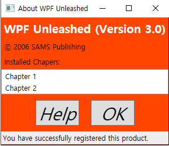

# Chapter03. WPF에서 새롭게 소개되는 중요한 개념들
## 의존 프로퍼티
- WPF에서 사용자 인터페이스는 로지컬 트리(logical tree)라는 객체의 계층구조에 의해 만들어짐
- 윈도우 엘리먼트는 스택패널을 자식 엘리먼트로 가지고 있음 
- 스택패널은 단순한 컨트롤들과 두 개의 버튼을 가진 또 다른 스택패널을 자식 엘리먼트로 포함하는 계층적 구조 
```XAML
<Window x:Class="WpfApplication2.MainWindow"
        xmlns="http://schemas.microsoft.com/winfx/2006/xaml/presentation"
        xmlns:x="http://schemas.microsoft.com/winfx/2006/xaml"
        xmlns:d="http://schemas.microsoft.com/expression/blend/2008"
        xmlns:mc="http://schemas.openxmlformats.org/markup-compatibility/2006"
        xmlns:local="clr-namespace:WpfApplication2"
        mc:Ignorable="d"
        Title="About WPF Unleashed" SizeToContent="WidthAndHeight" Background="OrangeRed" Height="350" Width="525">
    <StackPanel>
        <Label FontWeight="Bold" FontSize="20" Foreground="White">
            WPF Unleashed (Version 3.0)
        </Label>
        <Label>ⓒ 2006 SAMS Publishing</Label>
        <Label>Installed Chapters:</Label>
        <ListBox>
            <ListBoxItem>Chapter1</ListBoxItem>
            <ListBoxItem>Chapter2</ListBoxItem>
        </ListBox>
        <StackPanel Orientation="Horizontal" HorizontalAlignment="Center">
            <Button MinWidth="75" Margin="10">Help</Button>
            <Button MinWidth="75" Margin="10">OK</Button>
        </StackPanel>
        <StatusBar>You have successfully registered this product.</StatusBar>
    </StackPanel>
</Window>
```
- 로지컬 트리


- 로지컬 트리는 실제 프로그램에서 사용하는 프로퍼티나 이벤트, 리소스를 포함한 모든 것들과 관련이 있음.
- 로지컬 트리와 유사한 개념이 **비주얼 트리**
- 비주얼 트리: 로지컬 트리의 확장
  - 로지컬 트리의 각 노드들은 핵심적 배주얼 컴포넌트로 다시 분해됨
  - 비주얼 트리는 각 엘리먼트의 내부를 비주얼한 구현 단위로 다시 표현함
  - ex)리스트박스 = 하나의 컨트롤, 그러나 리스트박스는 한 개의 Border, 두 개의 스크롤바 등 기초적인 엘리먼트의 조합으로 구성됨
  - System.Windows.Media.Visual 이나  System.Windows.Media.Visual3D에서 파생된 엘리먼트들만 비주얼 트리에 나타남
  - 리스트박스가 두 개의 스크롤바를 갖거나 각 라벨이 Border를 갖고 있음
  - 비주얼 트리는 WPF에 포함된 엘리먼트의 내부 구조를 심층적으로 엿볼 수 있게 해줌 -> 놀랄만큼 내용이 복잡함

- System.Windows.LogicalTreeHelper와 System.Windows.Media.VisualTreeHelper를 이용 시 로지컬 트리와 비주얼 트리를 쉽게 이해 가능함.
- **코드 비하인드 파일**
```C#
 public partial class AboutDialog : Window
    {
        public AboutDialog()
        {
            InitializeComponent();
            PrintLogicalTree(0, this);
        }

        protected override void OnContentRendered(EventArgs e)
        {
            base.OnContentRendered(e);
            PrintViusalTree(0, this);
        }

        //protected override void OnContentRendered(EventArgs e)
        //{
        //    base.OnContentRendered(e);
        //    PrintViusalTree(0, this);
        //}

        void PrintLogicalTree(int depth, object obj)
        {
            //계층 구조의 깊이를 표현하기 위해 빈 공간을 가진 객체를 찍음
            Debug.WriteLine(new string(' ', depth) + obj);
            //가끔 마지막 엘리먼트가 문자열처럼 DependencyObjects가 아니라면
            if (!(obj is DependencyObject)) return;

            foreach (object child in LogicalTreeHelper.GetChildren(obj as DependencyObject))
                PrintLogicalTree(depth + 1, child);    
        }

        void Print(VisualTree(int depth, DependencyObject obj)
        {
            Debug.WriteLine(new string(' ', depth) + obj);

            for (int i = 0; i < (VisualTreeHelper.GetChildrenCount(obj); i++)
                PrintVisualTree(depth + 1, (VisualTreeHelper.GetChild(obj, i));
        }

    }
```
- 로지컬 트리가 프로그램 대화상자의 윈도우(AboutDialog) 엘리먼트의 생성자 안에서 실행됨
- 비주얼 트리는 적어도 한 번은 윈도우 객체의 화면배치가 끝날 때까지는 비어있음


- WPF: **의존 프로퍼티** 라는 새로운 개념 소개
    - 스타일링, 자동 데이터 바인딩, 애니메이션 등 많은 부분에 사용됨

- 의존 프로퍼티는 사용되는 시점에 프로퍼티의 값을 결정하기 이해 다중 프로바이더를 사용함
- 프로바이더들: 연속적으로 값이 변경되는 애니메이션이나 자식 엘리먼트로 값이 상속되는 부모 엘리먼트일 수 있음
- 의존 프로퍼티의 가장 큰 특징: 변경통보(change notification)라는 내장 기능이 있음

- 일반 프로퍼티에 인지 기능을 추가한 이유: 선언만으로 풍부한 기능을 사용할 수 있도록 하기 위해서 
- WPF가 선언 프로그래밍을 할 수 있는 가장 큰 이유: 프로퍼티를 다양하게 사용 가능하기 때문에
- 프로퍼티는 XAML을 직접 작성하든, 디자인 도구를 사용하든 관계없이 프로그래밍 코드를 사용하지 않고 
  값을 쉽게 설정가능하도록 함
- 의존 프로퍼티의 추라적 도움이 없다면 코드를 추가하지 않고는 원하는 결과를 얻기 어려움

- 의존 프로퍼티가 평범한 닷넷 프로퍼티에 값을 추가하는 몇 가지 방법이 있음
    - 변경 통보
    - 프로퍼티 값 상속
    - 다중 프로바이더 지원
- 사용자 지정 컨트롤을 만드는 개발자들은 의존 프로퍼티의 미묘한 차이점 대부분을 알아야 함
- 일반 개발자들도 의존 프로퍼티가 무엇이고 어떻게 동작하는지 정도는 알 필요가 있음

### 의존 프로퍼티의 구현
- 의존 프로퍼티는 WPF 기반에서 사용될 때의 특징을 제외하고는 보통 닷넷 프로퍼티와 동일함, 모두 WPF의 API를 통해서 실행됨
- 어떤 닷넷 언어도 의존 프로퍼티를 기본적으로 지원하지 않음 -> 별도로 구현해야 함

```C#
public class Button : ButtonBase
    {
        //의존 프로퍼티
        public static readonly DependencyProperty IsDefaultProperty;

        static Button()
        {
            //프로퍼티를 등록
            //예제 버튼에 사용할 프로퍼티는 IsDefault
            //bool 타입으로 등록함
            Button.IsDefaultProperty = DependencyProperty.Register("IsDefault", typeof(bool),
                typeof(Button), new FrameworkPropertyMetadata(false,
                new PropertyChangedCallback(OnIsDefaultChanged)));
            //의존 프로퍼티에 기본 값으로 false로 설정하거나 변경통보를 위한 델리게이트를 추가하기 위해서
            //스태틱 생성자 안에서 오버로드된 Register 메소드를 호출함
            ...

        }

        //닷넷 프로퍼티 래퍼(선택사항)
        public bool IsDefault
        {
            get { return (bool)GetValue(Button.IsDefaultProperty);}
            set { SetValue(Button.IsDefaultProperty, value); }
        }

        // 프로퍼티가 변경될 떄 호출되는 콜백 메소드
        private static void OnIsDefaultChanged(
            DependencyObject o, DependencyPropertyChangedEventArgs e)
        {...}
    }
```

- IsDefaultProperty 멤버 변수는 System.Windows.DependencyProperty 타입의 실제 의존 프로퍼티
- 관습적으로 모든 DependencyProperty 변수는 public, static 속성, Property 접미사가 붙음 
    - DependencyProperty.Register 메소드를 통해서 등록됨
    - 이 메소드는 기본적으로 프로퍼티 이름, 프로퍼티 타입, 의존 프로퍼티를 사용하려는 클래스 타입이 필요함
    - 다른 오버로드 메소드를 사용할 경우, 메타데이터를 추가 가능함.
    - 메타데이터는 프로퍼티가 어떻게 처리될 지 사용자가 지정 가능, 콜백 메소드를 통해 프로퍼티 값을 변경, 강제 할당, 유효성 평가 등을 할 수 있음

- System.Windows.DependencyObject에서 상속받은 GetValue와 SetValue 메소드를 통해 의존 프로퍼티에 접근할 수 있는 IsDefault라는 프로퍼티가 구현됨

- **프로퍼티 래퍼(Property wrapper):**
    - IsDefaultProperty같은 프로퍼티
    - 실제 의존 프로퍼티를 래핑하고 있다는 의미임
    - 항상 필요한 것은 아님
- 버튼을 사용할 때마다, public 속성의 GetValue/SetValue 메소드를 통해 직접 접근 가능, 그러나 프로퍼티를 사용하는 것이 프로그램 측면에서 
  사용자들에게 자연스러움, XAML은 프로퍼티를 통해 값을 설정 
- GetValue와 SetValue는 내부적으로 부족한 저장 시스템을 효과적으로 사용
- IsDefaultProperty가 인스턴스 변수가 아니라 스태틱 변수 -> 의존 프로퍼티를 구현 -> 일반적인 닷넷 프로퍼티와 비교 시 상당한 메모리 절약 효과가 있음

- 의존 프로퍼티 구현의 장점: 
    - 메모리의 효과적인 사용
    - 스레드 접근이나 다시 렌더링되어야 하는 엘리먼트를 알려주는 지시자 등
    - 체크해야 할 많은 코드를 집중화 및 표준화가 가능함
    
### 변경 통보
- 의존 프로퍼티의 값이 변경될 떄마다, WPF는 프로퍼티의 메타 데이터에 의존 -> 변경 내용을 자동을 통지함
- 이 과정: 엘리먼트를 적절하게 다시 렌더링, 화면 배치를 갱신, 데이터 바인딩을 새로고침 --> 많은 처리를 가능하게 해줌
- 내장된 변경 통보를 통해 가능한 것: **프로퍼티 트리거** 

**프로퍼티 트리거:**
- 프로퍼티 변경 시, 프로그래밍 코드를 다시 작성하지 않아도 사용자가 지정하는 처리(custom logic)을 가능하게 함

```XAML
<Button MouseEnter="Button_MouseEnter" MouseLeave="Button_MouseLeave"
        MinWidth="75" Margin="10">Help</Button>
<Button MouseEnter="Button_MouseEnter" MouseLeave="Button_MouseLeave"
        MinWidth="75" Margin="10">OK</Button>
```

- C#의 코드비하인트 파일에서 두 개의 이벤트 처리기를 처리함
```C#
 //마우스가 버튼에 올려졌을 때 전면색이 파란색으로 변함
        void Button_MouseEnter(object sender, MouseEventArgs e)
        {
            Button b = sender as Button;
            if (b != null) b.Foreground = Brushes.Blue;
        }

        void Button_MouseLeave(object sender, MouseEventArgs e)
        {
            Button b = sender as Button;
            if (b != null) b.Foreground = Brushes.Black;
        }
```
- 프로퍼티 트리거를 이용하면 복잡한 코딩 없이 XAML만으로 쉽게 처리 가능
- 간단한 Trigger 객체만 있으면 다 처리됨
```XAML
    <Trigger Property="IsMouseOver" Value="True"></Trigger>
    <Trigger Property="Foreground" Value="Blue"></Trigger>
```
- 이 프로퍼티 트리거는 버튼의 IsMouseOver 프로퍼티 값이 true가 되면 동시에 MouseEvent가 일어남
- false가 되면 MouseLeave 이벤트가 일어남
- IsMouseOver 값이 false가 되면 Foreground를 검정색으로 되돌리는 문제는 내부에서 처리됨

- 프로퍼티 트리거는 WPF에서 지원되는 트리거의 세 가지 형태 중 하나
- **데이터 트리거**
- **이벤트 트리거**
   라우티드 이벤트와 밀접한 관계가 있음
   특정 처리를 선언만으로 가능하게 해줌, 애니메이션이나 사운드를 처리할 경우에 반드시 사용됨

### 프로퍼티 값 상속
- 프로퍼티 값 상속: 전통적인 객체 지향 클래스에서 말하는 상속의 개념이 아님
    - 엘리먼트 트리 구조에서 프로퍼티의 값이 하위 엘리먼트로 상속된다는 의미임.
    ```C#
    <Window x:Class="WpfApplication3.MainWindow"
        xmlns="http://schemas.microsoft.com/winfx/2006/xaml/presentation"
        xmlns:x="http://schemas.microsoft.com/winfx/2006/xaml"
        xmlns:d="http://schemas.microsoft.com/expression/blend/2008"
        xmlns:mc="http://schemas.openxmlformats.org/markup-compatibility/2006"
        xmlns:local="clr-namespace:WpfApplication3"
        mc:Ignorable="d" 
        SizeToContent="WidthAndHeight"
        FontSize="30" FontStyle="Italic"
        Background="OrangeRed"
        Title="MainWindow" >
    <Grid>
        <StackPanel>
            <Label FontWeight="Bold" FontSize="20" Foreground="White">
                WPF Unleashed (Version 3.0)
            </Label>
            <Label>ⓒ 2006 SAMS Publishing</Label>
            <Label>Installed Chapers:</Label>
            <ListBox>
                <ListBoxItem>Chapter 1</ListBoxItem>
                <ListBoxItem>Chapter 2</ListBoxItem>
            </ListBox>
            <StackPanel Orientation="Horizontal" HorizontalAlignment="Center">
                <Button MinWidth="75" Margin="10">Help</Button>
                <Button MinWidth="75" Margin="10">OK</Button>
            </StackPanel>
            <StatusBar>
                You have successfully registered this product.
            </StatusBar>
        </StackPanel>
    </Grid>
    </Window>
    ```
- 두 프로퍼티는 트리 구조상 하위로 전달됨, 대부분 자식 엘리먼트에게 상속됨
- 첫 번째 라벨의 경우 폰트사이즈가 30으로 상속됨, 그러나 명시적으로 20이라고 설정하면 값이 변하지 않음
- 폰트스타일의 Italic 속성은 모든 라벨과 리스트박스 아이템 그리고 버튼에 영향을 미침
    
    - 이유: 하위 엘리먼트에 명시적으로 폰트스타일을 설정한 것이 없음(끊어지지 않고 유기적으로 영향을 받음)
- StatusBar 컨트롤은 다른 컨트롤처럼 이 두 속성을 지원함, 그러나 어떤 영향도 받지 않음(이 아이만 특히 글씨가 작음)
    - 그 이유: 프로퍼티 값 상속은 두 가지 이유로 미묘한 차이가 있을 수 있음
        - 1. 모든 의존 프로퍼티가 프로퍼티 값 상속에 참여하는 것 아님(내부적인 처리과정을 살펴보면 의존 프로퍼티는 DependencyProperty.Register 메소드의 메타데이터가
             FrameworkProperty.MetadataOptions.Inherits일 때만 상속에 최적화됨)
        - 2. 프로퍼티에 더 높은 우선순위의 값들이 있는 경우


### 다중 프로바이더 지원
- WPF에는 의존 프로퍼티를 설정하기 위한 독립적이고 강력한 여러 처리과정이 있음 
- 이런 과정을 **프로퍼티 값 프로바이더**라고 함
- 프로바이더들이 잘 정의되어 있지 않으면, 시스템은 정확한 값을 처리하는 데 다소 혼동될 것, 프로퍼티들은 정확한 값을 갖고 있다고 단정하기가 쉽지 않을 것임.

**의존 프로퍼티 값을 알아내기 위한 처리과정 절차**
프로퍼티 값 처리 기준 설정 -> 표현식 전환 -> 애니메이션 적용 -> 강제 설정 -> 유효성 검사
- 1 단계: 프로퍼티 값 처리 기준 결정
대부분의 프로퍼티 값 프로바이더들은 순서가 있는 처리 기준을 이용함.

**대부분의 의존 프로퍼티를 설정할 수 있는 대표적인 프로바이더**
1. 로컬 값 설정
2. 스타일 트리거
3. 템플릿 트리거
4. 스타일 세터
5. 테마 스타일 트리거
6. 테마 스타일 세터
7. 프로퍼티 값 상속
8. 기본 값

**로컬 값 설정:**
- DependencyObject.SetValue 메소드 호출을 의미함
- 실제로는 XAML이나 프로그래밍 코드에서 단순히 프로퍼티를 설정하는 것과 크게 다를 바 없음
- 의존 프로퍼티는 Button.IsDefault를 설정하는 것과 동일한 방식으로 구현됨
- **기본 값:** 
    - 가장 우선순위가 낮고 초기에 이미 값이 등록되었다는 것을 의미함. 
    - 계층 구조 중 가장 낮은 위치에 있고, 값이 이미 등록된 상태. 
- 예시: 예전에 썼던 스테이스바 컨트롤 설정은 우선순위가 6위인 테마 스타일 세터를 이용해서 시스템의 설정된 값을 상속받음
        -> 우선순위 7번째인 프로퍼티 값 상속보다 우선함 

- 2 단계: 표현식 전환
    - 1단계를 거친 후, 프로퍼티 값이 System.Windows.Expression 에서 파생된 표현이라면, WPF는 그 표현식을 실제 적당한 값으로 변환하는 특별한 단계를 거침

- 3 단계: 애니메이션 적용
    - 하나 이상의 애니메이션이 실행되고 있다면, 2단계를 거친 현재의 프로퍼티 값을 변경하거나 다른 값으로 완벽히 교체 가능함.
    - 애니메이션은 어떤 프로바이더보다 우선순위가 높음 -> 로컬 값 설정조차 바꿀 수 있음.
- 4 단계: 강제 설정
    - 프로퍼티 값 프로바이더의, 모든 처리과정을 마치면 의존 프로퍼티에 CoerceValueCallback이 등록되어 있다면 WPF는 거의 결정 단계에 있는 값을 이 델리게이트에 넘김
    - 콜백 델리게이트: 개발자가 지정한 처리 로직 이용 -> 새로운 값 반환
    - 예시: 프로그레스바같은 내장 컨트롤은 프로퍼티 값을 자신의 최솟값~최댓값 사이에서 결정하려 함
            최솟값보다 작은 경우, 최솟값 반환, 최댓값보다 큰 경우 최댓값 반환
- 5 단계: 유효성 검사
    - 의존 프로퍼티가 ValidateValueCallback 델리게이트 가진다면, 이 콜백 델리게이트는 입력된 값이 유효하면 true 반환, 그렇지 않으면 false 반환
    - false일 경우 예외 발생, 전체 과정 취소됨

### 첨부 프로퍼티
- 첨부 프로퍼티(attached property): 임의의 객체에 추가하기 위해 사용하는 특별한 의존 프로퍼티
- 예시: 대화상자(두 버튼 엘리먼트에만 폰트가 적용되도록...)
    - TextElement 클래스에 정의된 첨부 프로퍼티를 사용해야 함
    - 원하는 곳에 프로퍼티 값 상속을 가능하게 함
    ```C#
    <Window x:Class="WpfApplication3.MainWindow"
        xmlns="http://schemas.microsoft.com/winfx/2006/xaml/presentation"
        xmlns:x="http://schemas.microsoft.com/winfx/2006/xaml"
        xmlns:d="http://schemas.microsoft.com/expression/blend/2008"
        xmlns:mc="http://schemas.openxmlformats.org/markup-compatibility/2006"
        xmlns:local="clr-namespace:WpfApplication3"
        mc:Ignorable="d" 
        SizeToContent="WidthAndHeight"
        Background="OrangeRed"
        Title="About WPF Unleashed" >
    <StackPanel>
        <Label FontWeight="Bold" FontSize="20" Foreground="White">
            WPF Unleashed (Version 3.0)
        </Label>
        <Label>ⓒ 2006 SAMS Publishing</Label>
        <Label>Installed Chapers:</Label>
        <ListBox>
            <ListBoxItem>Chapter 1</ListBoxItem>
            <ListBoxItem>Chapter 2</ListBoxItem>
        </ListBox>
        <StackPanel TextElement.FontSize="30" TextElement.FontStyle="Italic"
                    Orientation="Horizontal" HorizontalAlignment="Center">
            <Button MinWidth="75" Margin="10">Help</Button>
            <Button MinWidth="75" Margin="10">OK</Button>
        </StackPanel>
        <StatusBar>
            You have successfully registered this product.
        </StatusBar>
    </StackPanel>
    </Window>
    ```


- 간편하게 폰트 사이즈와 폰트 스타일을 사용하는 게 좋지만, 스택 패널에는 그런 게 없음
- -> TextElement.FontSize와 TextElement.FontStyle을 사용해야 함
- XAML 파서나 컴파일러가 파싱과정에서 이런 첨부 프로퍼티를 만나면 TextElement 에 정외듼 SetFontSize와 SetFontStyle 메소드를 호출해서 적절한 값으로 프로퍼티를 설정

- 예시 속 스택패널을 C# 으로 옮기면
```C#
StackPanel panel = new StackPanel();
TextElement.SetFontSize(panel, 30);
TextElement.SetFontStyle(panel, FontStyles.Italic);
panel.Orientation = Orientation.Horizontal;
panel.HorizontalAlignment = HorizontalAlignment.Center;
Button helpButton = new Button();
helpButton.MinWidth = 75;
helpButton.Margin = new Thickness(10);
helpButton.Content = "Help";
Button okButton = new Button();
okButton.MinWidth = 75;
okButton.Margin = new Thickness(10);
okButton.Content = "OK";
panel.Children.Add(helpButton);
panel.Children.Add(okButton);
```
- FontStyles.Italic, Orientation.Horizontal, HorizontalAlignment.Center처럼 긴 열거형 값들이 XAML에서는 비교적 간단한 Italic, Horizontal, Center로 줄었음
- EnumConverter가 있기 때문에 그러함
- 첨부 프로퍼티는 닷넷 프로퍼티와 연관성이 없음
- 내부 처리과정 -> 단순히 DependencyObject.SetValue 메소드를 호출하는 SetFontSize 같은 메소드만 덩그러니 존재함
- 닷넷 프로퍼티를 통해 의존 프로퍼티에 접근하는 방식과 유사함
```C#
public static void SetFontSize(DependencyObject element, double value){
    element.SetValue(TextElement.FontSizeProperty, value);
}
```
- 첨부 프로퍼티는 DependencyObject.GetValue 메소드를 호출하는 GetXXX 형식의 메소드를 정의함
```C#
public static double GetFontSize(DependencyObject element){
    return (double)element.GetValue(TextElement.FontSizeProperty);
}
```
- 프로그램 정보 대화상자는 좀 더 세련된 프로퍼티 값 상속을 위해 첨부 프로퍼티를 사용했음 
- 보통 첨부 프로퍼티는 사용자 인터페이스 관련 엘리먼트의 화면 배치에 사용됨
- 패널에서 파생된 다양한 클래스들은 적절한 화면 배치를 위해 자식 엘리먼트에 추가할 수 있도록 설계된 첨부 프로퍼티들을 가지고 있음
    -> 첨부 프로퍼티를 추가하는 것만으로 하위까지 영향을 미칠 수 있음

## 라우티드 이벤트
- 엘리먼트 트리 구조에서 잘 동작하도록 설계됨
- 라우티드 이벤트 발생 시, 특정 코드가 없어도 간편하고 일관성 있게 비주얼 또는 로지컬 트리 상의 각 엘리먼트마다 이벤트를 일으키면서 위 혹은 아래로 이동함
- 이벤트 라우팅: 많은 프로그램들이 비주얼 트리의 세세한 부분까지 신경 쓰지 않도록 도와줌
    - WPF 엘리먼트를 올바르게 구성하는 데 아주 중요한 역할을 함.
- 이벤트는 비주얼 트리의 아래 자식 엘리먼트에서 상위 엘리먼트로 이동함 
- 예시) 마우스의 MouseLeftButtonDown이나 키보드의 KeyDown 이벤트를 처리
        비주얼 트리에서 보면 실제 그 이벤트에 반응하는 컨트롤은 버튼 아래에 있는 버튼 크롬(ButtonChrome)이나 텍스트 블록(TextBlock)임.
        결과적으로 버튼은 이벤트가 발생했다는 것을 감지하고 처리하게 됨
- 이벤트가 전이될 때, 실제 이벤트가 어디서 발생했는지 명확하지 않을 수도 있지만 이벤트 발생지점을 알아내는 방법은 있음.

- 버튼 내부에 복잡한 컨텐트를 포함하거나 의도적으로 복잡한 비주얼 트리를 만들 수도 있음.
    - 내부 엘리먼트에서 마우스의 왼쪽 클릭하면 부모 엘리먼트인 버튼이 이벤트를 일으킨 것처럼 보임.
    - 라우티드 이벤트가 없다면, 이벤트를 발생시킨 실제 ㅇ레리먼트나 처리하는 부모 엘리먼트에는 추가적인 코드가 붙어야 할 수 있음.

### 라우티드 이벤트 구현
- 일반적인 닷넷 이벤트와 크게 다르지 않음, 그러나 의존 프로퍼티처럼 어떤 닷넷의 언어도 라우티드 이벤트를 기본적으로 지원하지 않음
- XAML에서만 라우티드 이벤트를 지원함 -> WPF의 API들을 이용해야만 함
- 의존 프로퍼티는 public static 속성인 DependencyProperty 타입의 멤버 변수를 래핑한 프로퍼티
- 라우티드 이벤트도 public static 속성인 RoutedEvent 타입의 멤버 변수를 감싼 이벤트, 스태틱 생성자 안에서 등록됨

```C#
    public partial class Button : ButtonBase
    {
        //라우티드 이벤트 멤버변수 지정
        public static readonly RoutedEvent ClickEvent;
        
        //마우스가 버튼에 올려졌을 때 전면색이 파란색으로 변함
        static Button()
        {
            //이벤트를 등록
            Button.ClickEvent = EventManager.RegisterRoutedEvent("Click",
                RoutingStrategy.Bubble, typeof(RoutedEventHandler), typeof(Button));
        }

        //이벤트 래퍼는 선택사항임
        public event RoutedEventHanlder Click
        {
           add { AddHandler(Button.ClickEvent, value); }
           remove { RemoveHandler(Button.ClickEvent, value); }
        }
        //정상적인 닷넷 이벤트의 형태를 갖춘 이유:
        //XAML의 어트리뷰트로 사용하거나, 프로그래밍 코드에서 일반 이벤트처럼 사용하도록 하기 위해서임.
        //프로퍼티 래퍼처럼, 이벤트 래퍼는 AddHandler나 RemoveHandler의 호출 외에는 어떤 접근자도 허용하면 안 됨
        protected override void OnMouseLeftButtonDown(MouseButtonEventArgs e)
        {
            //이벤트 발생
            RaiseEvent(new RoutedEventArgs(Button.ClickEvent, this));
        }
    }
```
- AddHandler나 RemoveHandler 메소드는 DependencyObject에서 상속받은 것이 아님
- System.Windows.UIElement에서 상속받은 것
- 이 메소드들은 라우티드 이벤트에 반응하는 델리게이트를 추가하거나 제거함
- this로 표현된 현재 버튼의 인스턴스는 이벤트를 일으킨 엘리먼트를 지나침

### 라우팅 전략과 이벤트 처리
- 등록된 모든 라우티드 이벤트는 세 가지 **라우팅 전략** 중 하나를 선택함
- 이 전략들은 엘리먼트의 트리 구조에서 이벤트 발생이 어떻게 처리도리 지 결정함, RoutingStrategy 열거형의 값으로 나타냄
- 터널링:
    - 루트 엘리먼트에서 처음 일어남
    - 소스 엘리먼트에 도달하거나 이벤트 처리기가 이벤트를 처리하기 위해 터널링을 멈출 때까지 트리 구조의 하위 엘리먼트 아래로 전달됨
- 버블링:
    - 이벤트는 소스 엘리먼트에서 먼저 일어남, 루트 엘리먼트에 도달하거나 이벤트 처리를 위해서 버블링을 멈출 떄까지 트리 구조의 상단부로 전달됨
- 다이렉트:
    - 이 이벤트는 소스 엘리먼트에서 한 번 일어나고 이벤트 트리거 같은 라우티드 이벤트의 특정한 처리과정에 참가할 수 있다는 것을 제외하고는 보통 닷넷 이벤트와 동일한 처리를 함.

- 첫번째 파라미터는 System.Object 타입, 두 번째 파라미터는 System.EventArgs에서 상속된 클래스
- 첫 번째 변수명으로 sender를, 두 번째는 e를 사용함
- 이벤트 처리기로 넘어가는 sender 파라미터는 이벤트 처리기에 항상 추가되는 엘리먼트, e 파라미터는 RoutedEventArgs의 인스턴스이면서 EventArgs 클래스의 하위 클래스임

**EventArgs 클래스의 많이 사용되는 프로퍼티들**
- Source: 본래 이벤트를 발생시킨 로지컬 트리상의 엘리먼트를 가리킴
- OriginalSource: 본래 이벤트를 발생시킨 비주얼 트리상의 엘리먼트(버튼의 경우 TextBlock 이나 ButtonChrome 같은 자식 엘리먼트를 가리킴)
- Handled: 이벤트 처리를 위해 true/false 값을 설정 가능한 불리언 타입의 프로퍼티. 이 값으로 이벤트의 터널링이나 버블링 멈출 수 있음.
- RoutedEvent: Button.ClickEvent 처럼 실제 라우티드 이벤트 객체를 가리킴

- Source와 OriginalSource 프로퍼티 모두 로지컬 트리나 비주얼 트리와 함께 잘 동작하지만 마우스 이벤트처럼 실제 이벤트가 있어야 차이를 알 수 있음.
- 비주얼 트리에서 엘리먼트와 직접 관련을 가질 필요가 없는 추상 이벤트에서는 Source나 OriginalSource 프로퍼티 양쪽 모두 동일한 객체로 간주함.

### 동작 중인 라우티드 이벤트
- UIElement 클래스: 키보드, 마우스, 태블릿에서 사용가능한 라우티드 이벤트를 많이 정의하고 있음.
- 이벤트의 대부분은 버블링 이벤트...그러나 터널링 이벤트와 한 쌍으로 정의되어 있는 경우도 많음
- 터널링 이벤트:이름 앞에 Preview가 붙기 때문에 쉽게 구별됨
    - 자신과 대응되는 버블링 이벤트가 일어나기 전에 발생함
    - 예시) PreviewMouseMove는 MouseMove 버블링 이벤트가 발생하기 전에 먼저 발생함
- 텍스트박스에 우편번호나 전화번호 등을 입력하기 위해 특정 패턴이나 정규식 통해서 입력 제한한다고 가정...
    - 가장 좋은 방법: 잘못 입력됐을 때 텍스트박스 내부의 글자를 제거하는 것
    - But... 텍스트박스의 PreviewKeyDown이벤트를 사용하려고 하면, Handled 프로퍼티에 값을 설정해서 터널링 이벤트나 KeyDown 버블링 이벤트를 멈출 수 있음.
    - 결론: 텍스트박스는 KeyDown 이벤트가 일어났다는 통지를 받아들일 수 없음, 타이핑한 글자들은 표시되지 않는 문제 발생...

```XAML
<Window x:Class="WpfApplication3.AboutDialog" MouseRightButtonDown="AboutDialog_MouseRightButtonDown"
        xmlns="http://schemas.microsoft.com/winfx/2006/xaml/presentation"
        xmlns:x="http://schemas.microsoft.com/winfx/2006/xaml"
        xmlns:d="http://schemas.microsoft.com/expression/blend/2008"
        xmlns:mc="http://schemas.openxmlformats.org/markup-compatibility/2006"
        xmlns:local="clr-namespace:WpfApplication3"
        mc:Ignorable="d" 
        SizeToContent="WidthAndHeight"
        Background="OrangeRed"
        Title="About WPF Unleashed" >
    <StackPanel>
        <Label FontWeight="Bold" FontSize="20" Foreground="White">
            WPF Unleashed (Version 3.0)
        </Label>
        <Label>ⓒ 2006 SAMS Publishing</Label>
        <Label>Installed Chapers:</Label>
        <ListBox>
            <ListBoxItem>Chapter 1</ListBoxItem>
            <ListBoxItem>Chapter 2</ListBoxItem>
        </ListBox>
        <StackPanel  Orientation="Horizontal" HorizontalAlignment="Center">
            <Button MinWidth="75" Margin="10">Help</Button>
            <Button MinWidth="75" Margin="10">OK</Button>
        </StackPanel>
        <StatusBar>
            You have successfully registered this product.
        </StatusBar>
    </StackPanel>
</Window>
```

```C#
public partial class AboutDialog : Window
    {
        public AboutDialog()
        {
            InitializeComponent();
        }

        void AboutDialog_MouseRightButtonDown(object sender, MouseButtonEventArgs e)
        {
            //이벤트 정보를 표시
            this.Title = "Source = " + e.Source.GetType().Name + ", OriginalSource = " +
                e.OriginalSource.GetType().Name + " @ " + e.Timestamp;
            //이 예제에서, Control 클래스에 상속받은 모든 가능한 소스들을 표시함 
            Control source = e.Source as Control;

            //소스 컨트롤창에 테두리가 보였다 안 보였다를 전환 가능하게 함
            if (source.BorderThickness != new Thickness(5))
            {
                source.BorderThickness = new Thickness(5);
                source.BorderBrush = Brushes.Black;
            }
            else
                source.BorderThickness = new Thickness(0);
        }
    }
```

- AboutDialog_MouseRightButtonDown 이벤트 처리기: 오른쪽 버튼 클릭 시 윈도우 루트 엘리먼트까지 버블링 이벤트 발생 -> 두 가지 처리를 함
    - 제목 표시줄에 이벤트에 관한 정보를 표시(OriginalSource 프로퍼티 내용 말고 Source 프로퍼티 내용)
    - 로지컬 트리상에서 오른쪽 마우스 이벤트를 가진 엘리먼트 주변에 검은색 테두리를 추가함
- 흥미로운 사실:
    - 1. 윈도우 루트 엘리먼트는 리스트박스 아이템 어디서든 오른쪽 마우스 클릭해도 MouseRightButtonDown 이벤트 받지 않음
         리스트박스아이템이 내부적으로 아이템 선택을 구현하기 위해 MouseRightButtonDown/MouseLeftButtonDown 이벤트를 함께 처리하기 때문임 (이벤트 버블링이 정지함.)
    - 2. 윈도우 루트 엘리먼트는 버튼 위에서 오른쪽 마우스 클릭 시 MouseRightButtonDown 이벤트 받음, 그러나 버튼의 Border 프로퍼티는 어떤 시각적 효과도 확인 불가능
         버튼의 기본 비주얼 트리 때문임.윈도우, 라벨, 리스트박스 등과는 다르게 버튼의 비주얼 트리는 Border 프로퍼티가 없음

### 첨부 이벤트
라우티드 이벤트의 터널링이나 버블링은 XAML의 트리 구조에서 이벤트 일으키는 엘리먼트 입장에서는 당연한 것
첨부 이벤트: 첨부 프로퍼티오 거의 유사하게 작동, 터널링 혹은 버블링을 이용하는 것은 프로퍼티 값 상속을 이용하는 첨부 프로퍼티와 유사함.

```XAML
<Window x:Class="WpfApplication3.AboutDialog" ListBox.SelectionChanged="ListBox_SelectionChanged"
        Button.Click="Button_Click"
        xmlns="http://schemas.microsoft.com/winfx/2006/xaml/presentation"
        xmlns:x="http://schemas.microsoft.com/winfx/2006/xaml"
        xmlns:d="http://schemas.microsoft.com/expression/blend/2008"
        xmlns:mc="http://schemas.openxmlformats.org/markup-compatibility/2006"
        xmlns:local="clr-namespace:WpfApplication3"
        mc:Ignorable="d" 
        SizeToContent="WidthAndHeight"
        Background="OrangeRed"
        Title="About WPF Unleashed" >
    <StackPanel>
        <Label FontWeight="Bold" FontSize="20" Foreground="White">
            WPF Unleashed (Version 3.0)
        </Label>
        <Label>ⓒ 2006 SAMS Publishing</Label>
        <Label>Installed Chapers:</Label>
        <ListBox>
            <ListBoxItem>Chapter 1</ListBoxItem>
            <ListBoxItem>Chapter 2</ListBoxItem>
        </ListBox>
        <StackPanel  Orientation="Horizontal" HorizontalAlignment="Center">
            <Button MinWidth="75" Margin="10">Help</Button>
            <Button MinWidth="75" Margin="10">OK</Button>
        </StackPanel>
        <StatusBar>
            You have successfully registered this product.
        </StatusBar>
    </StackPanel>
</Window>
```

```C#
    public partial class AboutDialog : Window
    {
        public AboutDialog()
        {
            InitializeComponent();
        }

        void ListBox_SelectionChanged(object sender, SelectionChangedEventArgs e)
        {
            if(e.AddedItems.Count > 0)
            {
                MessageBox.Show("You just selected " + e.AddedItems[0]);
            }
        }

        void Button_Click(object sender, RoutedEventArgs e)
        {
            if(e.AddedItems.Count > 0)
            {
                MessageBox.Show("You just clicked " + e.Source);
            }
        }
    }
```
- 런타임 시에 AddHandler 메소드는 윈도우 엘리먼트에 두 이벤트를 추가하기 위해 직접 호출됨
- 두 개의 이벤트 어트리뷰트는 윈도우 객체의 생성자에서 추가되는 것과 동일한 결과를 Show

## 명령어
- WPF는 내장 **명령어(command)**를 가짐
- 이 명령어들: 추상적이고 느슨한 결합을 가진 이벤트
- 이벤트: 버튼이 클릭되거나 리스트박스 아이템이 선택되는 것처럼 사용자의 특정한 반응과 밀접한 관련이 있음
- 흔하게 접할 수 있는 명령어: 잘라내기, 복사, 붙여넣기 등
- 이벤트와 궁합이 잘 맞는 잘라내기, 복사, 붙여넣기 같은 명령어들은 여럿이 함께 동작하도록 처리 가능함
- WPF가 지원하는 명령어들은 상황을 쉽게 처리할 수 있도록 설계되어 있음.
- 이런 지원을 통해 작성할 코드의 많은 양은 줄고 때론 코드가 전혀 필요 없을 수도 있음 
- 처리 로직을 수정하지 않고 사용자 인터페이스를 쉽게 변경하는 융퉁성을 가질 수 있게 해줌

- WPF가 강력한 이유(세 가지 특징을 가짐)
    - 1. WPF는 다수의 내장 명령어를 정의함
    - 2. 명령어는 키보드 단축키처럼 입력이 감지되면 자동으로 지원함
    - 3. WPF 일부 컨트롤은 여러 명령어들과 연관 있는 내부 처리를 가짐

### 내장 명령어
- System.WIndows.Input 네임스페이스의 세 멤버만 정의하고 있는 ICommand 인터페이스를 구현한 객체
    - Execute: 명령어의 특정 로직을 처리하는 메소드
    - CanExecute: 명령어를 실행가능하면 true를, 그렇지 않으면 false를 반환하는 메소드
    - CanExecuteChanged: CanExecute의 반환 값이 변할 때마다 일어나는 이벤트

- 버튼, 체크박스, 메뉴아이템처럼 명령어를 자주 사용하는 컨트롤들은 명령어들과 상호작용하는 로직을 갖고 있음
    - ICommand 타입의 Command 프로퍼티가 그런 역할을 함
    - Command 프로퍼티가 설정되면 자동으로 해당 명령어의 Execute 메소드를 호출
    - CanExecuteChanged 이벤트를 이용 -> IsEnabled 프로퍼티의 값을 자동으로 유지

- WPF는 엄청나게 많은 명령어를 미리 정의하고 있음
- 명령어 처리를 위해 ICommand객체를 구현 안 해도 되고 상태를 저장하는 장소를 마련하기 위해 고민하지 않아도 됨
- 다섯 종류의 클래스의 스태틱 프로퍼티로 분류된 WPF의 내장 명령어
    - ApplicationCommands
    - ComponentCommands
    - MediaCommands
    - NavigationCommands
    - EditingCommands

### 입력 행위로 명령어 실행하기
### 내장 명령어 바인딩을 가진 컨트롤들

## 클래스 계층구조 여행하기
## 결론
