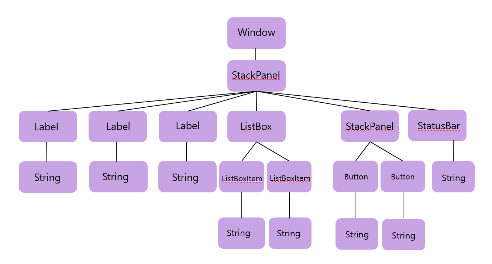

# Chapter03. WPF에서 새롭게 소개되는 중요한 개념들
## 의존 프로퍼티
- WPF에서 사용자 인터페이스는 로지컬 트리(logical tree)라는 객체의 계층구조에 의해 만들어짐
- 윈도우 엘리먼트는 스택패널을 자식 엘리먼트로 가지고 있음 
- 스택패널은 단순한 컨트롤들과 두 개의 버튼을 가진 또 다른 스택패널을 자식 엘리먼트로 포함하는 계층적 구조 
```XAML
<Window x:Class="WpfApplication2.MainWindow"
        xmlns="http://schemas.microsoft.com/winfx/2006/xaml/presentation"
        xmlns:x="http://schemas.microsoft.com/winfx/2006/xaml"
        xmlns:d="http://schemas.microsoft.com/expression/blend/2008"
        xmlns:mc="http://schemas.openxmlformats.org/markup-compatibility/2006"
        xmlns:local="clr-namespace:WpfApplication2"
        mc:Ignorable="d"
        Title="About WPF Unleashed" SizeToContent="WidthAndHeight" Background="OrangeRed" Height="350" Width="525">
    <StackPanel>
        <Label FontWeight="Bold" FontSize="20" Foreground="White">
            WPF Unleashed (Version 3.0)
        </Label>
        <Label>ⓒ 2006 SAMS Publishing</Label>
        <Label>Installed Chapters:</Label>
        <ListBox>
            <ListBoxItem>Chapter1</ListBoxItem>
            <ListBoxItem>Chapter2</ListBoxItem>
        </ListBox>
        <StackPanel Orientation="Horizontal" HorizontalAlignment="Center">
            <Button MinWidth="75" Margin="10">Help</Button>
            <Button MinWidth="75" Margin="10">OK</Button>
        </StackPanel>
        <StatusBar>You have successfully registered this product.</StatusBar>
    </StackPanel>
</Window>
```
- 로지컬 트리



- 로지컬 트리는 실제 프로그램에서 사용하는 프로퍼티나 이벤트, 리소스를 포함한 모든 것들과 관련이 있음.
- 로지컬 트리와 유사한 개념이 **비주얼 트리**
- 비주얼 트리: 로지컬 트리의 확장
  - 로지컬 트리의 각 노드들은 핵심적 배주얼 컴포넌트로 다시 분해됨
  - 비주얼 트리는 각 엘리먼트의 내부를 비주얼한 구현 단위로 다시 표현함
  - ex)리스트박스 = 하나의 컨트롤, 그러나 리스트박스는 한 개의 Border, 두 개의 스크롤바 등 기초적인 엘리먼트의 조합으로 구성됨
  - System.Windows.Media.Visual 이나  System.Windows.Media.Visual3D에서 파생된 엘리먼트들만 비주얼 트리에 나타남
  - 리스트박스가 두 개의 스크롤바를 갖거나 각 라벨이 Border를 갖고 있음
  - 비주얼 트리는 WPF에 포함된 엘리먼트의 내부 구조를 심층적으로 엿볼 수 있게 해줌 -> 놀랄만큼 내용이 복잡함

- System.Windows.LogicalTreeHelper와 System.Windows.Media.VisualTreeHelper를 이용 시 로지컬 트리와 비주얼 트리를 쉽게 이해 가능함.
- **코드 비하인드 파일**
```C#
 public partial class AboutDialog : Window
    {
        public AboutDialog()
        {
            InitializeComponent();
            PrintLogicalTree(0, this);
        }

        protected override void OnContentRendered(EventArgs e)
        {
            base.OnContentRendered(e);
            PrintViusalTree(0, this);
        }

        //protected override void OnContentRendered(EventArgs e)
        //{
        //    base.OnContentRendered(e);
        //    PrintViusalTree(0, this);
        //}

        void PrintLogicalTree(int depth, object obj)
        {
            //계층 구조의 깊이를 표현하기 위해 빈 공간을 가진 객체를 찍음
            Debug.WriteLine(new string(' ', depth) + obj);
            //가끔 마지막 엘리먼트가 문자열처럼 DependencyObjects가 아니라면
            if (!(obj is DependencyObject)) return;

            foreach (object child in LogicalTreeHelper.GetChildren(obj as DependencyObject))
                PrintLogicalTree(depth + 1, child);    
        }

        void Print(VisualTree(int depth, DependencyObject obj)
        {
            Debug.WriteLine(new string(' ', depth) + obj);

            for (int i = 0; i < (VisualTreeHelper.GetChildrenCount(obj); i++)
                PrintVisualTree(depth + 1, (VisualTreeHelper.GetChild(obj, i));
        }

    }
```
- 로지컬 트리가 프로그램 대화상자의 윈도우(AboutDialog) 엘리먼트의 생성자 안에서 실행됨
- 비주얼 트리는 적어도 한 번은 윈도우 객체의 화면배치가 끝날 때까지는 비어있음


- WPF: **의존 프로퍼티** 라는 새로운 개념 소개
    - 스타일링, 자동 데이터 바인딩, 애니메이션 등 많은 부분에 사용됨

- 의존 프로퍼티는 사용되는 시점에 프로퍼티의 값을 결정하기 이해 다중 프로바이더를 사용함
- 프로바이더들: 연속적으로 값이 변경되는 애니메이션이나 자식 엘리먼트로 값이 상속되는 부모 엘리먼트일 수 있음
- 의존 프로퍼티의 가장 큰 특징: 변경통보(change notification)라는 내장 기능이 있음

- 일반 프로퍼티에 인지 기능을 추가한 이유: 선언만으로 풍부한 기능을 사용할 수 있도록 하기 위해서 
- WPF가 선언 프로그래밍을 할 수 있는 가장 큰 이유: 프로퍼티를 다양하게 사용 가능하기 때문에
- 프로퍼티는 XAML을 직접 작성하든, 디자인 도구를 사용하든 관계없이 프로그래밍 코드를 사용하지 않고 
  값을 쉽게 설정가능하도록 함
- 의존 프로퍼티의 추라적 도움이 없다면 코드를 추가하지 않고는 원하는 결과를 얻기 어려움

- 의존 프로퍼티가 평범한 닷넷 프로퍼티에 값을 추가하는 몇 가지 방법이 있음
    - 변경 통보
    - 프로퍼티 값 상속
    - 다중 프로바이더 지원
- 사용자 지정 컨트롤을 만드는 개발자들은 의존 프로퍼티의 미묘한 차이점 대부분을 알아야 함
- 일반 개발자들도 의존 프로퍼티가 무엇이고 어떻게 동작하는지 정도는 알 필요가 있음

### 의존 프로퍼티의 구현
- 의존 프로퍼티는 WPF 기반에서 사용될 때의 특징을 제외하고는 보통 닷넷 프로퍼티와 동일함, 모두 WPF의 API를 통해서 실행됨
- 어떤 닷넷 언어도 의존 프로퍼티를 기본적으로 지원하지 않음 -> 별도로 구현해야 함

```C#
public class Button : ButtonBase
    {
        //의존 프로퍼티
        public static readonly DependencyProperty IsDefaultProperty;

        static Button()
        {
            //프로퍼티를 등록
            //예제 버튼에 사용할 프로퍼티는 IsDefault
            //bool 타입으로 등록함
            Button.IsDefaultProperty = DependencyProperty.Register("IsDefault", typeof(bool),
                typeof(Button), new FrameworkPropertyMetadata(false,
                new PropertyChangedCallback(OnIsDefaultChanged)));
            //의존 프로퍼티에 기본 값으로 false로 설정하거나 변경통보를 위한 델리게이트를 추가하기 위해서
            //스태틱 생성자 안에서 오버로드된 Register 메소드를 호출함
            ...

        }

        //닷넷 프로퍼티 래퍼(선택사항)
        public bool IsDefault
        {
            get { return (bool)GetValue(Button.IsDefaultProperty);}
            set { SetValue(Button.IsDefaultProperty, value); }
        }

        // 프로퍼티가 변경될 떄 호출되는 콜백 메소드
        private static void OnIsDefaultChanged(
            DependencyObject o, DependencyPropertyChangedEventArgs e)
        {...}
    }
```

- IsDefaultProperty 멤버 변수는 System.Windows.DependencyProperty 타입의 실제 의존 프로퍼티
- 관습적으로 모든 DependencyProperty 변수는 public, static 속성, Property 접미사가 붙음 
    - DependencyProperty.Register 메소드를 통해서 등록됨
    - 이 메소드는 기본적으로 프로퍼티 이름, 프로퍼티 타입, 의존 프로퍼티를 사용하려는 클래스 타입이 필요함
    - 다른 오버로드 메소드를 사용할 경우, 메타데이터를 추가 가능함.
    - 메타데이터는 프로퍼티가 어떻게 처리될 지 사용자가 지정 가능, 콜백 메소드를 통해 프로퍼티 값을 변경, 강제 할당, 유효성 평가 등을 할 수 있음

- System.Windows.DependencyObject에서 상속받은 GetValue와 SetValue 메소드를 통해 의존 프로퍼티에 접근할 수 있는 IsDefault라는 프로퍼티가 구현됨

- **프로퍼티 래퍼(Property wrapper):**
    - IsDefaultProperty같은 프로퍼티
    - 실제 의존 프로퍼티를 래핑하고 있다는 의미임
    - 항상 필요한 것은 아님
- 버튼을 사용할 때마다, public 속성의 GetValue/SetValue 메소드를 통해 직접 접근 가능, 그러나 프로퍼티를 사용하는 것이 프로그램 측면에서 
  사용자들에게 자연스러움, XAML은 프로퍼티를 통해 값을 설정 
- GetValue와 SetValue는 내부적으로 부족한 저장 시스템을 효과적으로 사용
- IsDefaultProperty가 인스턴스 변수가 아니라 스태틱 변수 -> 의존 프로퍼티를 구현 -> 일반적인 닷넷 프로퍼티와 비교 시 상당한 메모리 절약 효과가 있음

- 의존 프로퍼티 구현의 장점: 
    - 메모리의 효과적인 사용
    - 스레드 접근이나 다시 렌더링되어야 하는 엘리먼트를 알려주는 지시자 등
    - 체크해야 할 많은 코드를 집중화 및 표준화가 가능함
    
### 변경 통보
- 의존 프로퍼티의 값이 변경될 떄마다, WPF는 프로퍼티의 메타 데이터에 의존 -> 변경 내용을 자동을 통지함
- 이 과정: 엘리먼트를 적절하게 다시 렌더링, 화면 배치를 갱신, 데이터 바인딩을 새로고침 --> 많은 처리를 가능하게 해줌
- 내장된 변경 통보를 통해 가능한 것: **프로퍼티 트리거** 

**프로퍼티 트리거:**
- 프로퍼티 변경 시, 프로그래밍 코드를 다시 작성하지 않아도 사용자가 지정하는 처리(custom logic)을 가능하게 함

```XAML
<Button MouseEnter="Button_MouseEnter" MouseLeave="Button_MouseLeave"
        MinWidth="75" Margin="10">Help</Button>
<Button MouseEnter="Button_MouseEnter" MouseLeave="Button_MouseLeave"
        MinWidth="75" Margin="10">OK</Button>
```

- C#의 코드비하인트 파일에서 두 개의 이벤트 처리기를 처리함
```C#
 //마우스가 버튼에 올려졌을 때 전면색이 파란색으로 변함
        void Button_MouseEnter(object sender, MouseEventArgs e)
        {
            Button b = sender as Button;
            if (b != null) b.Foreground = Brushes.Blue;
        }

        void Button_MouseLeave(object sender, MouseEventArgs e)
        {
            Button b = sender as Button;
            if (b != null) b.Foreground = Brushes.Black;
        }
```
- 프로퍼티 트리거를 이용하면 복잡한 코딩 없이 XAML만으로 쉽게 처리 가능
- 간단한 Trigger 객체만 있으면 다 처리됨
```XAML
    <Trigger Property="IsMouseOver" Value="True"></Trigger>
    <Trigger Property="Foreground" Value="Blue"></Trigger>
```
- 이 프로퍼티 트리거는 버튼의 IsMouseOver 프로퍼티 값이 true가 되면 동시에 MouseEvent가 일어남
- false가 되면 MouseLeave 이벤트가 일어남
- IsMouseOver 값이 false가 되면 Foreground를 검정색으로 되돌리는 문제는 내부에서 처리됨

- 프로퍼티 트리거는 WPF에서 지원되는 트리거의 세 가지 형태 중 하나
- **데이터 트리거**
- **이벤트 트리거**
   라우티드 이벤트와 밀접한 관계가 있음
   특정 처리를 선언만으로 가능하게 해줌, 애니메이션이나 사운드를 처리할 경우에 반드시 사용됨

### 프로퍼티 값 상속
- 프로퍼티 값 상속: 전통적인 객체 지향 클래스에서 말하는 상속의 개념이 아님
    - 엘리먼트 트리 구조에서 프로퍼티의 값이 하위 엘리먼트로 상속된다는 의미임.
    ```C#
    <Window x:Class="WpfApplication3.MainWindow"
        xmlns="http://schemas.microsoft.com/winfx/2006/xaml/presentation"
        xmlns:x="http://schemas.microsoft.com/winfx/2006/xaml"
        xmlns:d="http://schemas.microsoft.com/expression/blend/2008"
        xmlns:mc="http://schemas.openxmlformats.org/markup-compatibility/2006"
        xmlns:local="clr-namespace:WpfApplication3"
        mc:Ignorable="d" 
        SizeToContent="WidthAndHeight"
        FontSize="30" FontStyle="Italic"
        Background="OrangeRed"
        Title="MainWindow" >
    <Grid>
        <StackPanel>
            <Label FontWeight="Bold" FontSize="20" Foreground="White">
                WPF Unleashed (Version 3.0)
            </Label>
            <Label>ⓒ 2006 SAMS Publishing</Label>
            <Label>Installed Chapers:</Label>
            <ListBox>
                <ListBoxItem>Chapter 1</ListBoxItem>
                <ListBoxItem>Chapter 2</ListBoxItem>
            </ListBox>
            <StackPanel Orientation="Horizontal" HorizontalAlignment="Center">
                <Button MinWidth="75" Margin="10">Help</Button>
                <Button MinWidth="75" Margin="10">OK</Button>
            </StackPanel>
            <StatusBar>
                You have successfully registered this product.
            </StatusBar>
        </StackPanel>
    </Grid>
</Window>
```
- 두 프로퍼티는 트리 구조상 하위로 전달됨, 대부분 자식 엘리먼트에게 상속됨
- 첫 번째 라벨의 경우 폰트사이즈가 30으로 상속됨, 그러나 명시적으로 20이라고 설정하면 값이 변하지 않음
- 폰트스타일의 Italic 속성은 모든 라벨과 리스트박스 아이템 그리고 버튼에 영향을 미침
    - 이유: 하위 엘리먼트에 명시적으로 폰트스타일을 설정한 것이 없음(끊어지지 않고 유기적으로 영향을 받음)
- StatusBar 컨트롤은 다른 컨트롤처럼 이 두 속성을 지원함, 그러나 어떤 영향도 받지 않음(이 아이만 특히 글씨가 작음)
    - 그 이유: 프로퍼티 값 상속은 두 가지 이유로 미묘한 차이가 있을 수 있음
        - 1. 모든 의존 프로퍼티가 프로퍼티 값 상속에 참여하는 것 아님(내부적인 처리과정을 살펴보면 의존 프로퍼티는 DependencyProperty.Register 메소드의 메타데이터가
             FrameworkProperty.MetadataOptions.Inherits일 때만 상속에 최적화됨)
        - 2. 프로퍼티에 더 높은 우선순위의 값들이 있는 경우


### 다중 프로바이더 지원
- WPF에는 의존 프로퍼티를 설정하기 위한 독립적이고 강력한 여러 처리과정이 있음 
- 이런 과정을 **프로퍼티 값 프로바이더**라고 함
- 프로바이더들이 잘 정의되어 있지 않으면, 시스템은 정확한 값을 처리하는 데 다소 혼동될 것, 프로퍼티들은 정확한 값을 갖고 있다고 단정하기가 쉽지 않을 것임.

**의존 프로퍼티 값을 알아내기 위한 처리과정 절차**
프로퍼티 값 처리 기준 설정 -> 표현식 전환 -> 애니메이션 적용 -> 강제 설정 -> 유효성 검사
- 1 단계: 프로퍼티 값 처리 기준 결정
대부분의 프로퍼티 값 프로바이더들은 순서가 있는 처리 기준을 이용함.

**대부분의 의존 프로퍼티를 설정할 수 있는 대표적인 프로바이더**
1. 로컬 값 설정
2. 스타일 트리거
3. 템플릿 트리거
4. 스타일 세터
5. 테마 스타일 트리거
6. 테마 스타일 세터
7. 프로퍼티 값 상속
8. 기본 값

**로컬 값 설정:**
- DependencyObject.SetValue 메소드 호출을 의미함
- 실제로는 XAML이나 프로그래밍 코드에서 단순히 프로퍼티를 설정하는 것과 크게 다를 바 없음
- 의존 프로퍼티는 Button.IsDefault를 설정하는 것과 동일한 방식으로 구현됨
- **기본 값:** 가장 우선순위가 낮고 초기에 이미 값이 등록되었다는 것을 의미함. 뭐라는 지 모르겟따 

- 2 단계: 표현식 전환
- 3 단계: 애니메이션 적용
- 4 단계: 강제 설정
- 5 단계: 유효성 검사


### 첨부 프로퍼티

## 라우티드 이벤트
### 라우티드 이벤트 구현
### 라우팅 전략과 이벤트 처리
### 동작 중인 라우티드 이벤트
### 첨부 이벤트

## 명령어
### 내장 명령어
### 입력 행위로 명령어 실행하기
### 내장 명령어 바인딩을 가진 컨트롤들

## 클래스 계층구조 여행하기
## 결론
