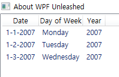

# Chapter04. WPF에서 새롭게 소개되는 중요한 개념들
## 컨텐트 컨트롤
- 오직 하나의 아이템만 갖도록 제한된 단순한 컨트롤
- 이 컨트롤들은 모두 System.Windows.Controls.ContentControl에서 파생됨

- 이 프로퍼티는 어떤 객체도 가질 수 있음 -> 중복된 객체의 트리 구조도 포함 가능, 그러나... 하위의 자식 컨트롤은 하나만 가질 수 있음
- ContentControl 클래스는 컨텐트 프로퍼티 뿐만 아니라 불리언 타입의 HasContent 프로퍼티도 갖고 있음.
- 이 프로퍼티는 컨텐트 프로퍼티가 널일 경우 false를 반환, 그렇지 않으면 true를 반환

### 버튼
- UI에 사용되는 컨트롤 중 가장 익숙하고 많이 사용됨

- 기본적인 버튼은 단순 클릭만 가능하고, 더블클릭은 불가능함

- 실제 버튼들의 정의: 버튼베이스(ButtonBase)라는 추상클래스에 있음
  
    - 클릭 이벤트뿐만 아니라 이 이벤트와 동일한 역할을 하는 로직을 함께 가짐
    
- 눌려진 상태에서 어떤 작업을 처리하기 원할 때 사용하는 IsPressed 라는 불리언 타입의 프로퍼티를 정의하고 있음

- 가장 흥미로운 것: 클릭모드 프로퍼티
    - 이 프로퍼티는 이벤트 발생 시, 더 세밀한 처리를 위해 ClickMode 열거형을 사용하여 값을 설정함.
    - 열거형의 값: Release(기본값), Press, Hover
    - 의미상: 버튼을 누르는 것=클릭하는 것
    
- 버튼 클래스의 자식 컨트롤
    - Button
    - RepeatButton
    - ToggleButton
    - CheckBox
    - RadioButton
**버튼**
    
- WPF의 버튼 클래스는 버튼 클래스의 기능 확장 -> 취소 버튼, 기본 버튼 기능을 추가함

- -> 대화상자의 단축키를 편리하게 사용하도록 함

- 대화상자 버튼에서 Button.IsCancel을 true로 설정하면 윈도우 클래스는 자동으로 DialogResult프로퍼티를 false로 설정하고 닫힘

**리피트버튼**

- 버튼과 기능이 거의 유사

- 차이점: 눌려있는 동안 계속해서 클릭 이벤트가 발생함

- 클릭 이벤트가 일어나는 빈도 수는 리피트버튼의 Delay와 Interval 프로퍼티로 조정

- 기본 값은 SystemParameters.KeyboardDelay와 SystemParameters.KeyboardSpeed임

- 버튼 누를 때마다 일정하게 증가 또는 감소를 표현하는 데 유용함

**토글버튼**
- 버튼의 취소 버튼과 기본 버튼 기능이 없음 -> 클릭했을 때 상태를유지할 수 있는 접착성 강한 버튼
- 처음 클릭하면 IsChecked 프로퍼티가 true가 되고 다시 클릭 시 false가 됨
- 토글 버튼은 IsThreeState 프로퍼티를 가짐 
    - 이 프로퍼티가 true로 설정될 경우, IsChecked 프로퍼티는 널 값이 추가됨
    - 본래 IsChecked 프로퍼티는 Nullable<Boolean> 타입
    - 첫 클릭 시 true(Checked 이벤트 발생), 두 번째는 null(Indeterminate 이벤트 발생), 세 번쨰는 false(Unchecked 이벤트 발생) 순으로 순회
- IsCheckedChanged라는 하나의 이벤트 처리기만 정의함

**체크박스**
- **체크박스 특징들**
    - 한 개의 컨텐트만 가질 수 있음 (표면적으로)
    - 마우스나 키보드에서 발생하는 클릭의 개념을 사용함
    - 클릭 시 checked나 unchecked의 상태를 유지함
    - 토글버튼처럼 checked/indeterminate/unchecked의 세 가지 상태 모드를 지원함
    - 토글 버튼의 모양만 바꾼 것, 토글 버튼에서 파생됨
**라디오 버튼**
- 토글 버튼에서 파생된 또 다른 컨트롤
- 다른 점: 
    - 상호배제(mutual exclusion)을 지원하는 내장 기능이 있음
- 여러 개의 라디오 버튼을 하나의 그룹으로 묶으면 단 하나만 선택 가능함
- 한 번 체크되면 원상 복구가 불가능 -> 프로그래밍 코드로만 가능
- 다수의 라디오 버튼을 동일한 그룹 내에 두는 것은 생각보다 간단함
```XAML
<StackPanel>
    <RadioButton>Option 1</RadioButton>
    <RadioButton>Option 2</RadioButton>
    <RadioButton>Option 3</RadioButton>
</StackPanel>
```

- 라디오 버튼을 사용자가 지정하는 방식을 사용해서 그룹화하려면,
  그룹네임 프로퍼티에 동일한 이름을 설정하면 됨 
- 로지컬 트리의 루트 엘리먼트 아래 있고, 그룹 이름이 동일하면 부모 엘리먼트가 달라도
  어디에 있든지 동일한 그룹으로 묶임

```XAML
<StackPanel>
 <StackPanel>
    <RadioButton GroupName="A">Option 1</RadioButton>
    <RadioButton GroupName="A">Option 2</RadioButton>
 </StackPanel>
 <StackPanel>
    <RadioButton GroupName="A">Option 3</RadioButton>
 </StackPanel>
</StackPanel>
```
- 동일한 부모 엘리먼트에서 다른 그룹으로 묶을 수 있음
```XAML
<StackPanel>
    <RadioButton GroupName="A">Option 1</RadioButton>
    <RadioButton GroupName="A">Option 2</RadioButton>
    <RadioButton GroupName="B">A Different Option 1</RadioButton>
    <RadioButton GroupName="B">A Different Option 2</RadioButton>
</StackPanel>
```
### 단순 컨테이너
- 버튼처럼 클릭한다는 개념이 없는 내장 컨트롤이 있음

**라벨**
- 텍스트를 보여주는 곳에 사용하는 아주 익숙한 컨트롤
- 어떤 객체도 포함가능한 컨텐트 컨트롤이지만, 일반적으로 텍스트를 표현하는 데 유용함
- 유일하게 액세스 키를 지원함
- 액세스 키를 이용하여 라벨의 텍스트 중 한 글자에 특정 처리를 하도록 설정 가능함
- 사용자가 Alt키+특정 지정 문자 누름 -> 지정된 동작 실행함
- 윈도우에서는 원하는 글자 앞에 언더스코어 사용 -> 간단하게 지정, 라벨의 Target 프로퍼티를 설정하면 됨

- 라벨의 액세스키를 사용하는 일반적인 경우: 텍스트박스에 포커스가 가도록 하는 것
```XAML
<Label Target="{Binding ElementName=userNameBox}">_User Name:</Label>
<TextBox x:Name="userNameBox"/>
```

**툴팁**
- 툴팁 컨트롤은 이 컨트롤과 연결된 컨트롤에 마우스 올리면 나타나고 내리면 사라지는 플로팅 박스(floating box)를 가짐
```XAML
<Button>
    OK
    <Button.ToolTip>
        <ToolTip>
            Clicking this will submit your request.
        </ToolTip>
    </Button.ToolTip>
</Button>
```
- 툴팁 컨트롤은 다른 엘리먼트처럼 UI 엘리먼트의 트리 구조상에서 독립적으로 자리잡을 수 없음
- 대신, FrameworkElement와 FrameworkContentElement 클래스에 정의된 툴팁 프로퍼티를 설정해서 사용함

```XAML
    <CheckBox>
        CheckBox
        <CheckBox.ToolTip>
            <StackPanel>
                <Label FontWeight="Bold" Background="Blue" Foreground="White">
                    The CheckBox
                </Label>
                <TextBlock Padding="10" TextWrapping="WrapWithOverflow" Width="200">
                    CheckBox is a familiar control. But in WPF, it's not much
                    more than a ToggleButton styled differently!
                </TextBlock>
                <Line Stroke="Black" StrokeThickness="1" X2="200"/>
                <StackPanel Orientation="Horizontal">
                    <Image Margin="2" Source="help.gif"/>
                    <Label FontWeight="Bold">Press F1 for more help.</Label>
                </StackPanel>
            </StackPanel>
        </CheckBox.ToolTip>
    </CheckBox>
```

- 툴팁은 나타났다 사라지는 효과를 사용자가 조절할 수 있도록 Open과 Closed 이벤트를 정의함
- ToolTipService 클래스는 툴팁 컨트롤 자체보다는 툴팁을 사용하려는 엘리먼트에 적용할 수 있도록 첨부 프로퍼티를 정의함
- 툴팁과 동일한 프로퍼티를 포함할 뿐만 아니라 더 다양한 프로퍼티 가짐, 이 프로퍼티들은 이름이 동일한 툴팁의 프로퍼티보다 우선순위가 높음

**프레임**
- 프레임 컨트롤은 다른 컨텐트 컨트롤처럼 어떤 엘리먼트도 가질 수 있음.
- UI의 나머지 부분과 이 컨텐트는 분리됨
- 프레임 컨트롤의 장점: WPF뿐만 아니라 HTML의 컨텐트도 처리 가능함
- 프레임 컨트롤은 어떤 HTML이나 XAML 페이지도 값으로 설정할 수 있는 System.Uri 타입의 소스 프로퍼티를 갖고 있음
`<Frame Source="http://www.pinvoke.net">`
- HTML과 XAML에 모두 적용 가능한 탐색 추적 기능을 내부적으로 지원함

### 헤더를 가진 컨테이너
- 버튼 크롬이나 체크박스처럼 매우 단순한 모양의 엘리먼트를 추가하거나 때론 어떤 것도 추가하지 않았음.
**그룹박스**
- 컨트롤을 조직화할 수 있는 컨트롤
```XAML
 <GroupBox Header="Grammar">
        <StackPanel>
            <CheckBox>Check grammar as you type</CheckBox>
            <CheckBox>Hide grammatical errors in this document</CheckBox>
            <CheckBox>Check grammar with spelling</CheckBox>
        </StackPanel>
    </GroupBox>
```


- 컨텐트 프로퍼티처럼, 헤더 프로퍼티는 Object 타입이므로 다양한 객체를 가질 수 있고
- 이 객체가 UIElement에서 파생된 것이라면 본래 모습대로 렌더링될 것
- 버튼을 헤더 프로퍼티에 설정하면 이렇게 됨
```XAML
<GroupBox>
        <GroupBox.Header>
            <Button>Grammar</Button>
        </GroupBox.Header>
        <StackPanel>
            <CheckBox>Check grammar as you type</CheckBox>
            <CheckBox>Hide grammatical errors in this document</CheckBox>
            <CheckBox>Check grammar with spelling</CheckBox>
        </StackPanel>
    </GroupBox>
```


**익스팬더**
- 익스팬더 컨트롤: 윈폼 같은 Win32 기반에서 제공하지 않는 흥미로운 컨트롤
- 내부 내용을 접었다 폈다 할 수 있는 기능이 추가되어 있음
- XAML에서 그룹박스 컨트롤을 익스팬더 컨트롤로 변경했음

```XAML
<Expander Header="Grammar">
        <StackPanel>
            <CheckBox>Check grammar as you type</CheckBox>
            <CheckBox>Hide grammatical errors in this document</CheckBox>
            <CheckBox>Check grammar with spelling</CheckBox>
        </StackPanel>
</Expander>
```


## 아이템즈 컨트롤
- 아이템즈 컨트롤: WPF 컨트롤의 또 다른 메인 컨트롤
- 아이템의 컬렉션을 갖도록 설계됨
- ContentControl 클래스처럼 Control의 하위 클래스인 ItemsControl 클래스에서 파생됨
- ItemsControl은 ItemCollection 타입의 Items 프로퍼티에 자신의 내용을 저장함

```XAML
<ListBox xmlns:sys="clr-namespace:System;assembly=mscorlib">
        <Button>Button</Button>
        <Expander Header="Expander"/>
        <sys:DateTime>1/1/2007</sys:DateTime>
        <sys:DateTime>1/2/2007</sys:DateTime>
        <sys:DateTime>1/3/2007</sys:DateTime>
</ListBox>
```

- 버튼과 익스팬더 컨트롤은 모두 UIElement를 상속받음 
  -> 보았던 것과 동일하게 처리됨, 갖고 있는 기능 대부분을 정상적으로 사용 가능함
- Items 프로퍼티는 읽기 전용
    - 초기화될 때, 빈 컬렉션에 객체를 추가하거나 제거할 수 있음
    - 다른 컬렉션을 가리키도록 할 수 없음

- ItemsControl 클래스는 이미 존재하는 임의의 컬렉션, 자신의 Items프로퍼티를 채울 수 있는 별도의 프로퍼티를 갖고 있음

**ItemsControl이 가지고 있는 유용한 프로퍼티들**
- HasItems
    - XAML에서 선언된 컨트롤의 상태를 쉽게 파악할 수 있는 읽기전용의 불리언 타입 프로퍼티
- IsGrouping
    - 컨트롤의 아이템들이 최상위 그룹으로 분리가 가능한지 여부를 알려주는 불리언 타입의 일기 전용 프로퍼틴
- DisplayMemberPath
    - 복잡한 표현식이나 각 항목이 어떻게 렌더링될지 여부를 지정할 수 있는 문자열 프로퍼티

```XAML
<ListBox xmlns:sys="clr-namespace:System;assembly=mscorlib"
             DisplayMemberPath="DayOfWeek">
        <Button>Button</Button>
        <Expander Header="Expander"/>
        <sys:DateTime>1/1/2007</sys:DateTime>
        <sys:DateTime>1/2/2007</sys:DateTime>
        <sys:DateTime>1/3/2007</sys:DateTime>
</ListBox>
```


### 셀렉터
- 인덱싱된 아이템들을 가진 컨트롤
- ItemsControl에서 파생된 셀렉터 클래스는 선택 처리를 할 수 있도록 프로퍼티들을 추가했음
**세 개의 프로퍼티**
- SelectedIndex:
    - 아이템은 인덱스가 0부터 시작함
    - 아이템이 컬렉션에 추가될 때마다 순서대로 값이 설정됨.
- SelectedItem:
    - 현재 선택된 실제 아이템의 인스턴스
- SelectedValue:
    - 현재 선택된 아이템의 값.
    - 기본적으로 아이템 그 자체를 값으로 처리함 
    - SelectedValue프로퍼티는 SelectedItem과 동일

세 가지 프로퍼티는 모두 읽기/쓰기가 가능 -> 현재의 선택 항목을 변경하고 값을 재설정 가능함.
셀렉터 컨트롤은 개별 아이템마다 적용 가능한 두 개의 첨부 프로퍼티를 지원함
- IsSelected: 아이템의 선택 여부나 아이템의 현재 선택 상태를 가져오는 불리언 타입의 프로퍼티
- IsSelectionActive: 현재 선택 아이템에 포커스가 있는지를 알려주는 읽기 전용의 불리언 타입 프로퍼티

셀렉터 컨트롤은 SelectionChanged라는 이벤트를 정의
현재 선택 상태에 변화가 있는지를 알 수 있게 함

WPF에 있는 Selector로부터 파생된 네 개의 컨트롤
- 콤보박스
- 리스트박스
- 리스트뷰
- 탭컨트롤


**콤보박스**
- 사용자들에게 목록에서 한 항목을 선택할 수 있게 해줌
- 이 컨트롤의 선택상자에서는 선택된 현재 아이템만 보여줌, 나머지는 요구가 있을 때만 보여줌

**사용자 지정 선택상자**
- 콤보박스: 사용자가 선택 상자에 임의의 텍스트를 입력할 수 있는 모드를 지원
- 텍스트가 목록에 있음 -> 자동으로 선택됨
- 텍스트가 목록에 없음 -> 어떤 아이템도 선택이 안 됨, 사용자가 타이핑한 텍스트는 콤보박스의 Text 프로퍼티에 저장됨 -> 적절할 때, 이용가능하게 됨
- IsEditable과 IsReadOnly 프로퍼티를 통해 기능 조절, 기본값은 false
- StaysOpenOnEdit 프로퍼티는 사용자가 선택박스 클릭해서 펼침 목록이 열린 상태에서만 true값을 가짐

**콤보박스의 IsEditable과 IsReadOnly프로퍼티의 차이점**

| IsEditable | IsReadOnly | 의미                                                         |
| ---------- | ---------- | ------------------------------------------------------------ |
| false      | false      | 선택 상자는 선택된 항목을 보여주긴 함, 그러나 어떤 텍스트도 입력 불가 |
| false      | true       | 위와 동일                                                    |
| true       | false      | 선택 상자는 선택된 항목을 텍스트로 보여줌, 임의의 텍스트를 입력 가능함 |
| true       | true       | 선택된 항목의 텍스트를 보여주고 어떤 텍스트도 입력 불가능    |


```XAML
<ComboBox>
        <StackPanel Orientation="Horizontal" Margin="5">
            <Image Source="CurtainCall.PNG"/>
            <StackPanel Width="200">
                <TextBlock Margin="5,0" FontSize="14" FontWeight="Bold"
                           VerticalAlignment="center">Curtain Call</TextBlock>
                <TextBlock Margin="5" TextWrapping="Wrap" VerticalAlignment="center">
                    Whimsical, with a red curtain background that represents a stage.
                </TextBlock>
            </StackPanel>
        </StackPanel>
        <StackPanel Orientation="Horizontal" Margin="5">
            <Image Source="firework.PNG"/>
            <StackPanel Width="200">
                <TextBlock Margin="5,0" FontSize="14" FontWeight="Bold"
                           VerticalAlignment="center">Fireworks</TextBlock>
                <TextBlock Margin="5" VerticalAlignment="center" TextWrapping="Wrap">
                    Sleek, with a black sky containing fireworks. When you need to 
                    celebrate PowerPoint-style, this design is for you!
                </TextBlock>
            </StackPanel>     
        </StackPanel>
    </ComboBox>
```
- 선택 상자에서 System.Windows.Controls.StackPanel이라는 타입 이름이 아이템의 이름으로 사용되는 것이 어색함
    -> TextSearch클래스를 이용해서 이름 변경 가능함
- TextSearch 클래스는 편집 가능한 선택 상자에 나타나는 텍스트를 쉽게 조절가능한 두 개의 첨부 프로퍼티를 정의하고 있음
- TextSearch의 Text첨부 프로퍼티는 융통성이 있음.
- TextSearch.Text에 원하는 텍스트를 추가하기만 하면 됨
- TextSearch.TextPath를 사용하면서 동시에 각 아이템마다 TextSearch.Text를 사용 가능함

**콤보박스 아이템**
- 콤보박스는 암시적으로 콤보박스아이템 객체에 아이템을 배치함
- 각 아이템의 비주얼 트리를 살펴보려 한다면 프로그래밍 코드를 작성해야 함
- TextSearch.Text 첨부 프로퍼티를 사용한다면 스택 패널이 가장 바깥쪽 엘리먼트가 아님 
  -> 그 프로퍼티를 콤보박스아이템 엘리먼트로 옮길 필요가 있음.
- 엘리먼트의 구조가 변경되므로 TextSearch.TextPath의 값을 Content.Children[1].Children[0].Text로 변경해야 함

**리스트박스**
- 콤보박스만큼 친숙한 리스트박스는 아이템들이 보여지는 방식만 다름, 거의 유사한 컨트롤
- 기본적으로 모든 아이템 보여줌, 아이템이 많을 경우 스크롤이 생김
- 리스트박스의 가장 중요한 특징: SelectionMode 프로퍼티를 통해 동시에 복수의 선택이 가능하다
    - SelectionMode 열거형을 통해 세 가지 상태의 값을 가짐
    - Single(기본값): 콤보박스처럼 한 번에 하나만 선택 가능함.
    - Multiple: 동시에 여러 아이템을 선택 가능함. 선택되지 않은 항목 클릭 시, 리스트박스의 SelectedItems 컬렉션에 추가됨
    - Extended: 다수의 아이템을 선택할 수 있지만, 하나를 선택하는 경우에 적합함.
- 리스트박스도 리스트박스아이템 클래스를 가지고 있음
- 콤보박스아이템은 리스트박스아이템에서 파생됨, IsSelected 프로퍼티와 Selected/Unselected 이벤트를 가지고 있음 
  -> 유용하게 사용 가능함

**리스트뷰**
- 리스트박스에서 파생한 리스트뷰 컨트롤은 SelectionMode 프로퍼티의 기본값이 Extended라는 것을 제외하면 리스트박스와 다른 점이 없음
- 리스트뷰는 뷰 프로퍼티를 추가 -> 사용자 지정 ItemsPanel을 선택하는 것보다 더 다양한 방법으로 표현할 수 있게 해줌
- 뷰 프로퍼티: ViewBase타입 - ViewBase는 추상 클래스
- WPF는 그리드뷰라는 컨트롤을 갖고 있음 (원래 WPF의 배타판에서의 이름이 DetailsView 였음)

```XAML
<ListView  xmlns:sys="clr-namespace:System;assembly=mscorlib">
        <ListView.View>
            <GridView>
                <GridViewColumn Header="Date"/>
                <GridViewColumn Header="Day of Week"
                                DisplayMemberBinding="{Binding DayOfWeek}"/>
                <GridViewColumn Header="Year" DisplayMemberBinding="{Binding Year}"/>
            </GridView>
        </ListView.View>
        <sys:DateTime>1/1/2007</sys:DateTime>
        <sys:DateTime>1/2/2007</sys:DateTime>
        <sys:DateTime>1/3/2007</sys:DateTime>
    </ListView>
```


- 리스트뷰를 만드는 XAML코드. mscorlib.dll에 있는 System네임 스페이스를 사용 -> sys라는 접두사를 붙이기로 함
- 그리드뷰는 컬럼의 헤더를 조정가능한 프로퍼티뿐만 아니라 GridViewColumn객체의 컬렉션 정보를 가고 있는 Columns 라는 컨텐트 프로퍼티를 가지고 있음. WPF에는 리스트박스아이템에서 파생한 리스트뷰아이템을 정의하고 있음 
- 그리드뷰는 윈도우 탐색기의 '자세히'보다 더 훌륭한 기능을 자동으로 제공함
  - 컬럼을 드래그&드롭으로 순서 바꿔서 배치 가능
  - 컬럼 구분자를 드래그해서 크기 조절 가능
  - 컬럼 구분자를 더블클릭 시 내용에 맞게 자동으로 크기 조절 가능
- 컬럼의 헤더 클릭 시 자동으로 정렬하는 기능이 없음
- SortDescriptions 프로퍼티 사용 시 컬럼 헤더 클릭해서 아이템 정렬하는 것도 복잡하지 않음
- 컬럼이 어떤 아이템을 기준으로 어떻게 정렬되었는가는 작은 화살표를 수동으로 만들어야 함

**탭컨트롤**
- 여러 페이지 사이를 전환하는 데 유용함
- 탭컨트롤 사이 탭들은 보통 상단에 놓임, Dock타입인 TabScripPlacement 프로퍼티 이용 시 사방으로 배치 가능
- 아이템을 더할수록 분리된 탭이 늘어남
- 내부적으로 탭아이템을 사용함, 지원하지 않는 아이템을 탭컨트롤에 추가하려면 탭아이템으로 명시적으로 처리해야 함
```XAML
<TabControl>
    <TextBlock>Content for Tab 1.</TextBlock>
    <TextBlock>Content for Tab 2.</TextBlock>
    <TextBlock>Content for Tab 3.</TextBlock>
</TabControl>
```


### 메뉴
- 흔히 접하는 메뉴와 컨텍스트메뉴를 내장하고 있음
- 메뉴 컨트롤: 다른 컨트롤보다 더 특별할 것도 없는 단지 아이템들을 계층적인 구조로 보일 수 있게 설계된 아이템즈 컨트롤의 일종
              가장 일반적으로 접하는 컨트롤

**메뉴 컨트롤**
- 회색바탕에 아이템들을 수평으로 배치한 컨트롤
- ItemsControl에서 상속받은 프로퍼티에 IsMainMenu라는 한 개의 프로퍼티만을 더 추가함
- 메뉴 컨트롤은 다른 아이템즈 컨트롤과 동일하게 어떤 객체도 아이템으로 사용 가능, 그러나 메뉴아이템(MenuItem)과 세퍼레이터(Separator) 엘리먼트를 사용함.

```XAML
<Menu>
    <MenuItem Header="_File">
        <MenuItem Header="_New..."/>
        <MenuItem Header="_Open..."/>
        <Separator/>
        <MenuItem Header="Sen_d To">
        <MenuItem Header="Mail Recipient"/>
        <MenuItem Header="My Documents"/>
        </MenuItem>
        <MenuItem Header="_Edit">
            ...
        </MenuItem>
        <MenuItem Header="_View">
            ...
        </MenuItem>
    </MenuItem>
</Menu>
```
- 메뉴 아이템은 HeaderedItemsControl에서 파생된 **헤더를 가진 아이템즈 컨트롤**임.
- 헤더를 가진 컨텐트 컨트롤에 비하면 많은 특징을 가짐
- 세퍼레이터는 메뉴아이템에 있는 단순 컨트롤, 메뉴를 구분하기 위한 수평선으로 렌더링됨
- 메뉴 컨트롤만 보면 단순하지만, 메뉴아이템에서 이루어지므로 이 컨트롤은 다양한 프로퍼티를 가지고 있음
- **사용하기에 유용한 메뉴 아이템의 프로퍼티들**
    - Icon: 헤더와 나란한 위치에 추가되고 임의의 객체도 추가 가능. 아잉콘에 추가된 객체들은 헤더처럼 렌더링되고 메뉴의 특징을 드러내는 작은 이미지를 주로 사용함.
    - IsCheckable: 메뉴아이템을 체크박스처럼 동작가능하게 함
    - InputGestureText: 라벨이 입력장치를 통해서 들어오는 정보와 연결가능하게 함, 이 프로퍼티를 설정하는 것만으로는 메뉴아이템의 단축키를 사용하는 것이 불가능
- 메뉴아이템은 Checked, Unchecked, SubmenuOpened, SubmenuClosed, Click 이벤트를 정의하고 있음
- 메뉴아이템에서는 클릭 이벤트를 처리하는 것이 가장 일반적인 처리를 함, 커맨드 프로퍼티를 통해 특정 명령어로 실행 가능함.

**컨텍스트 메뉴**
- 메뉴 컨트롤처럼 동작, 메뉴 아이템과 세퍼레이터 컨트롤을 포함할 수 있도록 설계된 컨트롤
- 이 컨트롤은 FrameworkElement나 FrameworkContentElement에 있는 ContextMenu 프로퍼티를 통해서만 사용 가능함

### 다른 아이템즈 컨트롤
**트리뷰**
- 접혔다 펼처지는 노드를 가지고 계층적인 데이터를 보여주기 위해 만든 컨트롤

- 트리뷰는 매우 단순한 컨트롤임

- 어떤 아이템도 포함 가능함, 수직 방향으로 아이템을 배치. 그러나 포인트를 잃지 않기 위해 트리뷰아이템으로 아이템들을 래핑함

- 트리뷰아이템도 헤더를 가진 아이템즈 컨트롤 . -> 헤더 프로퍼티는 현재 아이템을 포함함, Items 프로퍼티는 하위 아이템들을 포함하는 컬렉션을 갖고 있음.

```XAML
  <TreeView>
          <TreeViewItem Header="Desktop">
              <TreeViewItem Header="Computer">
                  ...
              </TreeViewItem>
              <TreeViewItem Header="Recycle Bin">
                  ...
              </TreeViewItem>
              <TreeViewItem Header="Control Panel">
                  <TreeViewItem Header="Programs"/>
                  <TreeViewItem Header="Security"/>
                  <TreeViewItem Header="User Accounts"/>
              </TreeViewItem>
              <TreeViewItem Header="Network">
                  ...
              </TreeViewItem>
          </TreeViewItem>
  </TreeView>
```


- 트리뷰아이템은 IsExtended/IsSelected 프로퍼티를 사용해서 펼침 여부를 조절 -> 네 개의 이벤트(Expanded, Collapsed, Selected, Unselected)를 발생시킴
- '+/-' 키를 가지고 노드의 펼침 여부를 조절하며 방향키나 Page Up, Page Down, Home, End 키를 이용해서 노드 간 이동을 하는 등 풍부한 키보드 지원을 함

**툴바**
- 툴바 컨트롤은 전통적인 메뉴 시스템의 기능 확장 위해서 많은 버튼이나 다른 컨트롤을 그룹으로 묶어 사용가능하게 함
```XAML
 <ToolBar>
        <Button>
            <Image Source="copy-icon.PNG" Width="50"/>
        </Button>
        <Separator/>
        <ToggleButton>
            <Image Source="Editing-Bold-icon.PNG" Width="50"/>
        </ToggleButton>
        <ToggleButton>
            <Image Source="Editing-Italic-icon.PNG" Width="50"/>
        </ToggleButton>
        <ToggleButton>
            <Image Source="Underline-icon.PNG" Width="50"/>
        </ToggleButton>
        <Separator/>
        <ToggleButton>
            <Image Source="Align-Right-icon.PNG" Width="50"/>
        </ToggleButton>
        <ToggleButton>
            <Image Source="Align-Left-icon.PNG" Width="50"/>
        </ToggleButton>
        <ToggleButton>
            <Image Source="Align-JustifyAll-icon.PNG" Width="50"/>
        </ToggleButton>
        <Separator/>
        <Label>Zoom</Label>
        <ComboBox>
            ...
        </ComboBox>
        <Separator/>
        <Button>
            <Image Source="text-superscript-icon.PNG"/></Button>
        <Button>
            <Image Source="text-subscript-icon.PNG"/>
        </Button>
</ToolBar>
```
- 툴바 컨트롤에서 버튼이나 콤보박스 사용 시 모양이 변형됨, 가로 라인으로 보이는 세퍼레이터가 세로로 렌더링됨
- 툴바 컨트롤은 보통 FrameworkElement 타입의 툴바트레이에 포함시키는 것이 일반적인 방법
- 툴바트레이는 ToolBars라는 컨텐트 프로퍼티 안에 툴바 컨트롤을 컬렉션 형태로 관리, IsLocked 프로퍼티가 false인 경우, 사용자가 드래그해서 컨트롤들 재배치 가능
- 이 클래스는 같은 이름의 ToolBarTray.IsLocked 첨부 프로퍼티를 가짐, 동일한 처리 가능
- Orientation 프로퍼티를 vertical로 설정 -> 수직 방향으로 아이템을 재배치할 수 있음
- 가장 마지막 아이템이 제일 처음으로 옮겨짐
- OverflowMode 첨부 프로퍼티를 이용하면 개별 아이템마다 오버플로 영역에서 처리를 조정할 수 있음
    - OverflowMode 프로퍼티: AsNeeded, Always, Never 값 가질 수 있음
    - AsNeeded가 기본값임


**스테이터스바 컨트롤**
- 스테이터스바 컨트롤은 메뉴 컨트롤처럼 동작, 아이템들을 수평방향으로 배치함
- 윈도우의 하위에서 상태 정보를 알려줌 

```XAML
<StatusBar>
        <Label>27 Items</Label>
        <Separator/>
        <Label>Zoom</Label>
        <ComboBox>
            ...
        </ComboBox>
        <Separator/>
        <Button>
            <Image Source="Align-JustifyAll-icon.PNG" Width="30"/>
        </Button>
</StatusBar>
```


- 툴바 컨트롤처럼 수직방향으로 렌더링됨, 다른 아이템들 모두는 내부적으로 스테이터스바아이템으로 래핑되어 렌더링됨

## 범위 컨트롤
- 범위 컨트롤: 컨텐트 컨트롤이나 아이템즈 컨트롤처럼 모든 객체들을 렌더링하지 못하고 단순히 특정 범위 안에서 숫자값을 표시, 저장하는 단순한 컨트롤
- 범위 컨트롤의 핵심적 기능: RangeBase라는 추상 클래스에 정의되어 있음
- 이 클래스는 범위의 최대/최소 값과 현재 값을 저장하는 데 사용하는 double 타입의 Value, Minimum, Maximum 프로퍼티와 ValueChanged 이벤트를 정의함

### 프로그레스바
- 처리가 오래 걸리는 상황일 때 보여줌
- 사용자의 이용편리성을 상당히 향상시킴
- 최솟값:0, 최댓값:100
- IsIndeterminate: 이 프로퍼티의 값이 true라면 프로그레스 바는 최솟값과 최댓값 사이에서 진행상태를 표시하는 애니메이션을 보여줌
- Orientation: 기본 값은 Horizontal, Vertical로 수정할 경우 왼쪽에서 오른쪽으로 진행하는 것을 아래에서 위로 진행하는 것으로 바꿀 수 있음

### 슬라이더
- 슬라이더 컨트롤: 눈금을 가진 화살표를 움직여서 현재 값을 변경 가능함
    - 프로그레스바보다 조금 더 복잡한 컨트롤
- 키보드를 이용하기 위해서, 리피트버튼의 프로퍼티 이름과 같은 Delay와 Interval 프로퍼티도 갖고 있음. 

- 슬라이더 컨트롤의 눈금은 TickPlacement 프로퍼티에 TopLeft, BottomRight, Both 중 하나를 설정해서 사용 가능함.
- 이러한 프로퍼티 값으로 슬라이더의 표시방향 처리 가능함
- IsSelectionRangeEnabled 프로퍼티의 값이 true이면 SelectionStart와 SelectionEnd 프로퍼티가 원하는 범위를 지정가능하게 함
- 키모드, 마우스, 스타일러스 같은 입력장치 통해 사용자가 범위 지정 못하면, 화살표로도 그 범위 안에서 머무르게 강제 불가능
- 한 슬라이더는 현재 미디어가 얼마나 다운로드되었는가를 알려주고, 또 다른 슬라이더는 재생 상태를 표시하는 윈도우 미디어플레이처럼 작동하는 슬라이더를 만들 수 있음

## 텍스트 및 잉크 컨트롤
**WPF 에 있는 다양한 컨트롤들**
- 텍스트박스
- 리치텍스트박스
- 패스워드박스
- 잉크캔버스

### 텍스트박스
- Text 프로퍼티를 이용해서 문자열로 저장함
- 실제 텍스트박스의 다양한 특징: Cut, Copy, Paste, Undo, Redo 명령어와 바인딩됨, 문자열 검색까지 지원
- 선택 영역이나 줄 번호 이용 -> 특정 텍스트를 얻어오기 위한 메소드나 프로퍼티 뿐만 아니라 다른 메소드들도 보유
- 내용 변경은 TextChanged와 SelectionChanged 이벤트를 통해 처리됨.

### 리치텍스트박스
- 텍스트박스보다 글자를 굵게 표시, 색을 주는 등 서식화된 텍스트를 가질 수 있음
- TextBoxBase를 상속받아서, 텍스트박스에서 설명한 많은 특징들을 포함, 다양한 기능들을 더 보완함
- 텍스트박스의 CaretIndex/SelectionStart/SelectionEnd같은 프로퍼티는 숫자로만 설정 가능
- 리치텍스트박스는 TextPointer 타입의 CaretPosition 프로퍼티나 TextSelection타입의 Selection 프로퍼티를 가짐 
  -> 범위의 활용이나 선택 영역의 처리를 쉽게 할 수 있음
- 가장 큰 차이점: Text 프로퍼티보다 훨씬 다양한 기능을 갖춘 FlowDocument 타입의 Document 프로퍼티를 이용해서 내용을 저장함.

### 패스워드박스
- 비밀번호 입력을 위해 만들어졌음 -> 텍스트박스보다 더 단순함, 입력된 내용을 알 수 없게 함
- 이전 두 컨트롤처럼 TextBoxBase 클래스에서 파생되지 않았음 -> Cut, Copy, Undo, Redo 명령어는 지원하지 않음, Paste 명령어만 사용 가능
- 원문자 말고 다른 문자 사용하고 싶으면 PasswordChar 프로퍼티에 원하는 문자를 지정하면 됨

- 패스워드박스의 텍스트는 Password 프로퍼티에 저장됨
- System.Security.SecureString 객체를 통해 최소한의 보호를 받음
- System.String 타입은 평문으로 저장됨, 가비지 컬렉션에서 처리될 때까지 상당 시간 메모리에 존재함, SecureString은 암호화되고 메모리에서 바로 사라짐

### 잉크캔버스
- 마우스나 스타일러스를 이용해서 수기로 작성하는 내용을 인식하기 위해 사용하는 놀랍고 다재다능한 컨트롤
- 계층구조상 FrameworkElement 클래스에서 직접 파생한 컨트롤이 아님, 개발자가 새로운 템플릿을 가지고 스타일을 바꿀 수 없음
  -> 이러한 점 말고는 다른 컨트롤처럼 잘 작동함.
- 입력되는 한 획(stroke)는 System.Windows.Ink.Stroke 객체로 인식디고 잉크캔버스의 Strokes 컬렉션에 저장됨
```XAML
<Window xmlns:x="http://schemas.microsoft.com/winfx/2006/xaml"
        x:Class="WpfApplication3.MainWindow" 
        xmlns="http://schemas.microsoft.com/winfx/2006/xaml/presentation"
        SizeToContent="WidthAndHeight"
        Title="About WPF Unleashed" >
    <Grid>
        <InkCanvas>
            <Image Source="http://pinvoke.net/blog/images/anathan.png"/>
        </InkCanvas>
    </Grid>
</Window>
```
- SizeToContent 프로퍼티는 윈도우의 경계선 바깥쪽에서 무엇을 그리면 윈도우가 자동으로 넘어선 그 영역까지 크기가 변함
- 잉크캔버스의 DefaultDrawingAttributes 프로퍼티 이용 시: 입력되는 획의 폭과 모양 등을 바꿀 수 있음

- 잉크캔버스는 몇 가지 모드를 사용함
    - Ink(EditingMode의 기본값): 마우스나 스타일러스펜으로 획을 그림
    - InkAndGesture: Ink와 같음, 사용자의 다른 제스처도 인식 가능, System.Windows.Ink.ApplicationGesture 열거형의 Up/Down/Circle/ScratchOut/Tap 값 중에서 하나를 사용함
    - GestureOnly: 제스처만을 인식, 사용자의 다른 입력의 획은 그리지 않음
    - EraseByStroke: 터치되는 전체 획을 지움
    - EraseByPoint: 연필 지우개처럼 입력 획과 직접 닿는 부분만 지움
    - Select: 터치될 떄 입력 획이나 UIElement가 선택됨. 잉크캔버스 안에서만 처리됨
    - None: 마우스나 스타일러스의 입력은 아무것도 없음
- 수기 입력은 인식을 못함 

**Tip**
- WPF에서 사진을 넣고 싶으면 절대 경로를 넣기..! 사진 이름만 넣으면 표시가 되지 않음...
