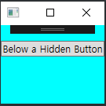
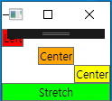
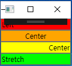
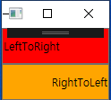
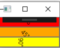
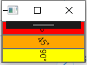
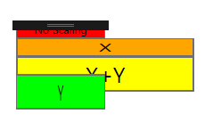
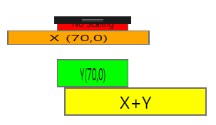
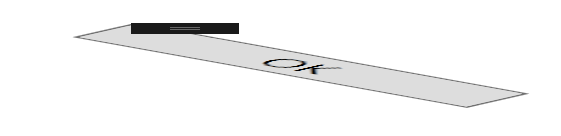

# Chapter5. 엘리먼트의 크기 및 위치 조정과 형태 변형
**화면 배치:**
- layout
- 컨트롤의 위치와 크기를 조절하는 것
- WPF의 화면배치는 부모와 그 하위 자식 엘리먼트 사이에 일어나는 상호작용을 통해 결정됨
  -> 최종 크기와 위치는 한쪽 엘리먼트의 일방적인 결정으로 정해지지 않음
- 부모 엘리먼트가 최종적으로 자식 엘리먼트가 어느 만큼의 공간을 차지하고 어떻게 렌더링될지 
  결정함.
- 부모 엘리먼트도 자식 엘리먼트가 얼마의 공간을 차지해야 효과적인 동작을 할 지 의식해야 함 
- 다수의 자식 컨트롤을 배치할 수 있도록 지원하는 부모 엘리먼트 = System.Windows.Controls.Panel 클래스에서 파생한 패널(Panel)
- 화면배치 과정에 포함되는 모든 컨트롤들은 System.Windows.UIElement에서 파생됨

## 크기 조절
- 윈도우의 크기가 변할 때처럼 화면배치가 일어나면, 자식 엘리먼트들은 부모에게 자신들이 원하는 크기를 전달함
- WPF 엘리먼트들은 **자신의 컨텐트에 크기를 맞추려는 경향**이 있음.

### 높이와 폭
- FrameworkElement에서 파생된 모든 엘리먼트는 double 타입의 Height와 Width 프로퍼티를 가짐
- MinHeight/MaxHeight/MinWidth/MaxWidth 프로퍼티 통해서 설정 가능한 범위를 제한 가능
- Height와 Width를 명시적으로 설정 -> 이 값들이 최솟값과 최댓값 사이라면 명시적으로 설정한 값이 우선순위가 높음
- MinHeight과 MinWidth의 기본값은 0, MaxHeight와 MaxWidth 의 기본값은 Double.PositiveInfinity
- XAML에서는 이를 줄여서 Infinity로 사용 가능함.
- 화면 배치 과정 중에 입력된 값들(Input): 
    - Panel.HorizontalAlignment
    - Panel.VerticalAlignment
    - Element.Height
    - Element.Width
    - Element.Padding
    - Element.Margin
- 처리과정의 출력(output)되는 값을 표현하는 읽기전용 프로퍼티들:
    - DesiredSize(UIElement에서 상속받음)
    - RenderSize(UIElement에서 상속받음)
    - ActualHeight/ActualWidth

- RenderSize 프로퍼티: 화면 배치가 완료된 후, 엘리먼트의 최종 크기를 알려줌
- ActualHeight/ActualWidth = RenderSize.Height/RenderSize.Width
- 위의 세 프로퍼티는 엘리먼트의 크기를 프로그램 코드를 통해 조절해야 하는 상황에 유용하게 사용됨 but 다른 크기 관련 프로퍼티들은 그렇지 못함
    - 엘리먼트에 명확한 값이 주어지지 않으면 실제로 값이 존재하더라도 Height/Width 프로퍼티의 값 => Double.NaN으로 설정됨.

### 마진과 패딩
- 마진과 패딩 프로퍼티는 엘리먼트의 크기와 관련 있는 아주 유사한 성질을 가짐
- FrameworkElement 클래스를 상속한 모든 엘리먼트들: 마진 프로퍼티를 가짐(최외곽 둘러싼 여유분을 조절)
- Controls 클래스를 상속한 모든 엘리먼트들: 패딩 프로퍼티를 가짐(엘리먼트의 내부 공간을 조절)
- 마진과 패딩 모두 System.Windows.Thickness 타입
```XAML
<Grid>
    <!--패딩-->
    <Label Padding="0" Background="Orange">0</Label>
    <Label Padding="10" Background="Orange">10</Label>
    
    <!--2개 값: 왼쪽과 오른쪽은 첫번째 값(20), 상단과 하단은 두 번째 값(5) 가 적용됨-->
    <Label Padding ="20,5" Background="Orange">20, 5</Label>
    <!--4개 값: 좌측, 상단, 우측, 하단의 순서로 적용-->
    <Label Padding="0,10,20,30" Background="Orange">0,10,20,30</Label>
        
    <!--마진-->
        <Border BorderBrush="Black" BorderThickness="1">
            <Label Background="Aqua">0</Label>
        </Border>

        <Border BorderBrush="Black" BorderThickness="1">
            <Label Margin="10" Background="Aqua">10</Label>
        </Border>

        <Border BorderBrush="Black" BorderThickness="1">
            <Label Margin="20,5" Background="Aqua">20,5</Label>
        </Border>

        <Border BorderBrush="Black" BorderThickness="1">
            <Label Margin="0,10,20,30" Background="Aqua">0,10,20,30</Label>
        </Border>
</Grid>
```

### Visibility
- UIElement 클래스에 정의된 Visibility 프로퍼티는 화면배치와는 다른 내용 같지만, 실제로는 그렇지 않음
- 엘리먼트의 Visibility 프로퍼티는 System.Windows.Visibility 열거형을 값으로 가짐
    - Visible: 엘리먼트가 화면배치 처리과정에 참여해서 렌더링됨.
    - Collapsed: 엘리먼트는 보이지 않고 화면배치 처리과정에 참여하지 않음.
                 크기가 0이 됨
    - Hidden: 엘리먼트는 보이지 않지만, 화변배치 처리과정에 참여함.
              크기가 남아있어 ActualHeight와 ActualWidth 프로퍼티의 값이 변하지 않음
- Collapsed가 설정되었을 경우:
```XAML
<Window xmlns:x="http://schemas.microsoft.com/winfx/2006/xaml"
        x:Class="WpfApplication3.MainWindow" 
        xmlns="http://schemas.microsoft.com/winfx/2006/xaml/presentation"
        SizeToContent="WidthAndHeight"
        Title="About WPF Unleashed" >
    <Grid>
        <StackPanel Height="100" Background="Aqua">
            <Button Visibility="Collapsed">Collapsed Button</Button>
            <Button>Below a Collapsed Button</Button>
        </StackPanel>
    </Grid>
</Window>
```


- Hidden 값을 갖도록 설정된 경우:
```XAML
<Window xmlns:x="http://schemas.microsoft.com/winfx/2006/xaml"
        x:Class="WpfApplication3.MainWindow" 
        xmlns="http://schemas.microsoft.com/winfx/2006/xaml/presentation"
        SizeToContent="WidthAndHeight"
        Title="About WPF Unleashed" >
    <Grid>
        <StackPanel Height="100" Background="Aqua">
            <Button Visibility="Hidden">Hidden Button</Button>
            <Button>Below a Hidden Button</Button>
        </StackPanel>
    </Grid>
</Window>
```


## 위치 조정
- 흔히 생각하는 (X,Y) 좌표값을 가지고 엘리먼트의 위치를 이야기하지 않음
- 부모 패널들은 패널 안의 자식 엘리먼트가 스스로 위치를 결정할 수 있도록 돕는 독특한 처리 과정이 있음
- FrameworkElement 클래스의 자식 클래스들에게 몇 가지 공통적으로 적용되는 것이 있음 
- 정렬(Alignment) 및 플로우 디렉션(flow direction)과 연관됨

### 정렬
- HorizontalAlignment와 VerticalAlignment 프로퍼티는 부모 패널이 넘겨주는 여유 공간을 가지고 무엇인가를 조절할 수 있게 해줌
- 각 프로퍼티는 System.Windows 네임스페이스 안에 동일한 이름의 열거형이 존재함
- HorizontalAlignment: Left, Center, Right, Stretch
- VerticalAlignment: Top, Center, Bottom, Stretch
- 두 프로퍼티의 기본값은 Stretch임

```XAML
<StackPanel>
    <Button HorizontalAlignment="Left" Background="Red">Left</Button>
    <Button HorizontalAlignment="Center" Background="Orange">Center</Button>
    <Button HorizontalAlignment="Right" Background="Yellow">Center</Button>
    <Button HorizontalAlignment="Stretch" Background="Lime">Stretch</Button>
</StackPanel>
```


### 컨텐트 정렬
- Control 클래스는 HorizontalAlignment와 VerticalAlignment 외에도, HorizontalContentAlignment와 VerticalContentAlignment 프로퍼티를 가지고 있음
- 이 프로퍼티들은 컨트롤의 컨텐트를 어떻게 채울지를 결정하는 역할을 함
- 컨텐트 정렬 프로퍼티들은 정렬 프로퍼티에 상응하는 열거형 타입을 갖고 있음, 그 값들은 동일함
- HorizontalContentAlignment의 기본 값: Left, VerticalContentAlignment의 기본 값: Top



- 실제 영향을 받는 것: 버튼 내부의 텍스트블록

### 플로우디렉션
- 플로우디렉션 프로퍼티: FrameworkElement 클래스나 다른 몇몇 컨트롤에서 내부 엘리먼트 내부 컨텐트의 흐름을 반대로 바꿀 수 있음
- 이 프로퍼티는 일부 패널에서 자식 엘리먼트의 나열, 자식 컨트롤의 내부 컨텐트를 정렬하는 방법에도 적용됨
- System.Windows.FlowDirection 타입, LeftToRight 혹은 RightToLeft 값을 사용함, 기본값은 LeftToRight임
- 플로우 디렉션은 오른쪽에서 왼쪽으로 읽는 문화를 가진 나라의 언어에 대해서는 RightToLeft로 설정해야 함
```XAML
<StackPanel>
    <Button FlowDirection="LeftToRight" 
            HorizontalContentAlignment="Left" VerticalAlignment="Top" 
            Height="40" Background="Red">
            LeftToRight
    </Button>
    <Button FlowDirection="RightToLeft" 
            HorizontalContentAlignment="Left" VerticalAlignment="Top" 
            Height="40" Background="Orange">
            RightToLeft
    </Button>
</StackPanel>
```


## 형태변형 적용
- FrameworkElement 클래스에서 상속받은 모든 엘리먼트들은 형태변형에 이용 가능한 Transform 타입의 두 가지 프로퍼티가 정의되어 있음
    - LayoutTransform: 엘리먼트가 화면배치되기 전에 적용됨 
                       형태변형된 엘리먼트의 위치 기준은 부모 패널의 배치기준에 따라 달라짐 -> 기준점이라는 개념이 없음
    - RenderTransform: UIElement 클래스에서 상속받은 이 프로퍼티는 화면배치가 끝나고 렌더링되기 바로 직전에 적용됨
                       변형의 시작은 버튼의 좌측 상단 코너가 됨, 이 기준을 기준으로 나머지 부분이 회전함
- RenderTransformOrigin 프로퍼티는 System.Windows.Point 타입의 값을 가짐, 기본값은 (0,0)임, 이 값은 좌측 상단 코너를 가리킴
- System.Windows.PointConverter 타입 컨버터가 XAML에 사용된 쉼표 구분자를 RenderTransformOrigin 의 적절한 값으로 캐스팅해줌
  -> 자신의 정중앙을 기준점으로 회전하는 형태변형이 일어날 수 있음

```XAML
<StackPanel>
    <Button Background="Red">
        Button1
    </Button>
            
    <Button RenderTransformOrigin="0.5,0.5" Background="Orange">
    <Button.RenderTransform>
    <RotateTransform Angle="45"/>
    </Button.RenderTransform>
        Rotated 45°
    </Button>

    <Button Background="Yellow">
        Button3
    </Button>
</StackPanel>
```
**RotateTransform**
- RotateTransform은 double 타입으로 주어진 세 개의 값을 사용 -> 엘리먼트를 회전시킴
    - Angle: 회전 각도(기본 값=0)
    - CenterX: 회전 시 수평의 기준점(기본 값=0)
    - CenterY: 회전 시 수직의 기준점(기본 값=0)
- 회전의 기준점은 (CenterX, CenterY)로 표시됨, 기본값은 (0,0), 좌측 상단 코너를 가리킴
- RenderTransform일 떄 서로 다른 두 가지 RednerTransformOrigin값을 가진 RotateTransform이 버튼의 내부 컨텐트에 적용된 결과를 보여줌
- 각 버튼의 컨텐트에 명시적으로 텍스트블록을 사용해야 함
```XAML
   <StackPanel>
            <Button Background="Red">
                <TextBlock RenderTransformOrigin="0.5,0.5">
                    <TextBlock.RenderTransform>
                        <RotateTransform Angle="0"/>
                    </TextBlock.RenderTransform>
                    0°
                </TextBlock> 
            </Button>
            
            <Button Background="Orange">
                <TextBlock RenderTransformOrigin="0.5,0.5">
                    <TextBlock.RenderTransform>
                        <RotateTransform Angle="45"/>
                    </TextBlock.RenderTransform>
                    45°
                </TextBlock>
            </Button>

            <Button Background="Yellow">
                <TextBlock RenderTransformOrigin="0.5,0.5">
                    <TextBlock.RenderTransform>
                        <RotateTransform Angle="90"/>
                    </TextBlock.RenderTransform>
                    90°
                </TextBlock>
            </Button>
   </StackPanel>
```
[좌측 상단을 중심으로 회전하는 경우]



[중앙을 중심으로 회전하는 경우]


**ScaleTransform**
- ScaleTransform은 엘리먼트를 수평, 수직 또는 양방향으로 늘이거나 줄이는 형태변형
- 4개의 double 타입 프로퍼티를 갖고 있음
- ScaleX: 가로 폭의 배율(기본값=1)
- ScaleY: 세로 높이의 배율(기본값=1)
- CenterX: 수평으로 크기 조정하기 위한 기준점(기본값=0)
- CenterY: 수직으로 크기 조정하기 위한 기준점(기본값=0)
```XAML
<StackPanel Width="100">
            <Button Background="Red">No Scaling</Button>
            <Button Background="Orange">
                <Button.RenderTransform>
                    <ScaleTransform ScaleX="2"/>
                </Button.RenderTransform>
            X</Button>
            <Button Background="Yellow">
                <Button.RenderTransform>
                    <ScaleTransform ScaleX="2" ScaleY="2"/>
                </Button.RenderTransform>
                X+Y
            </Button>
            <Button Background="Lime">
                <Button.RenderTransform>
                    <ScaleTransform ScaleY="2"/>
                </Button.RenderTransform>
                Y
            </Button>
</StackPanel>
```
- 크기 변형을 적용한 버튼

- 버튼들에 명시적인 기준점을 설정한 경우


**SkewTransform**
- 네 개의 double 타입 프로퍼티를 이용해서 엘리먼트에 다양한 기울기 줄 수 있음
    - AngleX: 수평으로 기울어지는 값(기본값 = 0)
    - AngleY: 수직으로 기울어지는 값(기본값 = 0)
    - CenterX: 수평기울기의 기준값(기본값 = 0)
    - CenterY: 수직기울기의 기준값(기본값 = 0)
- 좌측 상단 코너의 기본값을 기준점으로 함

**TranslateTransform**
- 오로지 두 개의 프로퍼티를 이용해서 엘리먼트를 움직임
    - X: 수평으로 이동하는 값(기본값=0)
    - Y: 수직으로 이동하는 값(기본값=0)
- TranslateTransform은 LayoutTransform일 떄는 어떤 결과도 보여주지 않음, RenderTransform이 적용되면 엘리먼트를 조금씩 이동하기 쉬움

**MatrixTransform**
- System.Windows.Media.Matrix타입인 Matrix 프로퍼티를 이요함
- 3X3 매트릭스는 다음과 같은 값을 가짐

| M11     | M12     | 0    |
| ------- | ------- | ---- |
| M21     | M22     | 0    |
| OffsetX | OffsetY | 1    |
- 마지막 열은 고정된 것
- 다른 6개의 값 변경해서 Matrix 프로퍼티를 설정하거나 행 순서대로 6개의 값을 받아들이는 생성자를 통해 형태변형을 일으킴

## 형태변형의 조합
- 엘리먼트를 회전하면서 동시에 크기를 바꾸려면 형태변형을 다중으로 사용해야 함
- 이런 형태를 지원하는 방법들:
    - LayoutTransform, RenderTransform을 사용하는 방법
    - 복잡한 MatrixTransform을 이용하는 방법
    - TrnasformGroup 클래스를 이용하는 방법(유용함!!)
```XAML
<StackPanel Width="100">
    <Button>
        <Button.RenderTransform>
            <TransformGroup>
                <RotateTransform Angle="45"/>
                    <ScaleTransform ScaleX="5" ScaleY="1"/>
                    <SkewTransform AngleX="30"/>
            </TransformGroup>
        </Button.RenderTransform>
        OK
    </Button>
</StackPanel>
```


## 결론
- 화면 배치에서 가장 중요한 것은 부모패널
- 이번 장에서는 스택패널을 부모패널로 사용했었음
