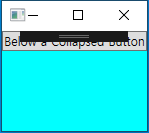

# Chapter5. 엘리먼트의 크기 및 위치 조정과 형태 변형
**화면 배치:**
- layout
- 컨트롤의 위치와 크기를 조절하는 것
- WPF의 화면배치는 부모와 그 하위 자식 엘리먼트 사이에 일어나는 상호작용을 통해 결정됨
  -> 최종 크기와 위치는 한쪽 엘리먼트의 일방적인 결정으로 정해지지 않음
- 부모 엘리먼트가 최종적으로 자식 엘리먼트가 어느 만큼의 공간을 차지하고 어떻게 렌더링될지 
  결정함.
- 부모 엘리먼트도 자식 엘리먼트가 얼마의 공간을 차지해야 효과적인 동작을 할 지 의식해야 함 
- 다수의 자식 컨트롤을 배치할 수 있도록 지원하는 부모 엘리먼트 = System.Windows.Controls.Panel 클래스에서 파생한 패널(Panel)
- 화면배치 과정에 포함되는 모든 컨트롤들은 System.Windows.UIElement에서 파생됨

## 크기 조절
- 윈도우의 크기가 변할 때처럼 화면배치가 일어나면, 자식 엘리먼트들은 부모에게 자신들이 원하는 크기를 전달함
- WPF 엘리먼트들은 **자신의 컨텐트에 크기를 맞추려는 경향**이 있음.

### 높이와 폭
- FrameworkElement에서 파생된 모든 엘리먼트는 double 타입의 Height와 Width 프로퍼티를 가짐
- MinHeight/MaxHeight/MinWidth/MaxWidth 프로퍼티 통해서 설정 가능한 범위를 제한 가능
- Height와 Width를 명시적으로 설정 -> 이 값들이 최솟값과 최댓값 사이라면 명시적으로 설정한 값이 우선순위가 높음
- MinHeight과 MinWidth의 기본값은 0, MaxHeight와 MaxWidth 의 기본값은 Double.PositiveInfinity
- XAML에서는 이를 줄여서 Infinity로 사용 가능함.
- 화면 배치 과정 중에 입력된 값들(Input): 
    - Panel.HorizontalAlignment
    - Panel.VerticalAlignment
    - Element.Height
    - Element.Width
    - Element.Padding
    - Element.Margin
- 처리과정의 출력(output)되는 값을 표현하는 읽기전용 프로퍼티들:
    - DesiredSize(UIElement에서 상속받음)
    - RenderSize(UIElement에서 상속받음)
    - ActualHeight/ActualWidth

- RenderSize 프로퍼티: 화면 배치가 완료된 후, 엘리먼트의 최종 크기를 알려줌
- ActualHeight/ActualWidth = RenderSize.Height/RenderSize.Width
- 위의 세 프로퍼티는 엘리먼트의 크기를 프로그램 코드를 통해 조절해야 하는 상황에 유용하게 사용됨 but 다른 크기 관련 프로퍼티들은 그렇지 못함
    - 엘리먼트에 명확한 값이 주어지지 않으면 실제로 값이 존재하더라도 Height/Width 프로퍼티의 값 => Double.NaN으로 설정됨.

### 마진과 패딩
- 마진과 패딩 프로퍼티는 엘리먼트의 크기와 관련 있는 아주 유사한 성질을 가짐
- FrameworkElement 클래스를 상속한 모든 엘리먼트들: 마진 프로퍼티를 가짐(최외곽 둘러싼 여유분을 조절)
- Controls 클래스를 상속한 모든 엘리먼트들: 패딩 프로퍼티를 가짐(엘리먼트의 내부 공간을 조절)
- 마진과 패딩 모두 System.Windows.Thickness 타입
```XAML
<Grid>
    <!--패딩-->
    <Label Padding="0" Background="Orange">0</Label>
    <Label Padding="10" Background="Orange">10</Label>
    
    <!--2개 값: 왼쪽과 오른쪽은 첫번째 값(20), 상단과 하단은 두 번째 값(5) 가 적용됨-->
    <Label Padding ="20,5" Background="Orange">20, 5</Label>
    <!--4개 값: 좌측, 상단, 우측, 하단의 순서로 적용-->
    <Label Padding="0,10,20,30" Background="Orange">0,10,20,30</Label>
        
    <!--마진-->
        <Border BorderBrush="Black" BorderThickness="1">
            <Label Background="Aqua">0</Label>
        </Border>

        <Border BorderBrush="Black" BorderThickness="1">
            <Label Margin="10" Background="Aqua">10</Label>
        </Border>

        <Border BorderBrush="Black" BorderThickness="1">
            <Label Margin="20,5" Background="Aqua">20,5</Label>
        </Border>

        <Border BorderBrush="Black" BorderThickness="1">
            <Label Margin="0,10,20,30" Background="Aqua">0,10,20,30</Label>
        </Border>
</Grid>
```

### Visibility
- UIElement 클래스에 정의된 Visibility 프로퍼티는 화면배치와는 다른 내용 같지만, 실제로는 그렇지 않음
- 엘리먼트의 Visibility 프로퍼티는 System.Windows.Visibility 열거형을 값으로 가짐
    - Visible: 엘리먼트가 화면배치 처리과정에 참여해서 렌더링됨.
    - Collapsed: 엘리먼트는 보이지 않고 화면배치 처리과정에 참여하지 않음.
                 크기가 0이 됨
    - Hidden: 엘리먼트는 보이지 않지만, 화변배치 처리과정에 참여함.
              크기가 남아있어 ActualHeight와 ActualWidth 프로퍼티의 값이 변하지 않음
- Collapsed가 설정되었을 경우:
```XAML
<Window xmlns:x="http://schemas.microsoft.com/winfx/2006/xaml"
        x:Class="WpfApplication3.MainWindow" 
        xmlns="http://schemas.microsoft.com/winfx/2006/xaml/presentation"
        SizeToContent="WidthAndHeight"
        Title="About WPF Unleashed" >
    <Grid>
        <StackPanel Height="100" Background="Aqua">
            <Button Visibility="Collapsed">Collapsed Button</Button>
            <Button>Below a Collapsed Button</Button>
        </StackPanel>
    </Grid>
</Window>
```


- Hidden 값을 갖도록 설정된 경우:
```XAML
<Window xmlns:x="http://schemas.microsoft.com/winfx/2006/xaml"
        x:Class="WpfApplication3.MainWindow" 
        xmlns="http://schemas.microsoft.com/winfx/2006/xaml/presentation"
        SizeToContent="WidthAndHeight"
        Title="About WPF Unleashed" >
    <Grid>
        <StackPanel Height="100" Background="Aqua">
            <Button Visibility="Hidden">Hidden Button</Button>
            <Button>Below a Hidden Button</Button>
        </StackPanel>
    </Grid>
</Window>
```

## 위치 조정
- 흔히 생각하는 (X,Y) 좌표값을 가지고 엘리먼트의 위치를 이야기하지 않음
- 부모 패널들은 패널 안의 자식 엘리먼트가 스스로 위치를 결정할 수 있도록 돕는 독특한 처리 과정이 있음
- FrameworkElement 클래스의 자식 클래스들에게 몇 가지 공통적으로 적용되는 것이 있음 
- 정렬(Alignment) 및 플로우 디렉션(flow direction)과 연관됨

### 정렬
- HorizontalAlignment와 VerticalAlignment 프로퍼티는 부모 패널이 넘겨주는 여유 공간을 가지고 무엇인가를 조절할 수 있게 해줌
- 각 프로퍼티는 System.Windows 네임스페이스 안에 동일한 이름의 열거형이 존재함
- HorizontalAlignment: Left, Center, Right, Stretch
- VerticalAlignment: Top, Center, Bottom, Stretch
- 두 프로퍼티의 기본값은 Stretch임

### 컨텐트 정렬
### 플로우디렉션
## 형태변형 적용
## 결론
