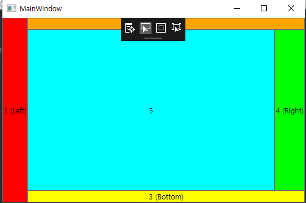
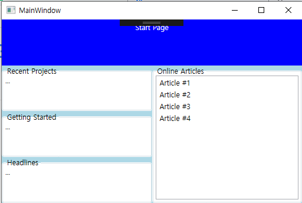
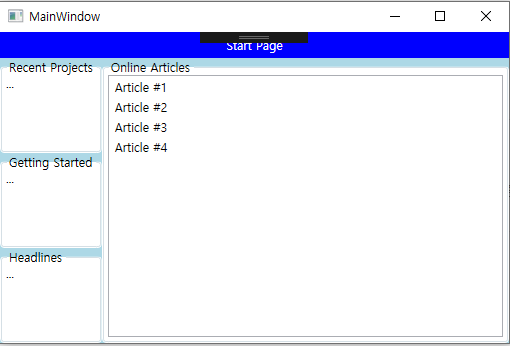

# Chapter06. 패널을 이용한 화면배치🏇
## 캔버스
- 가장 기본적인 패널
- 명시적인 좌표값을 이용해서 엘리먼트의 위치를 결정하는 개념만 지원
- 장치 독립적인 픽셀을 사용함 -> 사방을 자신의 좌표값으로 사용 가능함
- Left/Top/Right/Bottom 첨부 프로퍼티를 갖고 있음, 엘리먼트의 위치를 조정 가능함
```XAML
    <Canvas>
        <Button Background="Red">Left=0, Top=0</Button>
        <Button Canvas.Left="18" Canvas.Top="18"
                Background="Orange">Left=18, Top=18</Button>
        <Button Canvas.Right="18" Canvas.Bottom="18"
                Background="Yellow">Right=18, Bottom=18</Button>
        <Button Canvas.Right="0" Canvas.Bottom="0"
                Background="Lime">Right=0, Bottom=0</Button>
        <Button Canvas.Right="0" Canvas.Top="0"
                Background="Aqua">Left=0, Top=0</Button>
        <Button Canvas.Left="0" Canvas.Bottom="0"
                Background="Magenta">Left=0, Bottom=0</Button>
    </Canvas>
```


**자식 간의 화면배치 프로퍼티와 캔버스의 상호작용**

| 프로퍼티명                              | 캔버스 안에서의 역할 |
| --------------------------------------- | -------------------- |
| Margin                                  | 부분 반영. 엘리먼트의 위치를 잡는 데 사용된 두 변에서는 네 개의 마진 중 적당한 두 값이 첨부 프로퍼티 값으로 추가됨            |
| HorizontalAlignment와 VerticalAlignment | 미반영. 엘리먼트들은 자신에게 필요한 공간만 정확히 주어짐                    |
| LayoutTransform                         | 모두 반영. LayoutTransform일 때 엘리먼트들은 항상 캔버스의 선택된 코너와 일정한 거리만큼 떨어져 렌더링됨. RenderTransform과는 차이가 있음                     |

## 스택패널
- 이용하기에 간편하고 유용한 패널
- 먼저 추가된 것이 아래에 있음(스택이자너...!)
- 자신만의 첨부 프로퍼티를 정의하지 않음
- 자식 엘리먼트를 배열하는 데 사용하는 첨부 프로퍼티는 없음
- 오직 오리엔테이션 프로퍼티를 사용해서 조정함
- 이 프로퍼티는 System.Windows.Controls.Orientation타입임. Horizontal이나 Vertical 중 하나를 설정 가능(기본값은 Vertical)

**자식 엘리먼트의 화면배치 프로퍼티와 스택패널의 상호작용**

| 프로퍼티명                              | 스택패널 안에서의 역할                                         |
| --------------------------------------- | ------------------------------------------------------------ |
| Margin                                  | 반영. 마진은 엘리먼트 사이의 공간뿐만 아니라 엘리먼트와 스택패널의 경계 사이도 조정함. |
| HorizontalAlignment와 VerticalAlignment | 부분반영. 정렬이 엘리먼트가 누적되는 방향이면 자식 엘리먼트들 자신이 필요한 공간만 정확하게 차지함 -> 무시됨. 오리엔테이션이 우선순위가 높으므로 오리엔테이션에 따라 결정됨 |
| LayoutTransform                         | 반영. LayoutTransform일 때 스택에 남아있는 엘리먼트들은 자신이 필요한 공간을 만들기 위해 밀고 나옴 -> RenderTransform일 떄와는 차이가 있음. 또한, Stretch와 만나서 RotateTransform이나 SkewTransform 형태변형이 일어나면  90도의 배수(90,180,270)에서만 엘리먼트들이 늘어남. |

- 패널 안의 엘리먼트가 늘어나는 경우: 다른 엘리먼트와 평행하거나 수직일 때만 일어남, 엘리먼트는 한 방향으로만 늘어남
- LayoutTransform일 때만 일어나고 RenderTransform일 때는 일어나지 않음

## 랩패널
- 스택패널과 기본적으로 유사함
- 추가되는 엘리먼트마다 충분한 공간이 없을 때는 누적되는 방향으로 행이나 열을 바꿔서 래핑함
- 엘리먼트의 위치를 조정하는 첨부 프로퍼티는 없음. 

**화면배치 과정을 돕는 세 개의 프로퍼티**
- Orientation: 기본 값이 Horizontal이라는 것을 제외하고는 스택패널과 동일함. 엘리먼트는 좌측에서 우측으로 배치, 잘릴 것 같으면 상단에서 하단으로 래핑되어 줄바꿈함.

- ItemHeight: 자식 엘리먼트를 배치하기 위한 공통의 높이

- ItemWidth: 자식 엘리먼트를 배치하기 위한 공통의 폭
- ItemHeight 와 IteWidth는 값이 정해지지 않거나 Double.NaN을 가짐
- 오리엔테이션이 Vertical이면 래패널은 각 컬럼 중 가장 넓은 엘리먼트의 폭을 기준으로 ItemWidth의 값을 결정
- 오리엔테이션이 Horizontal이면 가장 높이가 큰 엘리먼트를 기준으로 ItemHeight의 값을 결정함
- 결과적으로 랩패널의 내부에서는 어떤 잘림도 없음

**자식 엘리먼트의 화면배치 관련 프로퍼티와 랩패널의 상호작용**

| 프로퍼티명                              | 랩패널 안에서의 역할                                         |
| --------------------------------------- | ------------------------------------------------------------ |
| Margin                                  | 반영. 마진은 랩패널이 누적되는 아이템마다 폭과 높이를 결정하는 계산과정에 포함됨. |
| HorizontalAlignment와 VerticalAlignment | 부분반영. 정렬은 스택패널처럼 누적되는 방향이 반대 방향일 떄만 사용됨. 랩패널의 ItemHeight나 ItemWidth가 정렬할 만한 여유공간을 엘리먼트에게 줄 수 있다면 누적되는 방향에서도 유용하게 사용 가능함 |
| LayoutTransform                         | 반영. LayoutTransform일 때 오리엔테이션에 의존하는 랩패널의 ItemHeight나 ItemWidth가 아직 설정이 안 되어 있을 때, 남아있는 엘리먼트들은 공간을 만들고 밀고 나옴 -> RenderTransform일 때와는 결과가 다름 |

## 도크패널
- 사방으로 엘리먼트가 쉽게 도킹할 수 있게 함 -> 전체 높이와 폭을 채울 수 있음
- 도크패널은 System.Windows.Controls.Dock 타입의 Dock 첨부 프로퍼티를 정의하고 있음
        - Left/Top/Right/Bottom(default:Left) 중 한 개 이상을 사용해서 자식 엘리먼트의 도킹을 조정 가능함
- 마지막 엘리먼트의 LastChildFill 프로퍼티가 false로 설정되지 않으면 나머지 여분의 공간을 다 채울 수 있음.
- LastChildFill이 기본값인 true로 설정되면 마지막으로 추가되는 자식 엘리먼트의 Dock 프로퍼티는 무시됨
- 반대로 false로 설정되면 값이 명시적으로 설정되지 않는 한 기본적으로 Left가 적용되어 도킹됨
- 엘리먼트들이 늘어나는 이유: HorizontalAlignment나 VerticalAlignment의 기본값이 Stretch이기 때문임.
- 도크패널은 윈도우나 페이지 엘리먼트의 최상위 UI를 배열하는 데 유용함.
- 개별 자식 엘리먼트가 도킹된 경계의 나머지 공간을 차지함 -> 추가되는 자식의 순서는 매우 중요함
```XAML
<DockPanel>
        <Button DockPanel.Dock="Top" Background="Red">1 (Top)</Button>
        <Button DockPanel.Dock="Left" Background="Orange">2 (Left)</Button>
        <Button DockPanel.Dock="Right" Background="Yellow">3 (Right)</Button>
        <Button DockPanel.Dock="Bottom" Background="Lime">4 (Bottom)</Button>
        <Button Background="Aqua">5</Button>
</DockPanel>
```
- 도크패널은 제한 없이 자식 엘리먼트를 가질 수 있음

- 도크패널의 기능은 스택패널의 기능을 확장한 것
- LastChildFill 프로퍼티가 false일 때, 모든 자식 엘리먼트가 좌측으로 도킹되어 있으면 수평방향의 스택패널처럼 동
    - 모든 자식 엘리먼트가 상단에 도킹되어 있으면 수직 방향의 스택패널처럼 동작
| 프로퍼티명                              | 도크패널 안에서의 역할                                       |
| --------------------------------------- | ------------------------------------------------------------ |
| Margin                                  | 반영. 마진은 엘리먼트 사이 공간뿐만 아니라 엘리먼트와 도크패널의 경계도 조절함 |
| HorizontalAlignment와 VerticalAlignment | 부분반영. 스택패널처럼, 정렬은 도킹되는 방향일 때는 무시됨. 도킹되는 방향이 Left나 Right일 때, HorizontalAlignment가 의미 없음. Top이나 Bottom일 때는 VerticalAlignment가 의미 없음 |
| LayoutTransform                         | 반영. LayoutTransform으로 동작할 때, 남아있는 엘리먼트들은 여분의 공간을 만들기 위해 밀고 나옴 -> RenderTransform일 때와는 다름. LayoutTransform일 때 Stretch로 설정된 도크패널에서 RotateTransform이나 SkewTransform 형태변형이 일어나면 90의 배수일 때만 엘리먼트가 늘어남 |

## 그리드
- 그리드: 여러가지 기능을 복합적으로 가진 패널(가장 자주 사용됨)
- 랩패널처럼 엘리먼트를 래핑해서 처리하지 않음
- 여러 행과 열로 자식 엘리먼트를 배치 가능하게 해줌. 
- HTML의 테이블과 아주 유사함
- 그리드는 의존프로퍼티인 `Grid.Row`를 써주지 않으면 그냥 디폴트로 덮어버림(0,0부분이 덮어씌워진다...! )
```XAML
<Grid Background="LightCyan">
        <!--네 개의 행을 선언-->
        <Grid.RowDefinitions>
            <RowDefinition/>
            <RowDefinition/>
            <RowDefinition/>
            <RowDefinition/>
        </Grid.RowDefinitions>

        <!--두 개의 열을 선언-->
        <Grid.ColumnDefinitions>
            <ColumnDefinition/>
            <ColumnDefinition/>
            <ColumnDefinition/>
        </Grid.ColumnDefinitions>

        <!--자식 엘리먼트를 배치-->
        <Label Grid.Row="0" Grid.Column="0" Background="LightBlue" Foreground="White"
               HorizontalAlignment="Center">Start Page</Label>
        <GroupBox Grid.Row="1" Grid.Column="0" Background="White" 
               Header="Recent Projects">...</GroupBox>
        <GroupBox Grid.Row="2" Grid.Column="0" Background="White"
               Header="Getting Started">...</GroupBox>
        <GroupBox Grid.Row="3" Grid.Column="0" Background="White"
                  Header="Headlines">...</GroupBox>
        <GroupBox Grid.Row="1" Grid.Column="1" Background="White"
                  Header="Online Articles">
            <ListBox>
                <ListBoxItem>Article #1</ListBoxItem>
                <ListBoxItem>Article #2</ListBoxItem>
                <ListBoxItem>Article #3</ListBoxItem>
                <ListBoxItem>Article #4</ListBoxItem>
            </ListBox>
        </GroupBox>
    </Grid>
```

- 그리드의 셀들은 비어있을 수도 있고 여러 엘리먼트가 한 셀 안에 배치되어 있을 수도 있음
- 후자의 경우, 엘리먼트들의 렌더링되는 순서는 Z-order에 따라서 처리됨
        - Z-order: 화면들을 개별 레이어로 생각하고 내려다보면 앞에 레이어에 의해 뒤의 레이어는 보이지 않음
- 로우스팬, 컬럼스팬의 기본값=1
- columnspan과 rowspan을 준 경우



- 크기자동화하려면 RowDefinition의 Height과 ColumnDefinition의  Width에 Auto를 설정하면 됨
```XAML
    <Grid Background="LightBlue">
        <!--네 개의 행을 선언-->
        <Grid.RowDefinitions>
            <RowDefinition Height="Auto"/>
            <RowDefinition/>
            <RowDefinition/>
            <RowDefinition/>
        </Grid.RowDefinitions>

        <!--두 개의 열을 선언-->
        <Grid.ColumnDefinitions>
            <ColumnDefinition Width="Auto"/>
            <ColumnDefinition/>
        </Grid.ColumnDefinitions>

        <!--자식 엘리먼트를 배치-->
        <Label Grid.Row="0" Grid.Column="0" Background="Blue" Foreground="White" Grid.ColumnSpan="2"
               HorizontalContentAlignment="Center">Start Page</Label>
        <GroupBox Grid.Row="1" Grid.Column="0" Background="White" 
               Header="Recent Projects">...</GroupBox>
        <GroupBox Grid.Row="2" Grid.Column="0" Background="White"
               Header="Getting Started">...</GroupBox>
        <GroupBox Grid.Row="3" Grid.Column="0" Background="White"
                  Header="Headlines">...</GroupBox>
        <GroupBox Grid.Row="1" Grid.Column="1" Background="White" Grid.RowSpan="3"
                  Header="Online Articles">
            <ListBox>
                <ListBoxItem>Article #1</ListBoxItem>
                <ListBoxItem>Article #2</ListBoxItem>
                <ListBoxItem>Article #3</ListBoxItem>
                <ListBoxItem>Article #4</ListBoxItem>
            </ListBox>
        </GroupBox>
    </Grid>
```


### 행과 열의 크기 조절
- FrameworkElement 클래스의 Height, Width는 double 타입, 기본 값은 double.NaN
- RowDefinition의 Height나 ColumnDefinition의 Width 프로퍼티는 System.Windows.GridLength타입, 기본값은 Auto나 Double.NaN이 아님
- 그리드는 RowDefinition과 ColumnDefinition의 크기를 조절하기 위해 세 가지 방법 사용함
       - 절대 크기: RowDefinition에 Height나 ColumnDefinition에 Width의 값을 숫자로 설정함 = 장치 독립적인 픽셀을 사용한다는 의미
       - 자동 크기: Height나 Width가 Auto로 설정되면 WPF에서 기본값이 설정된 것처럼 자식 엘리먼트들은 필요한 공간만 허용됨,  행은 엘리먼트 중 가장 높이가 큰 값 설정됨, 열은 엘리먼트 중 가장 넓은 값이 설정됨
       - 비율 기반 크기: 이용 가능한 공간을 동일한 비율이나 크기로 나누는 특별한 방법, 비율로 지정된 행이나 열은 그리드의 크기가 변하면 그에 따라 줄어들거나 늘어남

- 절대 크기나 자동 크기는 직관적, 특별한 값( `*`) 사용하는 비율 기반 방식은 설명이 더 필요함
      - 하나의 열, 행을 `*`로 설정 시, 남아있는 공간 채움
      - 복수 행 또는 열을 `*`로 설정 시, 남아있는 공간은 행이나 열의 개수로 동일하게 나눈 값을 가짐
      - 행이나 열이 더 많은 공간을 가지려면  `*`를 사용하는 것보다  `2*`또는 `5.5*`처럼 계수 사용 가능 

### GridSplitter를 이용해서 상호작용하는 크기 조절
- 그리드의 매력적인 특징: 마우스나 키보드 또는 스타일러스 사용 시 행이나 열과 상호작용하는 크기 조절을 지원하는 것
- 주로 이런 기능을 GridSplitter 클래스를 이용하여 처리함
- GridSplitter는 HorizontalAlignment의 기본값: Right, VerticalAlignment의 기본값은 Stretch
  -> 기본적으로 특정한 셀의 오른쪽에 도킹됨
- GridSplitter의 올바른 사용: 적어도 한 방향으로 Stretch(부모의 폭이나 높이를 가득 채움) 정렬을 함
- Gridsplitter의 정렬 관련 프로퍼티 이용해서 크기 조절, 방향의 모든 형태를 조절가능하지만 이 경우 사용 가능한 명시적이고 독립적인 두 개의 프로퍼티를 갖고 있음
  - GridResizeDirection 타입의 ResizeDirection(기본값:Auto)과 GridResizeBehavior타입의 ResizeBehavior
  
### 행과 열 크기 공유하기
- RowDefinitions의 ColumnDefinitions는 SharedSizeGroup이라는 프로퍼티 가짐
- GridSplitter처럼 런타임 시 엘리먼트 중 일부의 길이가 변경되어도 여러 엘리먼트 상호 간에 동일한 길이를 가질 수 있게 해줌
```XAML
<Grid>
        <Grid.ColumnDefinitions>
            <ColumnDefinition Width="Auto"/>
            <ColumnDefinition/>
            <ColumnDefinition/>
        </Grid.ColumnDefinitions>

        <!--자식 엘리먼트를 배치-->
        <Label Grid.Column="0" Background="Red" 
               HorizontalContentAlignment="Center" VerticalContentAlignment="Center">1</Label>
        <GridSplitter Grid.Column="0" Width="5"/>
        <Label Grid.Column="1" Background="Orange" 
               HorizontalContentAlignment="Center" VerticalContentAlignment="Center">2</Label>
        <Label Grid.Column="2" Background="Yellow" 
               HorizontalContentAlignment="Center" VerticalContentAlignment="Center">3</Label>
    </Grid> 
```
[기본화면 배치]

[GridSplitter를 우측으로 드래그한 결과]


- 첫번쨰 열과 마지막 열이 동일한 SharedSizeGroup으로 묶였을 때의 결과
- SharedSizeGroup으로 묶인 모든 열들은 가장 크기가 큰 자동이나 절대 크기 값으로 초기화됨
- 첫 번째 열이 늘어나면 마지막 열도 똑같은 크기로 늘어남, 가운데 열은 `*` 로 설정됨 -> 나머지 공간 적절히 채움

[기본화면 배치]

[GridSplitter를 우측으로 드래그한 결과]

- GridSplitter를 우측으로 움직이면 1과 같은 비율로 3이 동시에 증가함
- IsSharedSizeScope 프로퍼티는 떨어져 있는 여러 그리드에 동일한 그룹명을 공유하려고 할 때 사용함
- 잠재적인 이름 충돌 피하고 처리하는 데 필요한 로지컬 트리의 양 줄이기 위해 같은 그룹명을 사용하는 엘림너트들은 일반저긍로 IssHaredSizeScope 프로퍼티가 true인 부모 엘리먼트에 있어야 함
- 이 프로퍼티는 Grid내에서는 의존 프로퍼티로, 다른 패널에서는 첨부 프로퍼티로 사용함

### 다른 패널들과 그리드의 비교
- 그리드는 앞서 소개한 패널들의 기능들을 대부분 갖고 있음
  -> 대부분의 화면 배치에 사용 가능

**그리드로 캔버스 흉내내기**
- 단 하나의 행과 열을 가진 그리드와 모든 자식 엘리먼트의 HorizontalAlignment/VerticalAlignment 프로퍼티를 Stretch를 제외한 다른 어떤 값이라도 설정 시 모든 엘리먼트가 캔버스처럼 단 하나의 셀에 포함됨
- HorizontalAlignment를 Left, VerticalAlignment를 Top으로 설정 시 Canvas.Left와 Canvas.Top이 0처럼 됨(반대도 마찬가지임)

**그리드로 스택패널 흉내내기**
- 크기가 자동으로 변하는 행과 열을 가진 그리드는 개별 엘리먼트가 행마다 연속적으로 자리잡은 수직방향의 스택패널처럼 보임
- 크기가 자동으로 변하는 열들과 단일 행을 가진 그리드는 개별 엘리먼트가 열마다 연속적으로 자리잡은 수평 방향의 스택패널처럼 보임

**그리드로 도크패널 흉내내기**
- 로우스팬과 컬럼스팬을 가지고 도크패널에서 봤던 것처럼 최외곽에 도킹되고 늘어난 엘리먼트들을 그리드의 경계를 따라 쉽게 배열 가능함

- 자식 엘리먼트의 화면배치 관련 프로퍼티와 그리드의 작용

  | 프로퍼티명                              | 그리드 안에서의 역할                                         |
  | --------------------------------------- | ------------------------------------------------------------ |
  | Margin                                  | 반영. 마진은 엘리먼트와 셀의 경계 사이 공간 조절             |
  | HorizontalAlignment와 VerticalAlignment | 반영. 이전 패널들과 다르게, 크기가 자동으로 조절되는 셀이 엘리먼트가 여분의 공간 가질 수 있게 함, 수직/수평 방향 모두 이용 가능함. 기본적으로 대부분의 엘리먼트가 늘어나면 셀의 전체를 다 채움 |
  | LayoutTransform                         | 반영. LayoutTransform이 사용되면 셀 안에 남아있는 엘리먼트는 자신의 마진을 이용함 -> RenderTransfrom과 다름. 셀의 경계 밖으로 커진 부분은 잘림 |


## 기초 패널들
- 내장 컨트롤의 스타일을 바꾸거나 사용자 지정 컨트롤에서 사용하기에 가벼운 것들
- 이 패널들은 빠르게 처리되어야 하는 곳에서 사용됨
- 툴바트레이만 System.Windows.Controls 네임스페이스에 속해 있음, 나머지는 System.Windows.Controls.Primitives 네임스페이스에 속해있음
### 탭패널
- 랩패널과 유사함
- 탭컨트롤을 이용하기 위해 사용하는 것이 기본적 사용법
- 엘리먼트 추가하는 방향: 좌 -> 우
- 플로우디렉션을 LeftToRight으로만 설정 가능, 래핑은 상단-> 하단

### 툴바오버플로패널
- 좌->우 방향으로 엘리먼트 추가, 상단-> 하단 방향으로 래핑함
- 정해진 영역에 보일 수 없을 정도로 여분의 엘리먼트가 많을 때 사용함
- 랩패널 기능 외에 WrapWidth 프로퍼티 가짐 -> 패딩처럼 이용

### 툴바트레이
- 오로지 툴바 컨트롤만 자식 엘리먼트로 가질 수 있음
- 툴바들을 수평 방향으로 연속적으로 나열, 드래그 지원, 각 툴바를 줄였다 늘렸다 가능함

### 유니폼그리드
- 모든 행과 모든 열의 크기가 `*` 로 설정되어 있어 변경 불가능
- 행과 열의 수를 명시적으로 설정하지 않으면, 적절한 계산을 통해 값 선택함
- 2~4개의 엘리먼트: 2X2 그리드
- 5~9개의 엘리먼트: 3X3 그리드
- 10~16개의 엘리먼트: 4X4 그리드

## 컨텐트 오버플로 처리하기
- 때로는 필요한 공간보다 더 작은 공간을 강제로 할당할 수도 있고, 자식 엘리먼트는 필요한 공간보다 작을 경우 렌더링을 거부할 수도 있음
- **컨텐트 오버플로**문제가 발생함
- WPF가 컨텐트 오버플로를 처리하는 방법
    - 클리핑
    - 스크롤
    - 스케일링
    - 래핑
    - 트리밍: 클리핑보다 훨씬 더 지능적, 텍스트블록이나 액세스텍스트만을 이용해서 텍스트를 지원

### 클리핑
- 너무 큰 자식 엘리먼트를 가진 패널들이 이것들을 처리하는 가장 기본적인 방법
- 도크패널의 채움 영역이나 그리드 셀의 경계처럼 패널의 안쪽 경계부분에서 일어남
- UIElement를 상속받은 모든 클래스들은 ClipToBounds라는 불리언 타입의 프로퍼티 가짐 -> 자식 엘리먼트들이 자신의 경계 바깥쪽에서 렌더링되고 있는지? 조절 가능
- 설정과 관계없이 윈도우나 페이지 객체의 바깥쪽으로 넘어서면 자식 엘리먼트는 클리핑이 일어남
- 캔버스는 기본적으로 ClipToBounds 프로퍼티가 false( true일 때만 클리핑됨)

### 스크롤링
- 자체의 크기보다 보여줘야 되는 컨테트가 더 크면 스크롤을 사용함
- WPF는 어떤 내용이든지 System.Windows.Controls.ScrollViewer 컨트롤 내부에 포함해서 그 내용을 스크롤할 수 있게 함
- 스크롤뷰어는 내부적으로 스크롤바 컨트롤 이용 -> 어떤 컨텐트도 스크롤링할 수 있게 함
- 스크롤뷰어는 단 하나의 자식 엘리먼트만을 가질 수 있는 컨텐트 프로퍼티 가짐(그래서 자식이 패널들...)
- 스크롤뷰어는 더 편리한 스크롤을 지원하기 위해 더 많은 프로퍼티와 메소드를 가짐
    - VerticalScrollBarVisibility와 HorizontalScrollBarVisibility가 빈도수가 가장 많음
    - 두 프로퍼티 모두 ScrollBarVisibility 타입 
    - Visibile:
      스크롤바는 필요여부에 관계없이 항상 Visible, 웹 브라우저처럼 필요하지 않을 때는 입력장치에 반응하지 않도록 활성화되지 않을 뿐임
    - Auto:
      스크롤바가 보여주고자 하는 컨텐트가 너무 커서 스크롤이 필요할 때만 나타남
    - Hidden:
      보이지 않지만 방향 키로 스크롤링이 가능하다는 점 -> 논리적으로만 존재, 결과적으로 원하는 만큼의 길이가 모두 주어짐
    - Disabled:
      보이지 않고 논리적으로 존재하지도 않음.
- 대다수 프로그램은 스크롤링을 효과적으로 지원하기 위해 VerticalScrollBarVisibility의 기본값이 Visible이고 HorizontalVisibility의 기본값이 Auto

### 스케일링
- 한정된 공간에서 효율적으로 사용하기 위해 동적으로 크기가 변하는 상황에서 효과적임
- 벡터방식의 셰이프를 사용함(셰이프들은 윈도우의 캔버스 내부에 있고 명시적인 크기가 설정되어 있음)
- 윈도우의 크기가 변하거나 그리드의 셀 안으로 옮겨놓아도 크기 불변...
- ScaleTransform은 엘리먼트 자신의 크기에 비례해서 크기 조정 가능하지만 이용 가능한 공간에 비례해서 크기 조정 불가능

- 뷰박스는 데코레이터 형식의 클래스
- Border와 비슷한 클래스처럼 System.Windows.Controls.Decorator에서 파생됨
- 주어진 공간을 채우기 위해 양방향으로 늘어남
- 자신의 경계 내에서 자식 엘리먼트의 크기를 다루기 위해 Stretch라는 프로퍼티를 가지고 있음

- None: 어떤 스케일링도 없음
- Fill: 자식 엘리먼트의 넓이는 뷰박스의 넓이와 동일, 자식 엘리먼트의 가로세로 비율이 유지될 필요 없음
- Uniform(기본값): 자신의 가로세로 비율 유지, 뷰박스 내부만큼 자식 엘리먼트도 커짐
- UniformToFill: 자신의 가로세로 비율 유지하면서 뷰박스의 전체 크기만큼 커짐. 비율과 뷰박스의 크기가 다를 경우 어느 한 방향은 클리핑됨

- 뷰박스의 두 번째 프로퍼티(StretchDirection): 컨텐트의 크기를 늘리거나 줄이기 위한 사용 여부를 조절 가능함
    - UpOnly: 적당히 컨텐트를 늘림. 이미 컨텐트가 너무 커져 있으면 뷰박스는 현재 컨텐트의 크기를 그대로 내버려 둠
    - DownOnly: 적당히 내용을 줄임. 이미 컨텐트가 너무 작아져 있으면, 뷰박스는 현재의 크기를 그대로 내버려 둠
    - Both(기본값): 이전에 설명했듯이 필요에 따라 컨텐트를 줄이거나 늘릴 수 있음

## 종합예제:비주얼 스튜디오 스타일의 창을 만들어보기
[코드 참조..!]
## 결론
- 그리드 같은 내장 패널은 빠른 프로그램 개발을 도와주는 WPF의 대표적 기능
- 가장 강력한 기능:부모 패널이 다른 패널의 자식 패널로 사용 가능함
