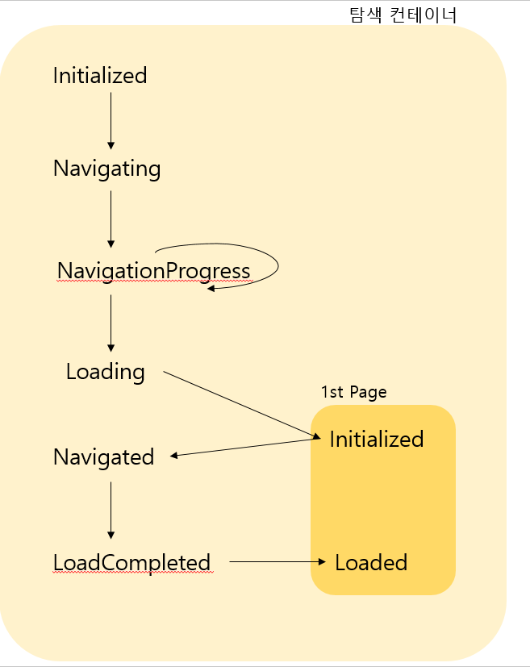
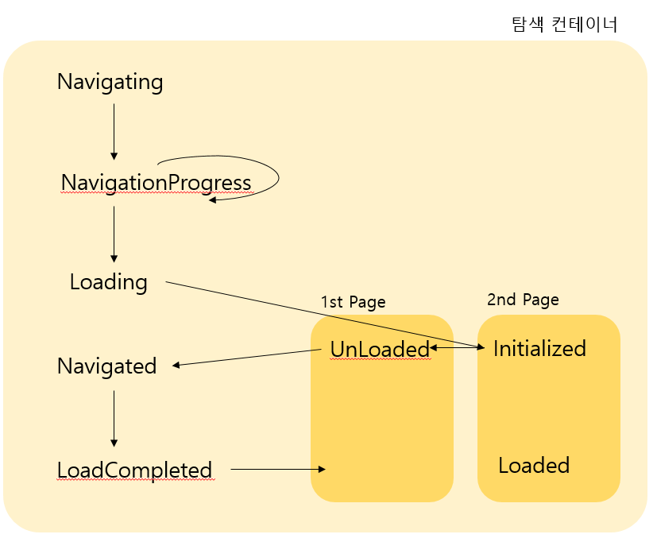

# Chapter7. 프로그램의 구조화와 배포🏇

## 표준 윈도우즈 프로그램
- 표준 윈도우즈 응용 프로그램은 로컬 컴퓨터에서 실행됨, 하나 이상의 윈도우를 사용하는 인터페이스를 가짐 
### 윈도우 클래스
- 컨텐트를 포함하는 가장 기본적인 엘리먼트
- WPF 윈도우는 Win32윈도 기반하에서 실행됨 -> WPF기반인지 Win32 기반인지 모름
- Win32와 동일한 방법으로 크롬을 렌더링하고 작업표시줄에 나타냄 
    - 크롬이란?
    - 최대화, 최소화, 닫기 버튼을 가진 비클라이언트 영역을 부르는 용어
- WPF 윈도우는 윈폼이 Win32를 이용하는 것과 유사한 방식으로 추상화를 위한 유용한 메소드와 프로퍼티를 지원
- Show 메소드 호출 -> 윈도우 나타남
- Hide 메소드 호출 -> 사라짐
- Close 메소드 호출 -> 영구히 사라짐
- 윈도우 엘리먼트의 외관은 Icon, Title, WindowStyle 프로퍼티를 이용하여 조정
- Left, Top을 이용하면 화면상의 위치 조정 가능
    - WindowStartupLocation 프로퍼티를 CenterScreen 또는 CenterOwner로 설정 시 윈도우가 처음 렌더링될 때 위치 더 쉽게 파악 가능
    - Topmost를 true로 설정 시 항상 모든 윈도우보다 앞에 있게 됨(레이어가 쌓여있고 설정된 레이어가 맨 위에 있다고 생각...!)
    - ShowInTaskbar를 false로 설정 시, 작업표시줄에 나타나는 전형적인 표시를 없앨 수 있음
- 윈도우의 속성은 윈도우가 노출하고 있는 프로퍼티를 통해서만 가능함

모덜리스 대화상자(modeless dialog):
- 윈도우 클래스가 Show 메소드를 이용해서 만든 자식 윈도우
- 다른 윈도우와 특별히 다른 점은 없지만, 부모 윈도우와 함께 종료되고 최소화됨 

- 윈도우가 다른 윈도우를 자식으로 만드려면 자식의 Owner 프로퍼티를 부모로 참조하도록 해야 함
- 부모 윈도우는 읽기 전용의 OwnedWindows 프로퍼티를 통해 자신의 자식 윈도우를 열거하고 접근 가능함

- InitializeComponent 메소드 호출이 중요한 이유:
    - 객체를 제대로 생성해주기 때문
    - 컴파일된 XAML의 런타임 시 처리가 이 메소드 안에서 이루어지기 때문
    - 비주얼 스튜디오를 이용하면 자동으로 이 메소드를 호출해주는 코드를 만들어주기 때문 -> 실수할 위험 줄어듬

### 애플리케이션 클래스
- 전체적인 프로그램이 시작되는 진입점이 있어야 함
- 만약 다음처럼 Main 메소드를 작성한다면...
```C#
public static void Main()
{
  MainWindow window = new MainWindow();
  window.Show();
}
```
**블로킹(blocking) vs 논블로킹(non-blocking)**
- 블로킹: 자신의 수행결과가 끝날 때까지 제어권을 갖고 있는 것
- 논블로킹: 자신이 호출되었을 때, 제어권을 자신을 호출한 쪽으로 넘김, 자신을 호출한 쪽에서 다른 일을 할 수 있도록 하는 것

- WPF 프로그램은 단일 스레드 방식(STA:single-threaded apartment)으로 실행되어야 함
    - Main 메소드는 STAThread라는 어트리뷰트가 선언되어야 함
- Show 메소드는 Win32의 ShowWindow 메소드 이용 -> 윈도우를 보여주고 바로 반환하는 넌블로킹을 이용함
- .... Show메소드를 Main 메소드의 가장 마지막에서 호출하면 눈에 안 보일 정도로 프로그램 깜빡이고 바로 종료됨... 흐규...
- MainWindow가 바로 종료되는 것을 막기 위해서, 종료시점까지 운영체제와 MainWindow 사이에 메세지 전달하는 처리를 할 필요가 있음
- 이 메세지들은 Win32 프로그램에서 만들어지는 WM_PAINT, WM_MOUSEMOVE 같은 윈도우 메시지와 동일함
- Win32 환경에서는 입력되는 메세지를 처리하고 절차에 따라 메시지를 보내 완료되었음을 알림
- 이 과정 = 메시지 루프 또는 메시지 펌프라고 함
- WPF는 이런 복잡한 작업을 쉽게 처리가능하도록 System.Windows.Application 클래스를 제공함

**Application.Run 사용하기**
- 애플리케이션 클래스는 프로그램을 활성화하고 메세지를 효과적으로 전달하기 위해 Run 메소드를 이용함
- Main 메소드를 다음과 같이 수정함
```C#
public static void Main()
{
  Application app = new Application();
  MainWindow window = new MainWindow();
  window.Show();
  app.Run(window);
}
```
- 애플리케이션 클래스는 StartupUri라는 프로퍼티 이용 -> 처음 로딩할 윈도우 지정 가능함
```C#
public static void Main()
{
  Application app = new Application();
  app.StartupUri = new Uri("MainWindow.xaml", UriKind.Relative);
  app.Run();
}
```
- MainWindow는 XAML의 소스파일 위치를 URI를 통해 확인, 윈도우를 생성할 필요 없는 Run을 호출
- StartupUri 프로퍼티를 갖고 있는 이유: XAML을 이용해서 어느 곳에서나 동일한 초기화가 가능하도록 하기 위함

**애플리케이션 클래스의 다른 기능들**
- 애플리케이션 클래스: 진입점이나 프로그램 사이의 메시지 전달 뿐만 아니라 프로그램 차원의 처리를 위해 다수의 이벤트, 프로퍼티, 메소드를 정의하고 있음
- 비주얼스튜디오에서 만들어진 App클래스처럼 Application 을 상속받은 클래스들은 Startup, Exit, Activated, Deativated, SessionEnding 같은 이벤트를 재정의해서 처리 가능함
- Application의 다른 유용한 프로퍼티: Properties 컬렉션
- Properties 컬렉션: 윈도우나 다른 객체 사이에 데이터를 저장하고 공유하기 위해 사용하는 키와 값을 한 쌍으로 하는 딕셔너리의 일종
- 애플리케이션 수준에서 전역 변수로 public 멤버나 프로퍼티를 정의하는 것 < Properties 컬렉션에 데이터를 보관하는 방법
```C#
myApplication.Properties["CurrentPhotoFilename"]=filename;
```
- 다시 가져오기 위해 다음과 같이 사용함
```C#
string filename = myapplication.Properties["CurrentPhotoFilename"] as string;
```
- 키와 값이 모두 Object 타입 -> 어떤 데이터도 보관 가능, 문자열에 제한 없음

### 대화상자 만들기와 보여주기
- 윈도우즈: 운영체제 차원에서 파일 열고 저장하거나 폴더를 탐색하고 폰트나 색깔을 선택하거나 인쇄할 수 있게 해주는 공통적인 대화상자를 제공
#### 공통 대화상자
- WPF는 몇몇 공통 대화상자(common dialog)를 내장하고 있음
- 이를 편리하기 사용 가능하도록 메소드와 프로퍼티를 지원함
- 순수 WPF만으로는 이런 대화상자를 렌더링할 수 없음 -> 내부적으로 Win32의 API를 호출함
- Win32를 래핑해서 사용하는 방식: 어떤 프로그램이 실행되어도 운영체제 입자에서는 일관성을 유지할 수 있음 -> 긍정적임
- 내장 공통 대화상자를 사용하는 것: ShowDialog 메소드를 호출하면 즉시 인스턴스가 생성되고 그 결과를 처리함 
```C#
void printMenu_Click(object sender, RoutedEventArgs e)
{
    string filename = (pictureBox.SelectedItem as ListBoxItem).Tag as string;
    Image image = new Image();
    image.Source = new BitmapImage(new Uri(filename, UriKind.RelativeOrAbsolute));

    PrintDialog pd = new PrintDialog();
    if( pd.ShowDialog() == true)
        pd.PrintVisual(image, Path.GetFileName(filename)+" from Photo Gallery");
}
```
#### 사용자지정 대화상자
- 프로그램에 특화된 대화상자를 보여줘야 할 때가 종종 있음
- WPF에서 그런 사용자지정 대화상자를 사용하는 것 = 일반 윈도우를 만들어 사용한다는 것
- 윈도우를 모달 대화상자로 사용하려면 Show 메소드 대신 ShowDialog를 호출해주기만 하면 됨
    - ShowDialog 메소드는 블로킹 호출-> 윈도우가 닫힐 때까지 종료 안 됨
```C#
void renameMenu_Click(object sender, RoutedEventArgs e)
{
    string filename = (pictureBox.SelectedItem as ListBoxItem).Tag as string;
    RenameDialog dialog = new RenameDialog(
        Path.GetFileNameWithoutExtension(filename));
    if(dialog.ShowDialog() == true)
    {
        try
        {
            File.Move(filename, Path.Combine(Path.GetDirectoryName(filename),
            dialog.NewFilename) + Path.GetExtension(filename));
            Refresh();
        }
        catch(Exception ex)
        {
            MessageBox.Show(Ex.Message, "Cannot Rename File", MessageBoxButton.OK,
            MessageBOxImage.Error);
        }
    }
}
```
### 프로그램 상태를 유지하고 복원하기
- 표준 윈도우즈 응용 프로그램: 컴퓨터의 사용자 권한이 허용하는 모든 자원에 접근 가능함
    - 윈도우즈 레지스트리나 파일로 많은 상태 정보를 저장해왔음
    - 이 방법과 닷넷 프레임워크가 다른 점: 격리된 저장소 기술을 사용한다는 점
    - 이 방식은 이용하기 쉽고, 매니지드 코드가 실행되는 모든 환경에서 접근 가능함
```C#
protected override void OnClosed(EventArgs e)
{
    base.OnClosed(e);
    // 프로그램이 종료될 때마다 개별 즐겨찾기 아이템을 저장함
    IsolatedStorageFile f = IsolatedStorageFile.GetUserStoreForAssembly();
    using (IsolatedStorageFileStream stream =
        new IsolatedStorageFileStream("myFile", FileMode.Create, f)) //myFile이라는 이름을 가진 IsolatedtorageFileStream을 꺼내옴 
    using (StreamWriter writer = new StreamWriter(stream)) //streamwriter를 사용함
    {
        foreach (TreeViewItem item in favoritesItem.Items) 
            writer.WriteLine(item.Tag as string); //스트림에 트리뷰 아이템들을 write해줌
    }
}

protected override void OnInitialized(EventArgs e)
{
    base.OnInitialized(e);

    //프로그램이 시작할 떄 개별 즐겨찾기 아이템을 읽어온다.
    IsolatedStoragefile f = IsolatedStorageFile.GetUserStoreAssemby();
    using (IsolatedStorageFileStream stream =
        new IsolatedStorageFileStream("myFile", FileMode.OpenOrCreate,f))
    using (StreamReader reader = new StreamREader(stream))
    {
        string line = reader.ReadLine();
        while(line != null){
            AddFavorite(line);
            line = reader.ReadLine();
        }
    }
}
```
- IsolatedStorageFile과 IsolatedStorageFileStream 클래스는 System.IO.IsolatedStorage 네임스페이스에 속해있음
- 격리된 저장소에 저장된 모든 데이터는 물리적으로 현재 사용자의 내문서 폴더에 숨김 속성으로 자리잡음
### 배포: 클릭원스 대 윈도우즈 인스톨러
- 표준 윈도우즈 응용 프로그램 배포하려고 할 떄, 보통 Program Files 포럳에 파일 설치, 관련된 컴포넌트 등록 후 제어판의 설치 프로그램 목록에 추가하는 것이 일반적인 방법
- 이렇게 설치된 프로그램들은 일반적으로 시작메뉸 데스크톱 바로가기에서 실행됨
- WPF에서도 윈도우즈 인스톨러를 이용 -> 이렇게 설치 수행이 가능함
- 비주얼 스튜디오는 '설치 및 배포'의 몇 가지 프로젝트를 통해 쉽게 이런 작업 처리 가능함.
- 클릭원스를 이용하면 훨씬 간단히 프로그램 배포가 가능 
    - 윈도우즈 인스톨러의 강력한 기능들이 필요하지 않은 경우, 매력적인 대안 될 수 있음

- 윈도우즈 인스톨러의 장점
    - 최종 사용자 이용동의 같은 내용을 원하는 부분에 넣을 수 있음
    - 설치될 파일의 경로 선택 가능함
    - 설치과정 중 특정 처리를 하기 위한 임의의 코드를 지원함
    - GAC에 공유 어셈블리를 추가 가능함
    - 파일과 연결된 COM을 등록 가능
    - 설치하는 사용자 뿐만 아니라 모든 사용자가 이용하도록 설정 가능
    - 오프라인에서 CD나 DVD로 설치 가능

- 클릭원스의 장점
    - 자동 업데이트아 이전 버전으로 되돌리기를 내부적으로 지원
    - 두 개의 설치 모델 제공
    - 격리된 저장소에 모든 파일 생성되고 다른 등록과정 없음 -> 다른 프로그램에 영향 미치지 않음
    - 설치되는 동안 추가적인 코드가 실행되지 않음 -> 제거 시 깨끗하게 제거됨
    - 전체 신뢰 프로그램은 실행되는 동안 컴퓨터에 어떤 것도 남겨놓을 수 있는 권한을 가짐
    - 닷넷의 CAS와 통합됨 -> 사용자를 완벽하게 검증하지 않아도 프로그램 실행시키도록 할 수 있음

## 탐색 기반 윈도우즈 응용 프로그램
- 탐색의 개념 -> 윈도우 탐색기, 미디어 플레이어, 마이크로소프트 머니, 윈도우즈 포토 갤러리 같은 다양한 프로그램에 도입되어 있음
- WPF는 최소한의 코딩으로 프로그램에 탐색 기능을 추가할 수 있도록 많은 지원을 해줌 
    - 웹 브라우저처럼 컨텐트를 검색하고 찾아볼 수 있는 프로그램을 쉽게 구현 가능함
- 탐색 기능은 전통적인 프로그램 스타일에 많은 부분 차지할 수도 있고, 그렇지 않을 수도 있음
- 웹 브라우저 같은 사용자 인터페이스를 원하지 않아도, 웹 사이트를 구조화하는 것보다 훨씬 더 탐색 기반 인터페이스를 사용 가능함

### 페이지와 탐색 컨테이너
- WPF에서 탐색 기능을 사용할 경우, 컨텐트는 보통 페이지 엘리먼트에서 구성됨
- 페이지 엘리먼트 = 윈도우 클래스의 단순 버전
- 페이지 엘리먼트들은 NavigationWindow나 프레임같은 내장 탐색 컨테이너에 호스팅됨
- 이 컨테이너들은 한 페이지에서 다른 페이지로 이동과 탐색 이력을 갖고 있는 저널 뿐만 아니라 탐색과 관련된 많은 이벤트를 정의하고 있음

**호스팅이란?**
- 그 외 다른 상황에서, 이 용어는 자신보다 작거나 능력이 떨어지는 장치 또는 프로그램에게 서비스를 제공하는 장치나 프로그램을 의미한다.
- 출처: http://www.terms.co.kr/host.htm

### 페이지 사이를 탐색하기
- 탐색 기능을 사용하는 주요 목적: 페이시 사이에서 처리 과정을 옮겨 갈 수 있음
- 탐색 기능의 주요 사용 방법:
    - Navigate 메소드 호출
    - 하이퍼링크 사용
    - 저널 사용

**Navigate 메소드 호출**
- 탐색 컨테이너들은 현재 페이지를 이동하기 위해 Navigate 메소드를 지원함
- 원하는 페이지의 인스턴스나 URI를 Navigate 메소드의 인수로 넘기면 원하는 곳으로 이동함.
```C#
// 페이지 인스턴스로 검색
PhotoPage nextPage = new PhotoPage();
this.NavigationService.Navigate(nextPage);
// URI를 통해서 페이지를 검색
this.NavigationService.Navigate(new Uri("PhotoPage.xaml", UriKind.Relative));
```
- URI를 사용하는 페이지는 느슨한 XAML파일이나 컴파일된 리소스를 사용 가능함
- XAML 파일은 루트 엘리먼트로 반드시 페이지를 사용해야 함
- HTML 페이지를 탐색하려면 Navigate의 오버로드된 메소드를 사용해야 함
`this.NavigationService.Navigate(new Uri("http://www.admanathan.net/wpf"));`

**하이퍼링크 사용하기**
- 간단히 탐색가능하도록 WPF는 HTML보다 더 강력한 기능의 하이퍼링크를 지원함
- 텍스트블록 엘리먼트 내부에서 하이퍼링크 사용 가능(HTML의 a태그와 유사)
- 현재 페이지에서 원하는 페이지로 이동하도록 자동으로 렌더링됨
- HTML이 href 어트리뷰트를 이용해서 웹 페이지를 지정하는 것처럼, NavigateUri 프로퍼티 이용 -> 결과가 렌더링됨
```XAML
<TextBlock>
Click <Hyperlink NavigateUri="PhotoPage.xaml">here</Hyperlink> to view the photo.
</TextBlock>
```
- 이 엘리먼트의 목적: 원하는 페이지의 링크를 알려주는 것

**저널 사용하기**
저널 기능: 웹 브라우저처럼 탐색한 경로를 기록하는 기능
- 뒤로/앞으로 버튼 누를 때마다 내부적인 처리를 통해 기록되어 있는 페이지 사이를 이동하게 해줌
- 내부적으로 두 개의 스택을 갖고 있음

[저널을 사용했을 때 탐색 기능의 결과]

| 처리             | 결과                                                         |
| ---------------- | ------------------------------------------------------------ |
| 뒤로(Back)       | 현재 페이지를 앞으로 버튼을 위한 스택에 넣고, 뒤로 버튼을 위한 스택에서 페이지를 꺼내온다. |
| 앞으로(Forward)  | 현재 페이지를 뒤로 버튼을 위한 스택에 넣고 앞으로 버튼을 위한 스택에서 페이지를 꺼내온다. |
| 다른 방식의 탐색 | 현재 페이지를 뒤로 버튼을 위한 스택에 넣고, 앞으로 버튼을 위한 스택을 비움 |

- NavigationWindow 클래스는 항상 저널 기능을 갖고 있음, 프레임은 JournalOwnership 프로퍼티의 설정 유무에 따라 달라짐
    - OwnsJournal: 프레임 클래스가 자체적으로 저널을 갖고 있음
    - UsesParentJournal: 부모 컨테이너의 저널을 사용한다. 부모 컨테이너의 저널이 없으면 기록 불가능.
    - Automatic: 기본 값, 프레임이 탐색 컨테이너에 포함되어 있을 경우 UsesParentJournal로 설정
      -> 그렇지 않으면 OwnsJournal로 설정됨
      

**탐색 이벤트**
- 탐색은 비동기적으로 실행되며, 이 때 많은 탐색 이벤트들이 발생함

[페이지가 처음 로드될 때 발생하는 이벤트의 발생 순서]

[페이지 사이를 이동할 때 일어나는 이벤트의 발생 순서]


### 페이지 사이의 데이터 전달
- HTML 기반의 웹 프로그램들은 URL 파라미터처럼 데이터를 인코딩하거나 서버측 변수를 이용함
- WPF에서는 이보다 더 다양한 기술을 사용함

**페이지에 데이터 전송**
1.
- WPF는 객체를 파라미터로 받아들이는 Navigate 메소드 이용 -> URL 파라미터처럼 사용 가능함
- 페이지의 인스턴스와 URi 뿐만 아니라, 다른 파라미터 사용해서 단순 데이터 타입, 배열, 사용자지정 데이터 등 어떤 것이든 전달 대상 페이지에 전송 가능

```C#
int photoId = 10;
//페이지 인스턴스를 사용하는 Navigate 메소드
PhotoPage nextPage = new PhotoPage();
this.NavigationService.Navigate(nextPage, photoId);
//URi를 사용하는 Navigate 메소드
this.NavigationService.Navigate(
    new Uri("photoPage.xaml", UriKind.Relative), photoId);
)
```
2.
- 더 단순한 방법; 페이지 인스턴스만 사용하는 Navigate 메소드를 사용하는 것
    - 원하는 데이터를 대상 페이지의 생성자에서 받아들이면 됨

```C#
int photoId=10;
//페이지 인스턴스를 사용하는 Navigate 메소드
PhotoPage nextPage = new PhotoPage(photoId);
this.NavigatieonService.Navigate(nextPage);
```
- PhotoPage 클래스의 생성자는 인수를 받아들이도록 오버로드 생성자를 작성해야 함
- 이 방식의 장점: 파라미터의 데이터 타입을 정확히 할 수 있음, 프레임워크 차원에서 타입을 보증 -> PhotoPage 클래스는 이 데이터가 널이 아니거나 정수형 데이터인지 체크할 필요 없음

3.
Application의 Properties 컬렉션을 통해서 전역 데이터로 공유하는 것
```C#
//URI나 페이지 인스턴스로 넘기기
Application.Propertiest["photoId"]=10;
this.NavigationService.Navigate(...);
```

- 전달 대상 페이지는 Navigate 메소드가 호출된 후 어느 곳에서든지 이 값을 가져다 사용 가능함
```C#
if(Application.Properties["PhotoId"]!=null)
  LoadPhoto((int)Application.Properties["photoId"]);
```
- 여러 페이지 사이에서 공유하기 원한다면 이 방식이 제일 적절함. 
- 그러나 처음 방식처럼 데이터 타입 안정성이 부족하다는 단점이 있음

**PageFunction 클래스를 사용한 페이지 간의 데이터 반환하기**
- 사용자들이 페이지를 탐색하다가 어떤 작업 요청하면 그 작업 처리한 후 이전 페이지로 돌아오도록 자동으로 설정 가능함
- 원하는 처리 결과도 반환함

[이전 페이지를 담고 있는 스택에서 앞으로 버튼을 눌러 페이지를 이동할 때 데이터가 반환되는 과정]


- URI이용 시 항상 새로운 인스턴스가 생성됨 -> 상황에 따라 MainPage의 인스턴스와 새로운 인스턴스를 동일한 조건으로 만들기 위해 상태 정보를 수동으로 재설정해야 할지 모름
- 단순한 결과를 시험하기 위해 앞으로 버튼을 누르면 원하지 않는 결과가 나올 수 있음

- 다른 방법으로 Application.Properties 이용해서 전역 데이터를 공유하고 대상 페이지에서 탐색 컨테이너의 GoBack 메소드를 이용하는 방법 -> 이전 페이지로 갈 수 있음
- 그러나... 단지 두 페이지만을 이용해서 전역 데이터를 사용하는 것은 비추

- 결론적으로, 그래서 WPF는 이전 페이지에 데이터를 반환하는 다른 방식을 제공
- 이 방식은 데이터 타입이 안정적이고 뒤로 버튼을 누른 것처럼 자동으로 이동함
- PageFunction이 이런 역할을 담당함

[PageFunction 클래스를 사용해서 탐색이 처리되는 과정]

- 이 클래스는 Page 클래스에서 파생됨 -> 페이지라고 봐도 무방함 그러나 데이터를 반환하는 처리과정이 있음 -> 함수처럼 실행됨
- 비주얼스튜디오에서는 PageFunction을 만들기 위한 템플릿이 있음 -> 새 항목 추가를 눌러 페이지 추가하는 것처럼 추가 가능
```xaml
<PageFunction
    xmlns="http://schemas.microsoft.com/winfx/2006/xaml/presentation"
    xmlns:x="http://schemas.microsoft.com/winfx/2006/xaml"
    xmlns:sys="clr-namespace:System;assembly=mscorlib" 
    x:Class="Chapter7.PageFunction1"
    x:TypeArguments="sys:String"
    xmlns:mc="http://schemas.openxmlformats.org/markup-compatibility/2006"
    xmlns:d="http://schemas.microsoft.com/expression/blend/2008"
    xmlns:local="clr-namespace:Chapter7"
    mc:Ignorable="d"
    d:DesignHeight="300" d:DesignWidth="300"
    Title="PageFunction1">
    <Grid>

    </Grid>
</PageFunction>
```
- PageFunction은 실제로 PageFunction<T> 타입의 제너릭 클래스임
    - 반환되는 값의 타입을 명시해야 함
    - 예제에서 반환되는 타입은 문자열이어야 함
    - PageFunction은 페이지에서 파생되었음 -> 다른 페이지처럼 탐색도 가능함
    ```C#
    PageFunction1 nextPage = new PageFunction1<string>();
    this.NavigationService.Navigate(nextPage);
    ```
- 반환값을 받으려면, 소스 페이지에서 PageFunction의 Return 이벤트를 다음과 같이 처리해야 함
```C#
nextPage.Return += new ReturnEventHandler<string>(nextPage_Return);
...
void nextPage_Return(object sender, ReturnEventArgs<string> e)
{
    string returnValue = e.Result;
}
```
- ReturnEventHandler와 ReturnEventArgs에도 동일한 제너릭 인수가 적용됨
- 이벤트의 인수 중 Result 프로퍼티는 PageFunction에서 반환되는 데이터와 동일한 타입임
- PageFunction 클래스는 부모 클래스에서 상속받은 OnReturn 메소드를 호출해서 반환되는 데이터를 다음과 같이
  ReturnEventArgs 타입으로 래핑해서 전달 가능함
  `OnReturn(new ReturnEventArgs<string>("the data"))`

## 윈도우즈 비스타의 룩앤필을 가진 응용 프로그램
- 보안, 신뢰성, 네트워크, 데이터, 사용자 인터페이스 등 많은 부분에서 혁신적인 새로운 기능을 선보이고 있음
### 메시지박스를 대신하는 태스크대화상자
- 윈도우즈 비스타에서는 메시지박스를 새롭게 발전시킨 태스크대화상자를 사용함
- 효율성+UI의 장점이 있음
- 태스크대화상자는 윈도우즈 비스타의 새로운 룩앤필(look and feel)과 동일함, 몇 가지 컨트롤 추가하면 수준 높은 대화상자 만들 수 있음
- 개발자들이 이것을 이용하려면 TaskDialog라는 Win32 API를 호출해야 함

### 에어로 글래스 사용하기

## 가젯 스타일의 응용 프로그램
## XAML 브라우저 응용 프로그램
## 느슨한 XAML 페이지
## 결론
