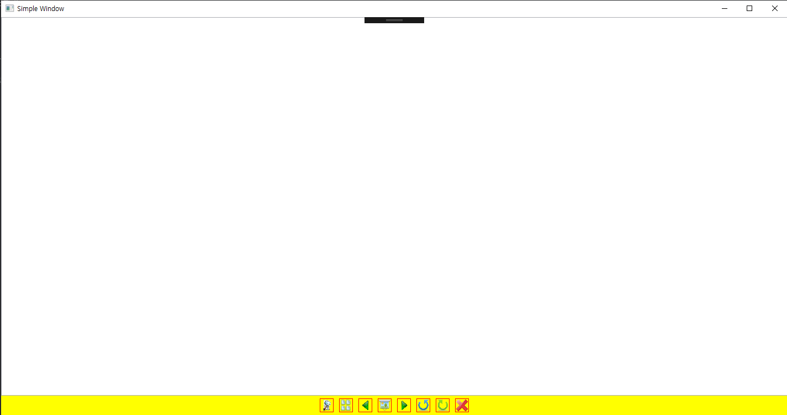
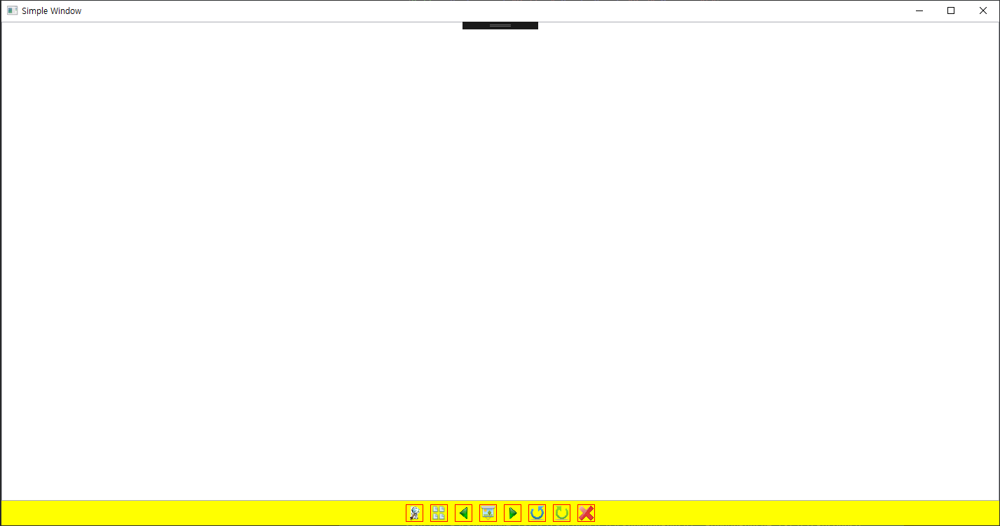

# Chapter8. 리소스🏇

## 바이너리 리소스

- 바이너리 리소스: WPF외에도 닷넷 프레임워크의 여러 분야에서 공통적으로 사용하는 기본 리소스
- WPF에서도 비트맵 같은 일반적인 그래픽 처리부터 컴파일된 XAML까지도 리소스로 저장이 가능함
- 바이너리 리소스는 세 가지 방식으로 패키지화하여 사용함
    - 어셈블리 내부에 포함됨
    - 컴파일 시점에 프로그램에 정보를 알려주는 느슨한 파일 형태로 사용됨
    - 컴파일 시점에도 프로그램에 정보를 알려주지 않는 느슨한 파일 형태로 사용됨

- 지역화 리소스: 바이너리 리소스는 현재 컬처에 의존함 
- 언어 중립적인 리소스: 컬처에 영향을 받지 않는 리소스

### 바이너리 리소스 정의하기

- 비주얼 스튜디오는 WPF 프로그램의 바이너리 리소스를 지원하기 위한 옵션을 지원함
    - Resource: 해당 사용 언어의 위성 어셈블리나 일반 어셈블리에 리소스를 포함함
    - Content: 리소스를 느슨한 파일로 남겨 두지만 Assembly AssociatedContentFile 어트리뷰트를 사용해서 파일의 상대경로와 파일명을 기록함
- 느슨한 파일로 리소스를 관리하려면 빌드작업에 Content 옵션을 선택하면 프로젝트에 파일을 추가하는 작업은 안 해도 된다
- 단순히 정확한 위치에 파일이 존재하면 프로젝트에 추가하지 않아도 프로그램이 실행될 때 알아서 처리함


### 바이너리 리소스에 접근하기

- 바이너리 리소스가 Resource 빌드작업을 통해 어셈블리에 포함되거나 아니면 Content 빌드 작업을 통해 느슨한 파일 형태로 링크되거나
  컴파일 시점에 어떤 작업도 하지 않는 느슨한 파일로 존재하더라도 WPF는 URI를 통해 XAML이나 코드에서 접근 가능함
  
- 문자열로 쓰인 URI를 적절하게 형전환해주는 타입 컨버터가 존재 -> 이런 작동이 가능함

- System.Windows.Controls.Image 클래스는 바이너리 이미지에 쉽게 접근할 수 있게 도와주는 컨트롤

- Image 컨트롤은 System.Windows.Media.ImageSource 타입의 Source 프로퍼티를 가짐, 그러나 타입 컨버터 덕분에 XAML의 단순 문자열을 프로퍼티에 설정 가능

- 이미지 엘리먼트를 하지 않아도 되지만, 바이너리 리소스에 접근하는 핵심: 리소스가 어떻든 간에 그 위치를 나타내는 URI를 해석할 수 있느냐?

  [XAML에서 바이너리 리소스 접근에 사용되는 URI]

  리소스 이름을 logo.jpg라고 사용한다는 가정 하에...

  | URI 표현                             | 리소스 설명                                                  |
  | ------------------------------------ | ------------------------------------------------------------ |
  | logo.jpg                             | 현재 어셈블리에 포함되어 있거나, 현재 xAML 페이지 혹은 어셈블리와 느슨한 형태로 함께 존재함. 특히, 후자일 경우 프로젝트에서 Content라고 표시될 때만 가능함. |
  | A/B/logo.jpg                         | 현재 어셈블리를 컴파일할 때 A\B라고 하위 폴더를 정의하고 그 내부에 포함되었거나, 현재 XAML 페이지 혹은 어셈블리와 A\B 하위 폴더의 상대 경로를 사용한 느슨한 구조로 존재함 특히 후자일 경우 프로젝트에서 Content라고 표시될 때만 가능 |
  | C:\temp\logo.jpg                     | 로컬 PC의 C:\temp 폴더에 느슨한 형태로 존재함                  |
  | file://C:/temp/logo.jpg              | 로컬 PC의 C:\temp 폴더에 느슨한 형태로 존재함                  |
  | \\\pc1\images\logo.jpg               | UNC 공유를 이용해 \\\pc1\images 로 지정된 곳과 공유함          |
  | http://pinvoke.net/logo.jpg          | 웹사이트에서 호스팅되는 파일로 존재함                           |
  | MyDll;Component/logo.jpg             | MyDll.dll 혹은 MyDll.exe 같은 다른 어셈블리의 파일로 존재함     |
  | MyDll;Component/A/B/logo.jpg         | MyDll.dll 혹은 MyDll.exe 같은 다른 어셈블리 내부의 A\B 하위 폴더에 있는 파일로 존재함 |
  | pack://siteOfOrigin:,,,/logo.jpg     | 사이트 원점을 기준으로 특정한 곳에 존재함                       |
  | pack://siteOfOrigin:,,,/A/B/logo.jpg | 사이트 원점을 기준으로 A\B 구조의 하위 폴더에 느슨한 형태로 존재함 |

**다른 어셈블리에 포함되어 있는 리소스 접근하기**
- 다른 어셈블리에 포함되어 있는 바이너리 리소스에 쉽게 접근하는 방법: 핵심파일을 수정하지 않고 리소스만 수정하면 됨
- 관리 측면에서 매우 유용한 방법, 그러나 사용하는 방법이 다소 생소함
`어셈블리 참조;컴포넌트/리소스명(AssemblyReference;Component/ResourceName)`
- 어셈블리 참조: 어셈블리의 물리적 파일명
- 컴포넌트: 키워드로 사용됨
- 버전번호나 공용키 토큰(public key token)등을 함께 사용 가능 -> 네 가지로 표기 가능함
    - 어셈블리명(MyDll;Component/images/logo.jpg)
    - 어셈블리명;v버전번호(v 접두사는 필요할 때만 사용함. MyDll;v1.35;component/imags/logo.jpg)
    - 어셈블리명;공용키토큰(MyDll;dc642a723123fadsf;component/images/logo.jpg)
    - 어셈블리명;v버전번호;공용키토큰(MyDll;v1.35;;dc642a723123fadsf;component/images/logo.jpg)

**사이트 원점에서 리소스 접근하기**
- 전체신뢰환경 프로그램이 윈도우즈 인스톨러로 설치되었다면, 사이트 원점 = 프로그램의 설치폴더
- 클릭원스를 통해 전체신뢰환경 프로그램이 배포되었다면, 사이트 원점 = 프로그램이 배포된 URL 또는 UNC 경로가 됨
- 클릭원스를 통해 XBAP이나 부분신뢰환경 프로그램이 배포되었다면, 사이트 원점은 프로그램을 호스팅하고 있는 URL이나 UNC의 경로가 됨
- 인터넷 익스플로러에서 사용된 느슨한 XAML 페이지는 사이트 원점이 없음 -> 사용 시 에러 발생

- 사이트 원점을 이용하는 표기법은 다른 어셈블리에 포함된 리소스를 참조하는 것보다 훨씬 낯설음
- `pack://siteOfOrigin:,,,/`로 사용하고 하위폴더를 포함한 리소스명을 사용해야만 함
- siteOfOrigin은 단순히 사이트 원점을 의미하는 키워드임

**프로그래밍 코드에서 리소스 접근하기**
- C#에서 리소스를 참조하기 위해 URI를 만드려고 할 때, XAML에 특화된 바로가기는 사용 불가능
- URI는 사이트 원점이나 URL 등의 전체 경로를 명시해줘야 함
- Image 소스 프로퍼티를 사용해서 logo.jpg 참조 가능함
```C#
Image image = new Image();
image.Source = new BitmapImage(new Uri("pack://application:,,,/logo.jpg"))
```
- JPEG, PNG, GIF, BMP 등 가장 일반적인 이미지 형식을 지원하는 ImageSource 클래스를 상속받은 System.Windows.MEdia.Imaging.BitmapImage 클래스를 사용햇음
- URI는 System.Uri 객체를 이용

### 지역화
- 프로그램이 특정 컬처에 종속된 바이너리 리소스를 가지고 있다면, 그 리소스 사용 시 자동으로 
  로딩될 수 있도록 사용된 컬처 개수만큼 위성 어셈블리로 분리해내야 함
- 처리하기 위해 지역화가 필요한 UI에서 사용하는 문자열을 갖고 있어야 함
- Windows SDK에 포함되어 있는 LocBaml이용 -> 지역화할 문자열을 수동으로 뽑아낼 필요 없이 약간의 작업만으로 간편하게 처리 가능
- LocBaml을 사용해서 위성 어셈블리를 만드는 기본적인 방법들이 이씅ㅁ

**다중 컬처를 위한 프로젝트 준비하기**
- 바이너리 리소스의 기본컬처를 정하고 필요한 위성 어셈블리를 만들기 위해 해야 하는 일
- UICulture 엘리먼트를 프로젝트에 추가함(편집기 이용해서 프로젝트 파일 직접 추가)
- UICulture 엘리먼트는 빌드 형태(Debug, Release)를 결정하는 빌드 환경에 상응하는 PropertyGroup 엘리먼트 아래에 추가되어야 함
```XAML
<Project ...>
  <PropertyGroup>
    <UICulture>en-US</UICulture>
```
- 설정을 마친 후, 프로젝트 다시 빌드하면 어셈블리명.resource.dll이라는 위성 어셈블리가 있는 en-US 폴더 발견 가능함
- 기본  UICulture와 같은 값을 가진 NeutralResourcesLanguage 어트리뷰트를 작성한 어셈블리에 표시줘야 함
```C#
[assembly: NeutralResourcesLanguage("en-US",
UltimateResourceFallbackLocation.Satellite)]
```
**지역화 ID를 원하는 사용자 인터페이스에 표시하기**
- 지역화가 필요한 모든 엘리먼트에 XAML 언어 네임스페이스의 Uid지시자 이용 -> 고유한 식별자를 지정하는 것
- 수동으로 하면 이 작업이 아주 오래 걸림, 그러나 명령 창에서 MSBuild 사용하여 자동으로 추가 가능함
`msbuild /t:updateuid ProjectName.csproj`
- 실행시키면 프로젝트 내부의 모든 XAML파일에 있는 엘리먼트에 고유값을 가진 x:Uid 지시자 추가 가능

**LocBaml을 사용해서 새로운 위성 어셈블리 만들기**
- Uid 추가한 프로젝트 컴파일 후에 LocBaml을 실행 -> 생성된 obj\debug 폴더에 있는 *.resources 파일들을 다시 빌드해해야 함
`LocBaml /parse ProjectName.g.en-US.resources /out:en-US.csv`
- 지역화가 필요한 모든 프로퍼티의 값을 갖고 있는 .csv파일을 만들어냄
- 원하는 컬처에 맞도록 수정 가능함
- 파일 저장, LocBaml 반대로 사용 시 .csv에서 새로운 위성 어셈블리를 만들 수도 있음
`LocBaml  /generate ProjectName.resources.dll /trans:fr-CA.csv  /cul:fr-CA`
- 새롭게 만든 파일들은 컬처에 맞는 어셈블리의 폴더로 복사되어야 함

## 로지컬 리소스
- WPF에서만 사용하는 리소스
- 적절한 용어가 없음 -> 로지컬이라고 부르기로 했음
- 로지컬 리소스: 엘리먼트의 Resources 프로퍼티에 닷넷 객체를 저장, 여러 자식 엘리먼트 사이에서 공유 가능
- FrameworkElement나 FrameworkContentElement에서 파생된 클래스들: System.Windows.ResourceDictionary타이의 Resources 프로퍼티 가짐 
 -> 대부분의 WPF 클래스들은 로지컬 리소스 이용 간으함
 ```XAML
 <Window x:Class="chapter8.MainWindow"
        xmlns="http://schemas.microsoft.com/winfx/2006/xaml/presentation"
        xmlns:x="http://schemas.microsoft.com/winfx/2006/xaml"
        xmlns:d="http://schemas.microsoft.com/expression/blend/2008"
        xmlns:mc="http://schemas.openxmlformats.org/markup-compatibility/2006"
        xmlns:local="clr-namespace:chapter8"
        mc:Ignorable="d"
        Title="Simple Window" Background="Yellow">
    <DockPanel>
        <StackPanel DockPanel.Dock="Bottom" Orientation="Horizontal" HorizontalAlignment="Center">
            <Button Background="Yellow" BorderBrush="Red" Margin="5">
                <Image Height="21" Source="search-b-icon.png"/>
            </Button>
            <Button Background="Yellow" BorderBrush="Red" Margin="5">
                <Image Height="21" Source="thumbnail.png"/>
            </Button>
            <Button Background="Yellow" BorderBrush="Red" Margin="5">
                <Image Height="21" Source="previous.png"/>
            </Button>
            <Button Background="Yellow" BorderBrush="Red" Margin="5">
                <Image Height="21" Source="slideshow-icon.png"/>
            </Button>
            <Button Background="Yellow" BorderBrush="Red" Margin="5">
                <Image Height="21" Source="next.png"/>
            </Button>
            <Button Background="Yellow" BorderBrush="Red" Margin="5">
                <Image Height="21" Source="counterclockwise.png"/>
            </Button>
            <Button Background="Yellow" BorderBrush="Red" Margin="5">
                <Image Height="21" Source="clockwise.png"/>
            </Button>
            <Button Background="Yellow" BorderBrush="Red" Margin="5">
                <Image Height="21" Source="delete-icon.png"/>
            </Button>
          </StackPanel>
        <ListBox/>
    </DockPanel>
</Window>
 ```


- WPF에서도 로지컬 리소스를 이용하면 스타일을 별도로 분리해서 사용 가능함
- 로지컬 리소스를 이용해서 객체를 공유 -> 복잡한 객체 사용 시 메모리 사용 많이 줄일 수 있음

```XAML
<Window x:Class="chapter8.MainWindow"
        xmlns="http://schemas.microsoft.com/winfx/2006/xaml/presentation"
        xmlns:x="http://schemas.microsoft.com/winfx/2006/xaml"
        xmlns:d="http://schemas.microsoft.com/expression/blend/2008"
        xmlns:mc="http://schemas.openxmlformats.org/markup-compatibility/2006"
        xmlns:local="clr-namespace:chapter8"
        mc:Ignorable="d"
        Title="Simple Window">
    <Window.Resources>
        <SolidColorBrush x:Key="backgroundBrush">Yellow</SolidColorBrush>
        <SolidColorBrush x:Key="borderBrush">Red</SolidColorBrush>
    </Window.Resources>
    <Window.Background>
        <StaticResource ResourceKey="backgroundBrush"/>
    </Window.Background>
    <DockPanel>
        <StackPanel DockPanel.Dock="Bottom" Orientation="Horizontal" HorizontalAlignment="Center">
            <Button Background="{StaticResource backgroundBrush}" BorderBrush="{StaticResource borderBrush}" Margin="5">
                <Image Height="21" Source="search-b-icon.png"/>
            </Button>
            <Button Background="{StaticResource backgroundBrush}" BorderBrush="{StaticResource borderBrush}" Margin="5">
                <Image Height="21" Source="thumbnail.png"/>
            </Button>
            <Button Background="{StaticResource backgroundBrush}" BorderBrush="{StaticResource borderBrush}" Margin="5">
                <Image Height="21" Source="previous.png"/>
            </Button>
            <Button Background="{StaticResource backgroundBrush}" BorderBrush="{StaticResource borderBrush}" Margin="5">
                <Image Height="21" Source="slideshow-icon.png"/>
            </Button>
            <Button Background="{StaticResource backgroundBrush}" BorderBrush="{StaticResource borderBrush}" Margin="5">
                <Image Height="21" Source="next.png"/>
            </Button>
            <Button Background="{StaticResource backgroundBrush}" BorderBrush="{StaticResource borderBrush}" Margin="5">
                <Image Height="21" Source="counterclockwise.png"/>
            </Button>
            <Button Background="{StaticResource backgroundBrush}" BorderBrush="{StaticResource borderBrush}" Margin="5">
                <Image Height="21" Source="clockwise.png"/>
            </Button>
            <Button Background="{StaticResource backgroundBrush}" BorderBrush="{StaticResource borderBrush}" Margin="5">
                <Image Height="21" Source="delete-icon.png"/>
            </Button>
        </StackPanel>
        <ListBox/>
    </DockPanel>
</Window>
```


- 엘리먼트에 리소스를 적용하려면 닷넷의 System.Windows.StaticResourceExtension 클래스와 상응하는 StaticResource 마크업 확장식을 사용해야 함
- Window.Background에 프로퍼티 엘리먼트를 사용해서 적용 가능함
- Button.Background와 Button.BorderBrush처럼 엘리먼트에 어트리뷰트로 사용 가능함
- 브러시를 사용가능한 곳이면 어디든지 사용 가능
```XAML
<Window x:Class="chapter8.MainWindow"
        xmlns="http://schemas.microsoft.com/winfx/2006/xaml/presentation"
        xmlns:x="http://schemas.microsoft.com/winfx/2006/xaml"
        xmlns:d="http://schemas.microsoft.com/expression/blend/2008"
        xmlns:mc="http://schemas.openxmlformats.org/markup-compatibility/2006"
        xmlns:local="clr-namespace:chapter8"
        mc:Ignorable="d"
        Title="Simple Window">
    <Window.Resources>
        <LinearGradientBrush x:Key="backgroundBrush" StartPoint="0,0" EndPoint="1,1">
            <GradientStop Color="Blue" Offset="0"/>
            <GradientStop Color="White" Offset="0.5"/>
            <GradientStop Color="Red" Offset="1"/>
        </LinearGradientBrush>
    </Window.Resources>
    <DockPanel Background="{StaticResource backgroundBrush}" >
        <StackPanel DockPanel.Dock="Bottom" Orientation="Horizontal" HorizontalAlignment="Center">
            <Button Background="{StaticResource backgroundBrush}" BorderBrush="Red" Margin="5">
                <Image Height="21" Source="search-b-icon.png"/>
            </Button>
            <Button Background="{StaticResource backgroundBrush}" BorderBrush="Red" Margin="5">
                <Image Height="21" Source="thumbnail.png"/>
            </Button>
            <Button Background="{StaticResource backgroundBrush}" BorderBrush="Red" Margin="5">
                <Image Height="21" Source="previous.png"/>
            </Button>
            <Button Background="{StaticResource backgroundBrush}" BorderBrush="Red" Margin="5">
                <Image Height="21" Source="slideshow-icon.png"/>
            </Button>
            <Button Background="{StaticResource backgroundBrush}" BorderBrush="Red" Margin="5">
                <Image Height="21" Source="next.png"/>
            </Button>
            <Button Background="{StaticResource backgroundBrush}" BorderBrush="Red" Margin="5">
                <Image Height="21" Source="counterclockwise.png"/>
            </Button>
            <Button Background="{StaticResource backgroundBrush}" BorderBrush="Red" Margin="5">
                <Image Height="21" Source="clockwise.png"/>
            </Button>
            <Button Background="{StaticResource backgroundBrush}" BorderBrush="Red" Margin="5">
                <Image Height="21" Source="delete-icon.png"/>
            </Button>
        </StackPanel>
        <ListBox/>
    </DockPanel>
</Window>
```


### 리소스 룩업
- 스태틱리소스 마크업 확장식은 리소스 딕셔너리에서 사용하는 아이템을 가리키는 키(x:Key로 설정된)를 파라미터로 받아들임
- 그 아이템이 반드시 현재 엘리먼트의 리소스 딕셔너리에 있을 필요는 없음

### 스태틱 리소스 대 다이나믹 리소스
### 시스템 리소스와 상호작용

## 결론

