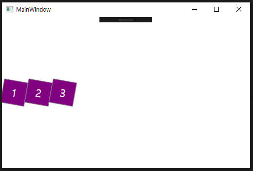
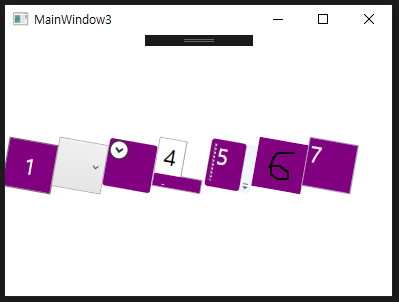
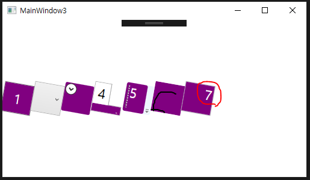
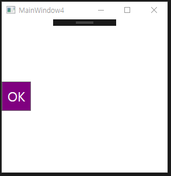
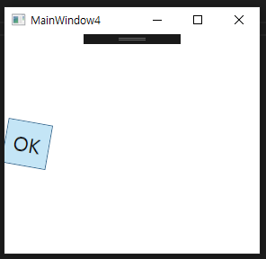

# Chapter10. 스타일, 템플릿, 스킨, 테마🐳
- 스타일: 
  HTML과 CSS의 관계처럼 사용자 인터페이스의 엘리먼트와 프로퍼티를 분리하는 목적으로 사용됨.
- 템플릿:
  WPF의 스타일을 변경했다면 주로 이 템플릿 기능을 사용한 것임
- 스킨:
  프로그램에 종속된 스타일이나 템플릿의 컬렉션. 동적으로 변경이 가능함
- 테마:
  OS 차원에서 지원하는 시각적인 특징들의 집합. 사용자들에 의해 설정 변경 가능함

## 스타일
- 스타일은 System.Windows.Style 클래스를 이용, 구조가 매우 단순함.
- 주요 기능: 개별적으로 적용되는 값들을 그룹으로 묶어줌, 여러 엘리먼트 사이에서 그 그룹들을 공유하는 것
```XAML
<StackPanel Orientation="Horizontal">
        <Button FontSize="22" Background="Purple" Foreground="White" Height="50" Width="50" RenderTransformOrigin=".5,.5">
            <Button.RenderTransform>
                <RotateTransform Angle="10"/>
            </Button.RenderTransform>
            1
        </Button>
        <Button FontSize="22" Background="Purple" Foreground="White" Height="50" Width="50" RenderTransformOrigin=".5,.5">
            <Button.RenderTransform>
                <RotateTransform Angle="10"/>
            </Button.RenderTransform>
            2
        </Button>
        <Button FontSize="22" Background="Purple" Foreground="White" Height="50" Width="50" RenderTransformOrigin=".5,.5">
            <Button.RenderTransform>
                <RotateTransform Angle="10"/>
            </Button.RenderTransform>
            3
        </Button>
    </StackPanel>
```

- 그렇지만 개별 버튼이 스타일을 사용하도록 설정하면 직접 값을 설정하지 않아도 간단하게 처리가 가능함
- 스타일은 대상 프로퍼티 설정을 위해 세터의 컬렉션을 사용함
- 세터 작성하는 것: 클래스명을 가지고 의존 프로퍼티 명과 원하는 것을 정의하는 것
- 스타일에서 사용할 이름을 지정하지만, 시각적인 부분을 상속받은 것은 nothing
- 화면상에 렌더링되는 프로퍼티를 설정해서 사용함
- 실제로 스타일은 의존 프로퍼티만을 설정 가능, 의존 프로퍼티들은 본래 시각적인 부분에 영향을 끼침
```XAML
<StackPanel Orientation="Horizontal">
        <StackPanel.Resources>
            <Style x:Key="buttonStyle">
                <Setter Property="Button.FontSize" Value="22"/>
                <Setter Property="Button.Background" Value="Purple"/>
                <Setter Property="Button.Foreground" Value="White"/>
                <Setter Property="Button.Height" Value="50"/>
                <Setter Property="Button.Width" Value="50"/>
                <Setter Property="Button.RenderTransformOrigin" Value=".5,.5"/>
                <Setter Property="Button.RenderTransform" >
                <Setter.Value>
                    <RotateTransform Angle="10"/>
                </Setter.Value>
                </Setter>
            </Style>
        </StackPanel.Resources>
        <Button Style="{StaticResource buttonStyle}">1</Button>
        <Button Style="{StaticResource buttonStyle}">2</Button>
        <Button Style="{StaticResource buttonStyle}">3</Button>
    </StackPanel>
```
### 스타일 공유하기 
**성격이 다른 엘리먼트들 사이에 스타일 공유하기**
- XAML에서 프로퍼티 엘리먼트처럼 스타일 프로퍼티를 직접 이용 가능함
- 다수의 엘리먼트 사이에서 스타일 공유 가능, 이를 조정할 수 있는 몇 가지 방법을 지원함
```XAML
<StackPanel Orientation="Horizontal">
        <StackPanel.Resources>
            <Style x:Key="controlStyle">
                <Setter Property="Control.FontSize" Value="22"/>
                <Setter Property="Control.Background" Value="Purple"/>
                <Setter Property="Control.Foreground" Value="White"/>
                <Setter Property="Control.Height" Value="50"/>
                <Setter Property="Control.Width" Value="50"/>
                <Setter Property="Control.RenderTransformOrigin" Value=".5,.5"/>
                <Setter Property="Control.RenderTransform" >
                    <Setter.Value>
                        <RotateTransform Angle="10"/>
                    </Setter.Value>
                </Setter>
            </Style>
        </StackPanel.Resources>
        <Button Style="{StaticResource controlStyle}">1</Button>
        <ComboBox Style="{StaticResource controlStyle}">
            <ComboBox.Items>2</ComboBox.Items>
        </ComboBox>
        <Expander Style="{StaticResource controlStyle}" Content="3"/>
        <TabControl Style="{StaticResource controlStyle}">
            <TabControl.Items>4</TabControl.Items>
        </TabControl>
        <ToolBar Style="{StaticResource controlStyle}">
            <ToolBar.Items>5</ToolBar.Items>
        </ToolBar>
        <InkCanvas Style="{StaticResource controlStyle}"/>
        <TextBox Style="{StaticResource controlStyle}" Text="7"/>
    </StackPanel>
```

- 의존 프로퍼티들이 없어도 걱정할 필요 없음
- 잉크 캔버스는 포어그라운드, 폰트 사이즈 프로퍼티가 없지만 스타일을 적용해도 존재하는 프로퍼티들(Background, Height, Width)만 영향을 받음
- 서로 다른 성격의 엘리먼트 간에도 공유가 가능함.
- 이런 세터를 추가한다면...
`<Setter Property="TextBox.TextAlignment" Value="Right"/>`
- 다른 모든 엘리먼트들은 영향을 받지 않고 텍스트박스만 영향을 받음


**스타일의 사용을 제한하기**
- 스타일을 특정한 타입에만 적용하도록 제한하고 싶다면, 타깃타입 프로퍼티를 이용하면 됨
```XAML
<Style x:Key="buttonStyle" TargetType="{x:Type Button}">
    <Setter Property="Button.FontSize" Value="22"/>
        <Setter Property="Button.Background" Value="Purple"/>
        <Setter Property="Button.Foreground" Value="White"/>
        <Setter Property="Button.Height" Value="50"/>
        <Setter Property="Button.Width" Value="50"/>
        <Setter Property="Button.RenderTransformOrigin" Value=".5,.5"/>
        <Setter Property="Button.RenderTransform" >
    <Setter.Value>
        <RotateTransform Angle="10"/>
        </Setter.Value>
    </Setter>
</Style>
``` 
- 이 스타일을 버튼이 아닌 엘리먼트에 적용하면 컴파일 시 에러 발생
- `TargetType="{x:Type Control}"` 이라고 설정 시 잉크캔버스를 제외한 모든 엘리먼트에만 적용 가능하게 할 수 있음
- 타깃타입 프로퍼티 설정 시 스타일 세터에 타입 이름 사용 안 해도 됨 
```XAML
<Style x:Key="buttonStyle" TargetType="{x:Type Button}">
    <Setter Property="FontSize" Value="22"/>
    <Setter Property="Background" Value="Purple"/>
    <Setter Property="Foreground" Value="White"/>
    <Setter Property="Height" Value="50"/>
    <Setter Property="Width" Value="50"/>
    <Setter Property="RenderTransformOrigin" Value=".5,.5"/>
    <Setter Property="RenderTransform" >
    <Setter.Value>
        <RotateTransform Angle="10"/>
    </Setter.Value>
    </Setter>
</Style>
``` 
**암시적인 스타일 만들기**
- 스타일에 타깃타입 프로퍼티 사용 시 여러 편리한 이점이 있음
- Key를 생략해도 같은 범위 내에서 설정하고자 하는 모든 엘리먼트에 스타일이 암시적으로 적용됨
- **명명 스타일**: 이전에 명칭을 사용한 스타일 <-> **타입 스타일(typed style)**
- 타입 스타일의 범위 -> 스타일 리소스의 위치에 따라 달라짐
```XAML
<Application.Resources>
            <Style x:Key="buttonStyle" TargetType="{x:Type Button}">
                <Setter Property="FontSize" Value="22"/>
                <Setter Property="Background" Value="Purple"/>
                <Setter Property="Foreground" Value="White"/>
                <Setter Property="Height" Value="50"/>
                <Setter Property="Width" Value="50"/>
                <Setter Property="RenderTransformOrigin" Value=".5,.5"/>
                <Setter Property="RenderTransform" >
                    <Setter.Value>
                        <RotateTransform Angle="10"/>
                    </Setter.Value>
                </Setter>
            </Style>
        </Application.Resources>
```
- 스타일이 Window.Resources에 속해 있다면 윈도우에 속해 있는 연관된 모든 엘리먼트에 적용됨
- 스타일을 프로그램 수준에 정의하면, 모든 버튼이 정의된 스타일을 기본 모양으로 사용함
- 각 버튼은 개별적인 프로퍼티나 다른 스타일을 명시적으로 설정 => 프로그램 수준의 스타일을 재정의 가능
- 스타일 프로퍼티에 null을 주면 처음 설정으로 복귀

### 트리거
- 스타일처럼 세터와 TriggerAction 객체의 컬렉션을 갖고 있음
- 스타일: 자신의 값을 조건 없이 적용 가능 <-> 트리거: 한 가지 이상의 조거상황이 주어져야만 실행됨
- 트리거의 세 가지 타입(이전에 설명함...)
    - 프로퍼티 트리거: 의존 프로퍼티의 값이 변경될 때 실행됨
    - 데이터 트리거: 일반 닷넷 프로퍼티의 값이 변경되었을 때 실행됨
    - 이벤트 트리거: 라우티드 이벤트가 발생했을 때 실행됨
- FrameworkElement 클래스, Style, DataTemplate, ControlTemplate 들은 모두 Triggers 컬렉션을 가짐
- 스타일과 템플릿 클래스들은 이 세 가지 트리거를 모두 사용 가능
- FrameworkElement 클래스는 단지 이벤트 트리거만 사용 가능함
- 스타일에서는 리소스의 형태로 공유해서 사용하든지 직접 엘리먼트에 사용하든지 관계없이 트리거를 사용 가능함

**프로퍼티 트리거**
- 프로퍼티 트리거는 프로퍼티가 특정한 값을 가졌을 때, 세터의 컬렉션을 실행함
- 더 이상 그 값을 가지고 있지 않다면 세터를 이전 상태로 되돌림
- 버튼 위에 마우스 포인터가 올라올 경우 회전 일어남, 포그라운드: 흰색-> 검정색
```XAML
<StackPanel Orientation="Horizontal">
        <StackPanel.Resources>
        <Style x:Key="buttonStyle" TargetType="{x:Type Button}">
                <Style.Triggers>
                    <Trigger Property="IsMouseOver" Value="True">
                        <Setter Property="RenderTransform">
                            <Setter.Value>
                                <RotateTransform Angle="10"/>
                            </Setter.Value>
                        </Setter>
                        <Setter Property="Foreground" Value="Black"/>
                    </Trigger>
                </Style.Triggers>
            <Setter Property="FontSize" Value="22"/>
            <Setter Property="Background" Value="Purple"/>
            <Setter Property="Foreground" Value="White"/>
            <Setter Property="Height" Value="50"/>
            <Setter Property="Width" Value="50"/>
                <Setter Property="RenderTransformOrigin" Value=".5,.5"/>
        </Style>
        </StackPanel.Resources>
        <Button Style="{StaticResource buttonStyle}">OK</Button>
    </StackPanel>
```

 

- 마우스가 올라갔을 때, 배경색은 버튼의 테마 스타일의 트리거에 영향을 받음
- 작성한 트리거의 내부에 백그라운드 프로퍼티를 명시적으로 설정 -> 트리거가 동작 시 해당 프로퍼티를 재정의 가능
- 검증 규칙에 위배되었을 때, 선언만으로 메세지를 보여주기 위해서 프로퍼티 트리거에
  Validation.HasError 첨부 프로퍼티를 추가 가능함.
```XAML
   <StackPanel Orientation="Horizontal">
        <StackPanel.Resources>
        <Style x:Key="buttonStyle" TargetType="{x:Type Button}">
                <Style.Triggers>
                    <Trigger Property="Validation.HasError" Value="True">
                        <Setter Property="Background" Value="Red"/>
                        <Setter Property="ToolTip" 
                                Value="{Binding RelativeSource={RelativeSource Self}, Path=(Validation.Errors)[0].ErrorContent}"/>
                    </Trigger>
                    <Trigger Property="IsMouseOver" Value="True">
                        <Setter Property="RenderTransform">
                            <Setter.Value>
                                <RotateTransform Angle="10"/>
                            </Setter.Value>
                        </Setter>
                        <Setter Property="Foreground" Value="Black"/>
                    </Trigger>
                </Style.Triggers>
            <Setter Property="FontSize" Value="22"/>
            <Setter Property="Background" Value="Purple"/>
            <Setter Property="Foreground" Value="White"/>
            <Setter Property="Height" Value="50"/>
            <Setter Property="Width" Value="50"/>
                <Setter Property="RenderTransformOrigin" Value=".5,.5"/>
        </Style>
        </StackPanel.Resources>
        <Button Style="{StaticResource buttonStyle}">OK</Button>
        <TextBox Style="{StaticResource textBoxStyle}">
            <TextBox.Text>
                <Binding>
                    <Binding.ValidationRules>
                        <local:JpgValidationRule/>
                    </Binding.ValidationRules>
                </Binding>
            </TextBox.Text>
        </TextBox>
    </StackPanel>
``` 
- jpg를 텍스트박스에서 입력하지 않으면 텍스트박스가 붉은색으로 변함

**데이터 트리거**

**트리거를 이용해서 복잡한 로직 처리하기**

**논리합**

## 템플릿
### 컨트롤 템플릿 소개하기
### 트리거를 이용한 상호작용
### 특정 타입만 제한해서 사용하기
### 템플릿에 사용된 부모 컨트롤의 프로퍼티 사용하기
**컨텐트 컨트롤의 컨텐트 프로퍼티 사용하기**
**다른 프로퍼티 사용하기**
**새로운 설정을 위해 기존 프로퍼티 가로채기**
### 화면에 표시되는 모든 상태를 고려하기
### 스타일을 함께 사용하는 템플릿

## 스킨


## 테마
### 시스템 설정 사용하기
### 테마의 종류마다 다른 스타일과 템플릿
