# Chapter10. 스타일, 템플릿, 스킨, 테마🐳
- 스타일: 
  HTML과 CSS의 관계처럼 사용자 인터페이스의 엘리먼트와 프로퍼티를 분리하는 목적으로 사용됨.
- 템플릿:
  WPF의 스타일을 변경했다면 주로 이 템플릿 기능을 사용한 것임
- 스킨:
  프로그램에 종속된 스타일이나 템플릿의 컬렉션. 동적으로 변경이 가능함
- 테마:
  OS 차원에서 지원하는 시각적인 특징들의 집합. 사용자들에 의해 설정 변경 가능함

## 스타일
- 스타일은 System.Windows.Style 클래스를 이용, 구조가 매우 단순함.
- 주요 기능: 개별적으로 적용되는 값들을 그룹으로 묶어줌, 여러 엘리먼트 사이에서 그 그룹들을 공유하는 것
```XAML
<StackPanel Orientation="Horizontal">
        <Button FontSize="22" Background="Purple" Foreground="White" Height="50" Width="50" RenderTransformOrigin=".5,.5">
            <Button.RenderTransform>
                <RotateTransform Angle="10"/>
            </Button.RenderTransform>
            1
        </Button>
        <Button FontSize="22" Background="Purple" Foreground="White" Height="50" Width="50" RenderTransformOrigin=".5,.5">
            <Button.RenderTransform>
                <RotateTransform Angle="10"/>
            </Button.RenderTransform>
            2
        </Button>
        <Button FontSize="22" Background="Purple" Foreground="White" Height="50" Width="50" RenderTransformOrigin=".5,.5">
            <Button.RenderTransform>
                <RotateTransform Angle="10"/>
            </Button.RenderTransform>
            3
        </Button>
    </StackPanel>
```

- 그렇지만 개별 버튼이 스타일을 사용하도록 설정하면 직접 값을 설정하지 않아도 간단하게 처리가 가능함
- 스타일은 대상 프로퍼티 설정을 위해 세터의 컬렉션을 사용함
- 세터 작성하는 것: 클래스명을 가지고 의존 프로퍼티 명과 원하는 것을 정의하는 것
- 스타일에서 사용할 이름을 지정하지만, 시각적인 부분을 상속받은 것은 nothing
- 화면상에 렌더링되는 프로퍼티를 설정해서 사용함
- 실제로 스타일은 의존 프로퍼티만을 설정 가능, 의존 프로퍼티들은 본래 시각적인 부분에 영향을 끼침
```XAML
<StackPanel Orientation="Horizontal">
        <StackPanel.Resources>
            <Style x:Key="buttonStyle">
                <Setter Property="Button.FontSize" Value="22"/>
                <Setter Property="Button.Background" Value="Purple"/>
                <Setter Property="Button.Foreground" Value="White"/>
                <Setter Property="Button.Height" Value="50"/>
                <Setter Property="Button.Width" Value="50"/>
                <Setter Property="Button.RenderTransformOrigin" Value=".5,.5"/>
                <Setter Property="Button.RenderTransform" >
                <Setter.Value>
                    <RotateTransform Angle="10"/>
                </Setter.Value>
                </Setter>
            </Style>
        </StackPanel.Resources>
        <Button Style="{StaticResource buttonStyle}">1</Button>
        <Button Style="{StaticResource buttonStyle}">2</Button>
        <Button Style="{StaticResource buttonStyle}">3</Button>
    </StackPanel>
```
### 스타일 공유하기 
**성격이 다른 엘리먼트들 사이에 스타일 공유하기**
- XAML에서 프로퍼티 엘리먼트처럼 스타일 프로퍼티를 직접 이용 가능함
- 다수의 엘리먼트 사이에서 스타일 공유 가능, 이를 조정할 수 있는 몇 가지 방법을 지원함
```XAML
<StackPanel Orientation="Horizontal">
        <StackPanel.Resources>
            <Style x:Key="controlStyle">
                <Setter Property="Control.FontSize" Value="22"/>
                <Setter Property="Control.Background" Value="Purple"/>
                <Setter Property="Control.Foreground" Value="White"/>
                <Setter Property="Control.Height" Value="50"/>
                <Setter Property="Control.Width" Value="50"/>
                <Setter Property="Control.RenderTransformOrigin" Value=".5,.5"/>
                <Setter Property="Control.RenderTransform" >
                    <Setter.Value>
                        <RotateTransform Angle="10"/>
                    </Setter.Value>
                </Setter>
            </Style>
        </StackPanel.Resources>
        <Button Style="{StaticResource controlStyle}">1</Button>
        <ComboBox Style="{StaticResource controlStyle}">
            <ComboBox.Items>2</ComboBox.Items>
        </ComboBox>
        <Expander Style="{StaticResource controlStyle}" Content="3"/>
        <TabControl Style="{StaticResource controlStyle}">
            <TabControl.Items>4</TabControl.Items>
        </TabControl>
        <ToolBar Style="{StaticResource controlStyle}">
            <ToolBar.Items>5</ToolBar.Items>
        </ToolBar>
        <InkCanvas Style="{StaticResource controlStyle}"/>
        <TextBox Style="{StaticResource controlStyle}" Text="7"/>
    </StackPanel>
```

- 의존 프로퍼티들이 없어도 걱정할 필요 없음
- 잉크 캔버스는 포어그라운드, 폰트 사이즈 프로퍼티가 없지만 스타일을 적용해도 존재하는 프로퍼티들(Background, Height, Width)만 영향을 받음
- 서로 다른 성격의 엘리먼트 간에도 공유가 가능함.
- 이런 세터를 추가한다면...
`<Setter Property="TextBox.TextAlignment" Value="Right"/>`
- 다른 모든 엘리먼트들은 영향을 받지 않고 텍스트박스만 영향을 받음


**스타일의 사용을 제한하기**
- 스타일을 특정한 타입에만 적용하도록 제한하고 싶다면, 타깃타입 프로퍼티를 이용하면 됨
```XAML
<Style x:Key="buttonStyle" TargetType="{x:Type Button}">
    <Setter Property="Button.FontSize" Value="22"/>
        <Setter Property="Button.Background" Value="Purple"/>
        <Setter Property="Button.Foreground" Value="White"/>
        <Setter Property="Button.Height" Value="50"/>
        <Setter Property="Button.Width" Value="50"/>
        <Setter Property="Button.RenderTransformOrigin" Value=".5,.5"/>
        <Setter Property="Button.RenderTransform" >
    <Setter.Value>
        <RotateTransform Angle="10"/>
        </Setter.Value>
    </Setter>
</Style>
``` 
- 이 스타일을 버튼이 아닌 엘리먼트에 적용하면 컴파일 시 에러 발생
- `TargetType="{x:Type Control}"` 이라고 설정 시 잉크캔버스를 제외한 모든 엘리먼트에만 적용 가능하게 할 수 있음
- 타깃타입 프로퍼티 설정 시 스타일 세터에 타입 이름 사용 안 해도 됨 
```XAML
<Style x:Key="buttonStyle" TargetType="{x:Type Button}">
    <Setter Property="FontSize" Value="22"/>
    <Setter Property="Background" Value="Purple"/>
    <Setter Property="Foreground" Value="White"/>
    <Setter Property="Height" Value="50"/>
    <Setter Property="Width" Value="50"/>
    <Setter Property="RenderTransformOrigin" Value=".5,.5"/>
    <Setter Property="RenderTransform" >
    <Setter.Value>
        <RotateTransform Angle="10"/>
    </Setter.Value>
    </Setter>
</Style>
``` 
**암시적인 스타일 만들기**
- 스타일에 타깃타입 프로퍼티 사용 시 여러 편리한 이점이 있음
- Key를 생략해도 같은 범위 내에서 설정하고자 하는 모든 엘리먼트에 스타일이 암시적으로 적용됨
- **명명 스타일**: 이전에 명칭을 사용한 스타일 <-> **타입 스타일(typed style)**
- 타입 스타일의 범위 -> 스타일 리소스의 위치에 따라 달라짐
```XAML
<Application.Resources>
            <Style x:Key="buttonStyle" TargetType="{x:Type Button}">
                <Setter Property="FontSize" Value="22"/>
                <Setter Property="Background" Value="Purple"/>
                <Setter Property="Foreground" Value="White"/>
                <Setter Property="Height" Value="50"/>
                <Setter Property="Width" Value="50"/>
                <Setter Property="RenderTransformOrigin" Value=".5,.5"/>
                <Setter Property="RenderTransform" >
                    <Setter.Value>
                        <RotateTransform Angle="10"/>
                    </Setter.Value>
                </Setter>
            </Style>
        </Application.Resources>
```
- 스타일이 Window.Resources에 속해 있다면 윈도우에 속해 있는 연관된 모든 엘리먼트에 적용됨
- 스타일을 프로그램 수준에 정의하면, 모든 버튼이 정의된 스타일을 기본 모양으로 사용함
- 각 버튼은 개별적인 프로퍼티나 다른 스타일을 명시적으로 설정 => 프로그램 수준의 스타일을 재정의 가능
- 스타일 프로퍼티에 null을 주면 처음 설정으로 복귀

### 트리거
- 스타일처럼 세터와 TriggerAction 객체의 컬렉션을 갖고 있음
- 스타일: 자신의 값을 조건 없이 적용 가능 <-> 트리거: 한 가지 이상의 조거상황이 주어져야만 실행됨
- 트리거의 세 가지 타입(이전에 설명함...)
    - 프로퍼티 트리거: 의존 프로퍼티의 값이 변경될 때 실행됨
    - 데이터 트리거: 일반 닷넷 프로퍼티의 값이 변경되었을 때 실행됨
    - 이벤트 트리거: 라우티드 이벤트가 발생했을 때 실행됨
- FrameworkElement 클래스, Style, DataTemplate, ControlTemplate 들은 모두 Triggers 컬렉션을 가짐
- 스타일과 템플릿 클래스들은 이 세 가지 트리거를 모두 사용 가능
- FrameworkElement 클래스는 단지 이벤트 트리거만 사용 가능함
- 스타일에서는 리소스의 형태로 공유해서 사용하든지 직접 엘리먼트에 사용하든지 관계없이 트리거를 사용 가능함

**프로퍼티 트리거**
- 프로퍼티 트리거는 프로퍼티가 특정한 값을 가졌을 때, 세터의 컬렉션을 실행함
- 더 이상 그 값을 가지고 있지 않다면 세터를 이전 상태로 되돌림
- 버튼 위에 마우스 포인터가 올라올 경우 회전 일어남, 포그라운드: 흰색-> 검정색
```XAML
<StackPanel Orientation="Horizontal">
        <StackPanel.Resources>
        <Style x:Key="buttonStyle" TargetType="{x:Type Button}">
                <Style.Triggers>
                    <Trigger Property="IsMouseOver" Value="True">
                        <Setter Property="RenderTransform">
                            <Setter.Value>
                                <RotateTransform Angle="10"/>
                            </Setter.Value>
                        </Setter>
                        <Setter Property="Foreground" Value="Black"/>
                    </Trigger>
                </Style.Triggers>
            <Setter Property="FontSize" Value="22"/>
            <Setter Property="Background" Value="Purple"/>
            <Setter Property="Foreground" Value="White"/>
            <Setter Property="Height" Value="50"/>
            <Setter Property="Width" Value="50"/>
                <Setter Property="RenderTransformOrigin" Value=".5,.5"/>
        </Style>
        </StackPanel.Resources>
        <Button Style="{StaticResource buttonStyle}">OK</Button>
    </StackPanel>
```

 

- 마우스가 올라갔을 때, 배경색은 버튼의 테마 스타일의 트리거에 영향을 받음
- 작성한 트리거의 내부에 백그라운드 프로퍼티를 명시적으로 설정 -> 트리거가 동작 시 해당 프로퍼티를 재정의 가능
- 검증 규칙에 위배되었을 때, 선언만으로 메세지를 보여주기 위해서 프로퍼티 트리거에
  Validation.HasError 첨부 프로퍼티를 추가 가능함.
```XAML
   <StackPanel Orientation="Horizontal">
        <StackPanel.Resources>
        <Style x:Key="buttonStyle" TargetType="{x:Type Button}">
                <Style.Triggers>
                    <Trigger Property="Validation.HasError" Value="True">
                        <Setter Property="Background" Value="Red"/>
                        <Setter Property="ToolTip" 
                                Value="{Binding RelativeSource={RelativeSource Self}, Path=(Validation.Errors)[0].ErrorContent}"/>
                    </Trigger>
                    <Trigger Property="IsMouseOver" Value="True">
                        <Setter Property="RenderTransform">
                            <Setter.Value>
                                <RotateTransform Angle="10"/>
                            </Setter.Value>
                        </Setter>
                        <Setter Property="Foreground" Value="Black"/>
                    </Trigger>
                </Style.Triggers>
            <Setter Property="FontSize" Value="22"/>
            <Setter Property="Background" Value="Purple"/>
            <Setter Property="Foreground" Value="White"/>
            <Setter Property="Height" Value="50"/>
            <Setter Property="Width" Value="50"/>
                <Setter Property="RenderTransformOrigin" Value=".5,.5"/>
        </Style>
        </StackPanel.Resources>
        <Button Style="{StaticResource buttonStyle}">OK</Button>
        <TextBox Style="{StaticResource textBoxStyle}">
            <TextBox.Text>
                <Binding>
                    <Binding.ValidationRules>
                    <!-- JpgValidatinRule이라는 인스턴스를 만든 것과 같음-->
                        <local:JpgValidationRule/>
                    </Binding.ValidationRules>
                </Binding>
            </TextBox.Text>
        </TextBox>
    </StackPanel>
``` 

- 
- jpg를 텍스트박스에서 입력하지 않으면 텍스트박스가 붉은색으로 변함

**데이터 트리거**
- 닷넷 프로퍼티에 트리거를 사용한다는 점을 제외하면 프로퍼티 트리거와 유사함
- 데이터 트리거를 사용하기 위해, Triggers 컬렉션에 DataTrigger 객체를 추가해야 함
- 의존 프로퍼티가 아닌 일반 닷넷 프로퍼티를 지원하려면, 단순히 프로퍼티 이름보다는 Binding 클래스와 관계있는 프로퍼티를 사용해야 함
```XAML
<StackPanel Width="200">
        <StackPanel.Resources>
            <Style TargetType="{x:Type TextBox}">
                <Style.Triggers>
                    <DataTrigger Binding="{Binding RelativeSource={RelativeSource Self}, Path=Text}" Value="disabled">
                        <Setter Property="IsEnabled" Value="False"/>
                    </DataTrigger>
                </Style.Triggers>
                <Setter Property="Background" Value="{Binding RelativeSource={RelativeSource Self}, Path=Text}"/>
            </Style>
        </StackPanel.Resources>
        <TextBox Margin="3"/>
        <TextBox Margin="3"/>
        <TextBox Margin="3"/>
        <TextBox Margin="3"/>
        <TextBox Margin="3"/>
        <TextBox Margin="3"/>
    </StackPanel>
```
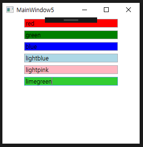
- 데이터 트리거의 외부에서 텍스트 프로퍼티에 동일한 바인딩 클래스를 사용해도 내부에서 설정했던 것과 같은 결과를 얻을 수 있음
- 텍스트박스에 적당한 배경색 입력하면 이 문자열을 브러시로 형변환해주는 타입 컨버터가 동작함
- 데이터 바인딩을 사용한 정상적인 세터를 추가 -> 실제 트리거는 아니지만 트리거처럼 보이도록 함

**트리거를 이용해서 복잡한 로직 처리하기**
- 논리합(logical OR) 사용: 동일한 엘리먼트에 다중 트리거 적용 가능
- 논리곱(logical AND) 사용: 동일한 트리거에 다중 프로퍼티 사용 가능

**논리합**
- 스타일의 Triggers 컬렉션은 다중 트리거를 포함 가능함 -> 논리합의 관계를 표현하기 위해 동일한 세터를 하나 이상 만들 수 있음
```XAML
<StackPanel Width="200" Orientation="Horizontal">
        <StackPanel.Resources>
            <Style TargetType="{x:Type TextBox}">
                <Style.Triggers>
                    <Trigger Property="IsMouseOver" Value="True">
                        <Setter Property="RenderTransform">
                            <Setter.Value>
                                <RotateTransform Angle="10"/>
                            </Setter.Value>
                        </Setter>
                        <Setter Property="Foreground" Value="Black"/>
                    </Trigger>
                    <Trigger Property="IsFocused" Value="True">
                        <Setter Property="RenderTransform">
                            <Setter.Value>
                                <RotateTransform Angle="10"/>
                            </Setter.Value>
                        </Setter>
                        <Setter Property="Foreground" Value="Black"/>
                    </Trigger>
                </Style.Triggers>
            </Style>
        </StackPanel.Resources>
        <TextBox Background="Yellow" Height="50" Width="50" Text="7"/>
    </StackPanel>
```
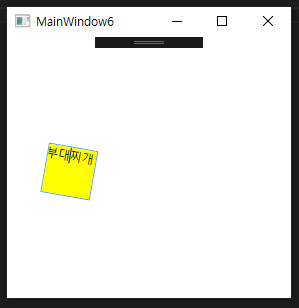
- "IsMouseOver"가 참이거나 IsFocused가 참이면, 글자색을 검정색으로 바꾸고 회전하라

**논리곱**
- 논리곱의 관계를 표현하기 위해, 트리거를 확장한 MultiTrigger나 데이터 트리거를 확장한 MultiDataTrigger를 사용 가능함.
- 이 확장 트리거들은 상황에 따라 다른 트리거를 적용 가능하도록 정보를 갖고 있는 Condition 객체를 컬렉션으로 갖고 있음 
[멀티트리거를 사용한 예시]
```XAML
<StackPanel Width="200" Orientation="Horizontal">
        <StackPanel.Resources>
            <Style TargetType="{x:Type TextBox}">
                <Style.Triggers>
                    <MultiTrigger>
                        <MultiTrigger.Conditions>
                            <Condition Property="IsMouseOver" Value="True"/>
                            <Condition Property="IsFocused" Value="True"/>
                        </MultiTrigger.Conditions>
                        <Setter Property="RenderTransform">
                            <Setter.Value>
                                <RotateTransform Angle="10"/>
                            </Setter.Value>
                        </Setter>
                        <Setter Property="Foreground" Value="Black"/>
                    </MultiTrigger>
                </Style.Triggers>
            </Style>
        </StackPanel.Resources>
        <TextBox Background="Yellow" Height="50" Width="50" Text="7"/>
    </StackPanel>
```
- "IsMouseOver"가 참이고 IsFocused가 참이면 전경색을 검정색으로 바꾸고 회전시키라는 뜻임

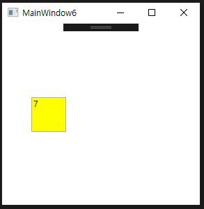


## 템플릿
- 컨트롤 클래스는 자신의 외관을 변경할 수 있도록 많은 프로퍼티들을 갖고 있음
vs
- 템플릿은 원하는 것들을 거의 다 반영해서 비주얼 트리를 완벽하게 변경 가능하도록 허용해줌
- 템플릿은 WPF의 다른 부분들처럼 써드파티를 위한 애드온 기능이 아님
- WPF에서 모든 컨트롤의 기본적인 모습 = 이미 템플릿으로 정의됨
- OS의 테마에 따라 기본 템플릿이 달라짐
- 모든 컨트롤의 소스 코드는 기본 비주얼 트리 표현 혹은 비주얼 소스코드와는 별개로 분리되어 있음
- WPF는 템플릿을 사용하여 디자인과 로직을 분리함 -> 코딩으로 외관을 설정하기 위한 별도의 프로퍼티들을 많이 노출하지 않음
- 익스팬더를 위한 새로운 템플릿을 정의하면 쉽게 처리 가능함, 사용자지정 템플릿을 사용한 익스팬더 화살표가 없음 -> ArrowBrush 혹은 ArrowColor 프로퍼티가 없음

- **컨트롤 템플릿**: 다양하고 많이 사용하는 템플릿
    - FrameworkTemplate 클래스에서 상속받은 ControlTemplate 클래스를 사용함
    - 어떤 닷넷 객체의 외관도 조정이 가능함
    -> UIElement에서 상속받지 않은 객체를 다룰 때 유용하게 사용 가능함

### 컨트롤 템플릿 소개하기
- 컨트롤 템플릿 클래스의 중요한 부분: VisualTree 컨텐트 프로퍼티
- 원하는 외관을 정의한 엘리먼트의 구조를 포함함
- XAML로 ControlTemplate 을 정의한 후, 임의의 컨트롤이나 페이지를 Template 프로퍼티를 이용하여 설정
```XAML
<Grid>
        <Grid.Resources>
            <ControlTemplate x:Key="buttonTemplate">
                <Grid>
                    <Ellipse Width="100" Height="100">
                        <Ellipse.Fill>
                            <LinearGradientBrush StartPoint="0,0" EndPoint="0,1">
                                <GradientStop Offset="0" Color="Blue"/>
                                <GradientStop Offset="1" Color="Red"/>
                            </LinearGradientBrush>
                        </Ellipse.Fill>
                    </Ellipse>
                    <Ellipse Width="80" Height="80">
                        <Ellipse.Fill>
                            <LinearGradientBrush StartPoint="0,0" EndPoint="0,1">
                                <GradientStop Offset="0" Color="White"/>
                                <GradientStop Offset="1" Color="Transparent"/>
                            </LinearGradientBrush>
                        </Ellipse.Fill>
                    </Ellipse>
                </Grid>
            </ControlTemplate>
        </Grid.Resources>
        <Button Template="{StaticResource buttonTemplate}">OK</Button>
    </Grid>
```
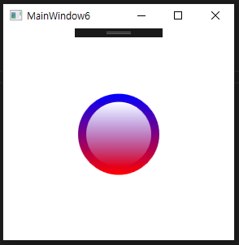
- 템플릿의 비주얼 트리는 하나의 셀을 가진 그리드 내부의 Ellipse 엘리먼트를 이용한 두 개의 원을 사용함

### 트리거를 이용한 상호작용
- 템플릿은  Triggers 컬렉션에 있는 모든 타입의 트리거들을 포함함
- Button.IsMouseOver 트리거: 버튼을 오렌지색으로 만듬
- Button.IsPressed 트리거: 버튼이 눌린 듯한 효과를 주기 위해 ScaleTransform 형태변형 사용
```XAML
<Grid>
    <Grid.Resources>
      <ControlTemplate x:Key="buttonTemplate">
        <Grid>
            <Ellipse x:Name="outerCircle" Width="100" Height="100">
                <Ellipse.Fill>
                    <LinearGradientBrush StartPoint="0,0" EndPoint="0,1">
                        <GradientStop Offset="0" Color="Blue"/>
                        <GradientStop Offset="1" Color="Red"/>
                    </LinearGradientBrush>
                </Ellipse.Fill>
            </Ellipse>
            <Ellipse Width="80" Height="80">
                <Ellipse.Fill>
                        <LinearGradientBrush StartPoint="0,0" EndPoint="0,1">
                            <GradientStop Offset="0" Color="White"/>
                            <GradientStop Offset="1" Color="Transparent"/>
                        </LinearGradientBrush>
                </Ellipse.Fill>
            </Ellipse>
        </Grid>
      <ControlTemplate.Triggers>
            <Trigger Property="Button.IsMouseOver" Value="True">
                <Setter TargetName="outerCircle" Property="Fill" Value="Orange"/>
            </Trigger>
            <Trigger Property="Button.IsPressed" Value="True">
                <Setter Property="RenderTransform">
                    <Setter.Value>
                        <ScaleTransform ScaleX=".9" ScaleY=".9"/>
                    </Setter.Value>
                </Setter>
                <Setter Property="RenderTransformOrigin" Value=".5,.5"/>
            </Trigger>
      </ControlTemplate.Triggers>
    </ControlTemplate>
    </Grid.Resources>
        <Button Template="{StaticResource buttonTemplate}">OK</Button>
</Grid>
```
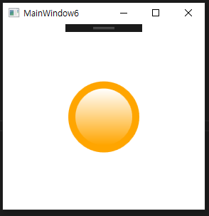
- 마우스가 원 위에 위치하면 노란색으로 변함
- 클릭 시 작아짐

- 첫 번째 트리거는 오직 outerCircle 엘리먼트만 오렌지색으로 채우기 위해 세터의 TargetName 프로퍼티를 사용함
- TargetName 을 이용하지 않으면 Fill 프로퍼티를 호출하는 버튼 전체에 트리거 사용 시 에러 발생 가능함
- 트리거로 템플릿의 하위 엘리먼트를 조절하는 기능은 복잡한 템플릿에서는 필수적임
- 두 번째 트리거는 RenderTransform을 사용하는 ScaleTransform을 전체 버튼에 적용함
- RenderTransformOrigin을 이용해서 기준점을 버튼의 중앙으로 설정함
- 10% 줄어들도록 설정 -> 버튼이 눌린 듯한 효과 줄 수 있음

### 특정 타입만 제한해서 사용하기
- ControlTemplate은 특정 타입에만 적용되도록 제한 가능한 타깃타입(TargetType) 프로퍼티를 가짐
- 이 프로퍼티를 이용하여 템플릿 내에서 참조하는 타입 이름을 제거할 수 있음
- 세터들은 트리거와 다르게 프로퍼티에 타입명을 사용하지 않음
    - 타깃타입을 대신 사용했거나 컨트롤 클래스에 공통적으로 적용되는 항목 -> 특정 타입을 명시하지 않아도 잘 동작함
    - 내부적으로 명시적인 타깃타입을 사용하지 않으면 내부적으로 컨트롤 클래스를 이용함
- 스타일과 다른 점: 타깃타입을 사용할 때 딕셔너리에서 사용되는 템플릿의 x:Key를 없앨 수 없음
- 키를 사용하지 않는 템플릿: 기본 컨트롤 템플릿 뿐임
- 키를 사용하지 않고 싶다면 타입 스타일의 내부에서 템플릿을 설정해야 함

### 템플릿에 사용된 부모 컨트롤의 프로퍼티 사용하기
- 지금까지 사용했던 예제의 문제점: Cotent가 OK임에도 보이지 않음...
- 컨트롤 템플릿의 재사용성을 높이기 위해서라도 적용하고자 하는 상위 컨트롤의 프로퍼티를 적절히 이용하는 작업을 추가적으로 해야함

**컨텐트 컨트롤의 컨텐트 프로퍼티 사용하기**
- 데이터 바인딩: 컨트롤 템플릿 내부에서 대상 엘리먼트의 프로퍼티 값을 넣어주는 역할을 함
- TemplateBindingExtension 클래스가 이 과정을 쉽게 처리해줌
- TemplateBindingExtension은 Binding과 유사, 그러나 테믚ㄹ리세엇 사용 가능하도록 단순화함, 시스템에 부담 주지 않도록 가볍게 만든 마크업 확장식임
- XAML에서 쓸 때는 Extension을 빼고 씀 -> TemplateBinding이라고 씀

- 템플릿바인딩의 '데이터 소스'는 항상 타깃 엘리먼트
    - '경로'는 타깃 엘리먼트에서 템플릿 바인딩의 Property로 선택된 의존 프로퍼티임
    - 버튼의 컨텐트 프로퍼티를 추가한 텍스트블록을 추가 가능함.
    `<TextBlock Text="{TemplateBinding Property=Button.Content}"/>`
- 템플릿바인딩 클래스는 의존 프로퍼티를 인수로 받아들이는 생성자를 갖고 있음 -> 다음처럼 작성이 가능함
    `<TextBlock Text="{TemplateBinding Button.Content}"/>`
- 타깃타입을 이용해서 버튼을 템플릿 내부에서 사용하도록 제한한다면 다음처럼 더 간단히 할 수 있음
    `<TextBlock Text="{TemplateBinding Content}"/>`


- 텍스트블록을 이용해서 버튼의 컨텐트를 표현하려면 에러가 발생하지 않도록 인위적인 제한을 둬야 함
- 텍스트블록 대신 제너릭 컨텐트 컨트롤을 사용할 수도 있음 
- 컨텐트컨트롤 클래스에 마진을 주고, 뷰박스로 감싸면 버튼에서 보여주기 적절한 크기로 조절이 가능함
```XAML
<Grid>
        <Grid.Resources>
            <ControlTemplate x:Key="buttonTemplate" TargetType="{x:Type Button}">
                <Grid>
                    <Ellipse x:Name="outerCircle" Width="100" Height="100">
                        <Ellipse.Fill>
                            <LinearGradientBrush StartPoint="0,0" EndPoint="0,1">
                                <GradientStop Offset="0" Color="Blue"/>
                                <GradientStop Offset="1" Color="Red"/>
                            </LinearGradientBrush>
                        </Ellipse.Fill>
                    </Ellipse>
                    <Ellipse Width="80" Height="80">
                        <Ellipse.Fill>
                            <LinearGradientBrush StartPoint="0,0" EndPoint="0,1">
                                <GradientStop Offset="0" Color="White"/>
                                <GradientStop Offset="1" Color="Transparent"/>
                            </LinearGradientBrush>
                        </Ellipse.Fill>
                    </Ellipse>
                    <Viewbox>
                        <ContentControl Margin="20" Content="{TemplateBinding Content}"/>
                    </Viewbox>
                </Grid>
                <ControlTemplate.Triggers>
                    <Trigger Property="Button.IsMouseOver" Value="True">
                        <Setter TargetName="outerCircle" Property="Fill" Value="Orange"/>
                    </Trigger>
                    <Trigger Property="IsPressed" Value="True">
                        <Setter Property="RenderTransform">
                            <Setter.Value>
                                <ScaleTransform ScaleX=".9" ScaleY=".9"/>
                            </Setter.Value>
                        </Setter>
                        <Setter Property="RenderTransformOrigin" Value=".5,.5"/>
                    </Trigger>
                </ControlTemplate.Triggers>
            </ControlTemplate>
        </Grid.Resources>
        <Button Template="{StaticResource buttonTemplate}">🐒</Button>
    </Grid>
```
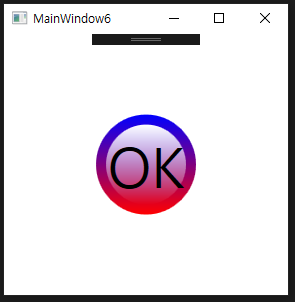
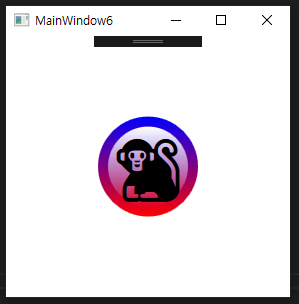

**다른 프로퍼티 사용하기**
- 만드려고 하는 컨트롤 템플릿에 사용할 컨트롤이 어떤 종류이든지, 템플릿에서 재사용하기 원하는 프로퍼티들은 다 다름
- Foreground나 FontSize 같은 일부 프로퍼티들은 프로퍼티 값 상속 때문에 자동으로 원하는 값을 상속받음, 다른 프로퍼티들은 명시적인 처리가 필요함

```XAML
<Grid>
        <Grid.Resources>
            <ControlTemplate x:Key="buttonTemplate" TargetType="{x:Type Button}">
                <Grid>
                    <Ellipse x:Name="outerCircle">
                        <Ellipse.Fill>
                            <LinearGradientBrush StartPoint="0,0" EndPoint="0,1">
                                <GradientStop Offset="0" 
                                              Color="{Binding RelativeSource={RelativeSource TemplatedParent}, 
                                              Path=Background.Color}"/>
                                <GradientStop Offset="1" Color="Red"/>
                            </LinearGradientBrush>
                        </Ellipse.Fill>
                    </Ellipse>
                    <Ellipse RenderTransformOrigin=".5,.5">
                        <Ellipse.RenderTransform>
                            <ScaleTransform ScaleX=".8" ScaleY=".8"/>
                        </Ellipse.RenderTransform>
                        <Ellipse.Fill>
                            <LinearGradientBrush StartPoint="0,0" EndPoint="0,1">
                                <GradientStop Offset="0" Color="White"/>
                                <GradientStop Offset="1" Color="Transparent"/>
                            </LinearGradientBrush>
                        </Ellipse.Fill>
                    </Ellipse>
                        
                    <Viewbox>
                        <ContentPresenter Margin="{TemplateBinding Padding}"/>
                    </Viewbox>
                </Grid>
                <ControlTemplate.Triggers>
                    <Trigger Property="IsMouseOver" Value="True">
                        <Setter TargetName="outerCircle" Property="Fill" Value="Orange"/>
                    </Trigger>
                    <Trigger Property="IsPressed" Value="True">
                        <Setter Property="RenderTransform">
                            <Setter.Value>
                                <ScaleTransform ScaleX=".9" ScaleY=".9"/>
                            </Setter.Value>
                        </Setter>
                        <Setter Property="RenderTransformOrigin" Value=".5,.5"/>
                    </Trigger>
                </ControlTemplate.Triggers>
            </ControlTemplate>
        </Grid.Resources>
        <Button Template="{StaticResource buttonTemplate}">🐒</Button>
    </Grid>
```
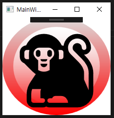
- 템플릿이 적용되는 대상 버트의 패딩은 ContentPresenter 엘리먼트의 마진으로 사용됨
- 템플릿 내에서 엘리먼트의 패딩은 내부 엘리먼트의 마진으로 활용됨
- GradientStop.Color는 컬러 타입 -> 템플릿 바인딩에 직접 설정 불가능
- 백그라운드는 브러시 타입 -> 바로 설정됨
  -> 예제에 일반적인 바인딩을 사용하여 컬러 프로퍼티를 참조하도록 함
- 주의할 점: 브러시는 컬러 프로퍼티가 없음 -> 백그라운드가 SolidColorBrush로 설정될 경우에만 바인딩이 설정됨

- 부모 그리드나 모든 Ellipse 엘리먼트에 템플릿이 적용되는 대상 버튼의 ActualHeight와 ActualWidth 프로퍼티에 명시적인 높이와 폭을 설정 가능 But, 템플릿이 적용된 컨트롤의 크기에 영향을 받음 
 -> 암시적으로 설정됨
- 개별 버튼마다 템플릿 내의 Ellipse 엘리먼트의 높이와 폭을 다르게 설정함 -> 모양이 바뀔 수 있음
```XAML
<StackPanel Orientation="Horizontal" >
            <Button Template="{StaticResource buttonTemplate}" Height="100" Width="100" FontSize="80" Background="Black" Padding="20" Margin="5">1</Button>
            <Button Template="{StaticResource buttonTemplate}" Height="150" Width="250" FontSize="80" Background="Yellow" Padding="20" Margin="5">2</Button>
            <Button Template="{StaticResource buttonTemplate}" Height="200" Width="200" FontSize="80" Background="White" Padding="20" Margin="5">3</Button>
</StackPanel>
```
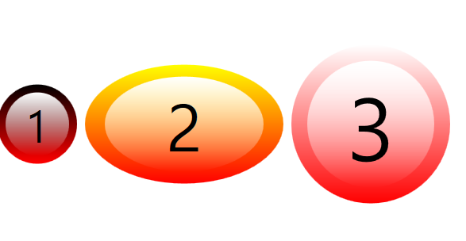
- 각 버튼은 컨트롤 템플릿에서 사용될 수 있도록 서로 다른 백그라운드, 패딩, 컨텐트 프로퍼티를 명시적으로 설정했음
- 높이와 폭은 템플릿에 반영됨
- 폰트사이즈는 ContentPresenter에 반영됨
- 폰트의 크기가 외부 Ellipse 엘리먼트의 내부에서만 유지되도록 하려고 뷰박스로 ContentPresenter를 감쌌음
  -> 렌더링 결과가 직접 반영되지는 않음


**새로운 설정을 위해 기존 프로퍼티 가로채기**
- 템플릿을 적용하는 컨트롤에 상응하는 프로퍼티가 없어도 컨트롤 템플릿의 특정 값을 파라미터처럼 갖도록 하고 싶을 때가 있음
- 많이 사용하는 방법: 의존 프로퍼티를 *가로채는* 것 
    1. 원하는 타입의 의존 프로퍼티를 가진 대상 컨트롤을 찾아야 함
    2. 이들을 이용할 수 있는지 여부를 알아야 함
```XAML
<Trigger Property="IsMouseOver" Value="True">
    <Setter TargetName="outerCircle" Property="Fill" Value="{Binding RelativeSource={RelativeSource TemplatedParent}, Path=BorderBrush}"/>
</Trigger>
```
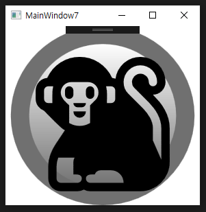

### 화면에 표시되는 모든 상태를 고려하기
- 컨트롤 템플릿을 설계할 때는 컨트롤의 모든 화면 상태를 고려해야 함
- 컨트롤이 갖고 있는 프로퍼티와 이벤트를 위한 트리거를 추가하거나 적절하게 바인딩을 해야함

[오늘 알게 된 점]
- local namespace 어쩌구 에러가 나면~ 거의 xaml 문제가 아니라 cs파일의 문제임 -> 여기서 에러를 잡아줘야 함

- 예를 들어, 프로그레스바를 위한 컨트롤 템플릿이 현재 상태 값을 보여준다면 아주 유용할 것
- 이 템플릿의 가장 중요한 일: 현재 상태 값에 따라 차트를 채우는 것
- 템플릿이 적용되는 컨트롤에 바인딩할 때 설정 값을 삼각함수를 이용하여 전환해주는 밸류 컨버터를 사용함 
- IsEnabled와 IsIndeterminate의 상태를 처리하는 트리거를 추가함
```XAML
<ProgressBar Foreground="{StaticResource foregroubdBrush}" Width="100" Height="100" Value="10" Template="{StaticResource progressPie}"/>
```
foregroundBrush 리소스 정의
```XAML
<LinearGradientBrush x:Key="foregroundBrush" StartPoint="0,0" EndPoint="1,1">
    <GradientStop Offset="0" Color="LightGreen"/>
    <GradientStop Offset="1" Color="DarkGreen"/>
</LinearGradientBrush>
```

[실행결과]

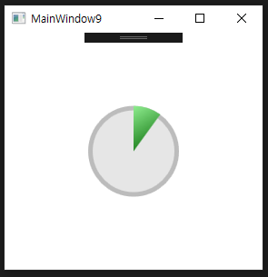<br>
[IsEnabled와 IsIndeterminate 프로퍼티의 상태를 보여주는 프로그레스바]<br>
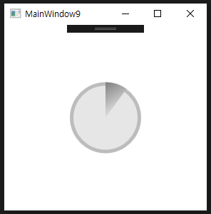<br>
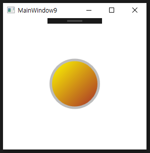<br>

### 스타일을 함께 사용하는 템플릿
- Control클래스의 Template 프로퍼티를 스타일 내부에 설정하고 원하는 엘리먼트에 스타일을 적용하는 것이 더 일반적인 방법임
- 스타일과 임의의 프로퍼티 설정을 가진 템플릿을 함께 사용하는 것은 편리하고 유용하게 사용 가능(다음과 같은 처리를 할 때)
    - 기본 템플릿으로 사용 가능함
        - 스타일 내부에 사용자지정 컨트롤 템플릿이 포함되어 있다면 이 엘리먼트에 어떤 명시적 설정이 없어도 내부적 템플릿이 자동으로 적용됨
    - 기본적으로 설정된 프로퍼티의 값을 재정의 -> 템플릿의 외관을 조절 가능함
        - 템플릿이 적용되는 컨트롤마다 서로 다른 프로퍼티의 값을 사용해서 기본적인 설정을 변경 가능함.
- 예제에 대해 생각해볼 때, 템플릿 내에 특정 브러시가 하드코딩되어 있다?
    - 다른 색상을 원하는 사용자들은 녹색 외에 어떤 값도 설정 불가능함
- 템플릿이 적용되는 대상 컨트롤의 Foreground 프로퍼티와 바인딩되어 있다면, 모든 프로그레스바에 전경색만 바꿔주면 원하는 색을 적용 가능함
- 주의할 점: 프로그레스바의 기본 전경색은 단순 녹색임 -> 원하는 그레디언트 효과를 줄 수 없음
- 스타일의 세터에 녹색 그레디언트를 추가 -> 원하는 부분마다 Foreground 프로퍼티의 설정을 명시적으로 설정
  -> 프로그레스바 컨트롤마다 재정의 가능함
  -> 템플릿 내부에 {TemplateBinding Foreground} 설정을 바꿀 필요가 없음. 

## 스킨
- 스킨을 입히는 것 = 프로그램의 모양을 즉시 변경하는 것
- WPF는 '스킨'이라는 독립된 개념을 갖고 있지 않음.
- 꼭 필요한 것도 아님
- But... 스타일과 템플릿을 사용한 WPF의 다이나믹 리소스를 사용하여 동적 스키닝을 지원하는 프로그램이나 컴포넌트를 쉽게 만들 수 있음 
- 프로그램이 스키닝을 지원하게 하려면 데이터의 형식을 결정하는 것이 선행되어야 함
- XAML을 이용하는 WPF 프로그램에서는 스킨의 데이터 형식을 사용하는 것이 매우 쉬움

- 지금까지는 느슨한 XAML 파일에서 Window나 Page 엘리먼트를 로드하면서 특정 로직을 추가하는 방식이었음
- 원할 경우 전체 UI 엘리먼트를 곧바로 로딩할 수 있는 점: 전체 컨텐트를 이용할 수 있는 완벽한 기화를 허락해줬음... 그러나 필요 이상의 너무 많은 기회를 허락함
- 프로그램에서 이용가능하도록 XAML 파일을 작성하려면 정확한 명칭을 가진 엘리먼트와 이벤트 처리기 등을 포함하는 많은 과정을 필요로 함

- 많은 부분을 조절 불가능하다면, 스킨을 ResourceDictionary로 만드는 것이 가장 좋은 방법임
- 일반적으로 ResourceDictionary는 강력한 확장성이 있음 -> 저장하고 있는 내용을 꺼내서 교체하고 합치는 작업 쉽게 가능함 

```XAML
<Window x:Class="chapter9.MainWindow10"
        xmlns="http://schemas.microsoft.com/winfx/2006/xaml/presentation"
        xmlns:x="http://schemas.microsoft.com/winfx/2006/xaml"
        xmlns:d="http://schemas.microsoft.com/expression/blend/2008"
        xmlns:mc="http://schemas.openxmlformats.org/markup-compatibility/2006"
        xmlns:local="clr-namespace:chapter9"
        mc:Ignorable="d"
        Title="Please Wait" Height="200" Width="300" ResizeMode="NoResize">
    <Grid>
        <StackPanel Style="{DynamicResource DialogStyle}">
            <Label Style="{DynamicResourgit ce HeadingStyle}">Loading...</Label>
            <ProgressBar Value="35" MinHeight="20" Margin="20"/>
            <Button Style="{DynamicResource CancelButtonStyle}" Width="70" Click="Cancel_Click">Cancel</Button>
        </StackPanel>
    </Grid>
</Window>
```
- 스타일을 이용하기 위해 다이나믹 리소스를 참조하는 것은 임의의 시간에 수정되어야 하는 경우에는 매우 중요함.
- 성공적인 결과를 보여주도록 컴파일하기 위해, Window 엘리먼트에 다음처럼 App.xaml을 추가해서 스타일이 정의된 리소스의 기본적 정의를 해줘야 함
```XAML
<Application x:Class="chapter9.App"
             xmlns="http://schemas.microsoft.com/winfx/2006/xaml/presentation"
             xmlns:x="http://schemas.microsoft.com/winfx/2006/xaml"
             xmlns:local="clr-namespace:chapter9"
             StartupUri="MainWindow10.xaml">
    <Application.Resources>
        <Style x:Key="DialogStyle" TargetType="{x:Type StackPanel}">
            <Setter Property="Margin" Value="20"/>
        </Style>
        <Style x:Key="HeadingStyle" TargetType="{x:Type Label}">
            <Setter Property="FontSize" Value="16"/>
            <Setter Property="FontWeight" Value="Bold"/>
        </Style>
        <Style x:Key="CancelButtonStyle" TargetType="{x:Type Button}"/>
    </Application.Resources>
</Application>
```
- 스킨을 교체하기 원하는 개발자들에게 CancelButtonStyle을 설정할 수 있는 기회 주려고 이렇게 만듬
- 프로그램에 포함시키기 위해 필요한 것: 스킨을 정의한 XAML 파일을 동적으로 로드 -> 새로운 Application.Resources 딕셔너리에 추가하는 것
- *.xaml 파일을 처리하는 코드: App.xaml.cs에 다음과 같이 넣어줌
```XAML
<ResourceDictionary>
    <ResourceDictionary.MergedDictionaries>
        <ResourceDictionary Source="Dictionary1.xaml" />
    </ResourceDictionary.MergedDictionaries>
</ResourceDictionary>
```
- 한 폴더에 존재하지 않는다면 인터넷이나 임의의 URL활용 -> 스킨 파일 가져올 수 있음
- Application.Current.Resources 에 새로 로딩한 리소스 할당 -> 현재 디렉토리 무시됨, 언제든지 복원 가능

- 이전 섹션에서 다뤘던 파이 차트의 내용 사용 -> 명시적인 스타일 설정 안 하고도 프로그레스 바를 '전기'효과 가진 스킨으로 교체함
- ResourcesDictionary 에서 타입 스타일을 추가/변경/삭제 하면 명시적인 다이나믹 리소스에 동일한 결과가 자동으로 반영됨
- 라벨의 특별한 부분: 라벨의 컨텐트를 '자이브 번역기' 웹 서비스에 전송하는 템플릿을 사용함(라벨이 텍스트 포함 시에만 실행됨)

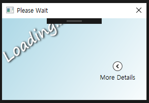
- XAML 코드
```XAML
<Window x:Class="chapter9.MainWindow10"
        xmlns="http://schemas.microsoft.com/winfx/2006/xaml/presentation"
        xmlns:x="http://schemas.microsoft.com/winfx/2006/xaml"
        xmlns:d="http://schemas.microsoft.com/expression/blend/2008"
        xmlns:mc="http://schemas.openxmlformats.org/markup-compatibility/2006"
        xmlns:local="clr-namespace:chapter9"
        mc:Ignorable="d"
        Title="Please Wait" Height="200" Width="300" ResizeMode="NoResize">
    <Grid>
        <StackPanel Style="{DynamicResource DialogStyle}">
            <Label Style="{DynamicResource HeadingStyle}">Loading...</Label>
            <ProgressBar Value="35" MinHeight="20" Margin="20"/>
            <Button Style="{DynamicResource CancelButtonStyle}" Width="70" Click="Cancel_Click">Cancel</Button>
        </StackPanel>
    </Grid>
</Window>
```
- 스킨코드
```XAML
<ResourceDictionary xmlns="http://schemas.microsoft.com/winfx/2006/xaml/presentation"
                    xmlns:x="http://schemas.microsoft.com/winfx/2006/xaml"
                    xmlns:local="clr-namespace:chapter9">

    <!--배경에 간단한 그레디언트를 만듬-->
    <Style x:Key="DialogStyle" TargetType="{x:Type StackPanel}">
        <Setter Property="Margin" Value="0"/>
        <Setter Property="Background">
            <Setter.Value>
                <LinearGradientBrush StartPoint="0,0" EndPoint="1,1">
                    <GradientStop Offset="0" Color="LightBlue"/>
                    <GradientStop Offset="1" Color="White"/>
                </LinearGradientBrush>
            </Setter.Value>
        </Setter>
    </Style>

    <!--핵심 글자를 회전, 이동한다-->
    <Style x:Key="HeadingStyle" TargetType="{x:Type Label}">
        <Setter Property="Foreground" Value="White"/>
        <Setter Property="FontSize" Value="30"/>
        <Setter Property="FontFamily" Value="Segoe Print"/>
        <Setter Property="RenderTransform">
            <Setter.Value>
                <TransformGroup>
                    <RotateTransform Angle="-35"/>
                    <TranslateTransform X="-19" Y="55"/>
                </TransformGroup>
            </Setter.Value>
        </Setter>
        <Setter Property="BitmapEffect">
            <Setter.Value>
                <DropShadowBitmapEffect ShadowDepth="2" Softness=".2"/>
            </Setter.Value>
        </Setter>
    </Style>

    <!--취소 버튼을 제거한다-->
    <Style x:Key="CancelButtonStyle" TargetType="{x:Type Button}">
        <Setter Property="Visibility" Value="Collapsed"/>
    </Style>

    <!--Expander 엘리먼트로 프로그레스 바를 감싼다-->
    <Style TargetType="{x:Type ProgressBar}">
        <Setter Property="Height" Value="100"/>
        <Setter Property="Template">
            <Setter.Value>
                <ControlTemplate TargetType="{x:Type ProgressBar}">
                    <Expander Header="More Details" ExpandDirection="Left">
                        <ProgressBar Style="{x:Null}"
                                     Height="30" Value="{TemplateBinding Value}"
                                     Minimum="{TemplateBinding Minimum}"
                                     Maximum="{TemplateBinding Maximum}"
                                     IsEnabled="{TemplateBinding IsEnabled}"
                                     IsIndeterminate="{TemplateBinding IsIndeterminate}"/>
                    </Expander>
                </ControlTemplate>
            </Setter.Value>
        </Setter>
    </Style>
</ResourceDictionary>
```
- CancelButtonStyle을 사용하는 이 스킨은 최소한의 사용자 인터페이스를 유지하기 위해 취소 버튼을 완전히 감춤
- 프로그레스바를 위한 타입 스타일은 사용자 인터페이스를 단순화하기 위해 편법 사용함
    - 접힘 속성을 가진 익스팬더 컨트롤 내부에 프로그레스바를 감싸는 사용자지정 템플릿을 정의하고 있음.
    - 감싸인 프로그레스바는 템플릿이 적용되는 컨트롤과 동기화하기 위해 다수의 TemplateBinding을 사용함
    - 내부 프로그레스바에 널 스타일을 설정한 부분: 불필요한 재귀호출의 문제를 피하기 위해 필요함
    - 명시적인 스타일이 지정되지 않는다면 내부 프로그레스바는 기본 타입 스타일을 얻기 위해 익스팬더컨트롤을 계속 호출할 것 
## 테마
- 테마: 모든 프로그램에 사용자 인터페이스 엘리먼트에 반영되는 OS 차원의 시각적인 특징들
- 현재 사용하고 있는 테마에 어울리는 스타일이나 템플릿, 스킨 등을 쉽게 만드는 방법을 알아볼 것


### 시스템 설정 사용하기
- 개발자가 SystemColors, SystemFonts, SystemParameters 클래스에 접근할 수 있는 필드들은 윈도우즈 테마가 변경되면 자동으로 수정됨
- 이런 시스템 설정 관련 필드들을 스타일이나 템플릿에 통합하는 것 -> 사용자의 테마에 스타일이나 템플릿을 통합하는 것만큼 쉬움!
```xaml
<Style TargetType="{x:Type ProgressBar}">
    <Style.Resources>
        <LinearGradientBrush x:Key="foregroundBrush" StartPoint="0,0" EndPoint="1,1">
            <GradientStop Offset="0" Color="{DynamicResource {x:Static SystemColors.InactiveCaptionColorKey}}"/>
            <GradientStop Offset="0.5" Color="{DynamicResource {x:Static SystemColors.InactiveCaptionColorKey}}"/>
            <GradientStop Offset="1" Color="{DynamicResource {x:Static SystemColors.ActiveCaptionColorKey}}"/>
        </LinearGradientBrush>
    </Style.Resources>
    <Setter Property="Foreground" Value="{StaticResource foregroundBrush}"/>
    <Setter Property="Background" Value="{DynamicResource {x:Static SystemColors.ControlBrushKey}}"/>
</Style>
```
### 테마의 종류마다 다른 스타일과 템플릿
- 자신만의 테마별로 다른 스타일과 템플릿을 만들려고 하면 '스킨'을 다룰 때 했던 것처럼 테마가 변경될 때마다 해당 내용을 로딩해서 교체하는 프로그래밍 작업을 해야 함
- WPF는 테마가 변경되었다는 것을 알려주는 이벤트를 노출하지 않음 -> Win32의 WM_THEMECHANGE 메시지를 가로채야 함

- 1. 작성한 테마별 리소스를 어셈블리로 컴파일 가능하도록 테마별로 구분
- 2. 프로젝트의 루트 폴더에 tehmes라는 폴더를 만듬 -> 각 리소스 딕셔너리를 **테마 딕셔너리**로 구분하도록 함
- 3. 테마명.테마색상.xaml 형식으로 테마별 파일들을 만듬

- 프로그램이 시작되고 테마가 변경되면 WPF가 자체적으로 이 파일들을 로딩하고 적용함
- 테마 딕셔너리 내부의 스타일들 = 테마 스타일

- 현재 테마나 색상에 상응하는 딕셔너리가 없을 때를 대비하여 대체 리소스 딕셔너리를 만들어 사용 가능함
- 이런 대체 딕셔너리 = 제네릭 딕셔너리
    - themes\Generic.xaml 형식의 파일로 구성함
- 한 개 이상의 테마 딕셔너리와 제너릭 딕셔너리를 구성했다면, 어셈블리 수준에서 ThemeInfoAttribute를 이용해서 자동으로 테마 최적화 가능함
- 첫 번째 파라미터: 테마 딕셔너리가 있는 곳
- 두 번째 파라미터: 제너릭 딕셔너리 지정 가능함
- 다음 처럼 개별적으로 설정 가능
    - None: 기본값. 리소스 딕셔너리를 찾지 않음
    - SourceAssembly: 현재 어셈블리 내부를 찾음
    - ExternalAssembly: 다른 어셈블리에서 찾지만, 반드시 어셈블리의 형식이 '어셈블리명.테마명dll'이어야 함, 어셈블리명은 현재 어셈블리의 이름과 같아야 함
- ThemeInfoAttribute의 일반적인 사용법임
`[assembly:ThemeInfo(ResourceDictionaryLocation.SourceAssembly, ResourceDictionaryLocation.SourceAssembly)]`
- 테마를 사용할 때 마지막으로 해줘야 하는 것: 엘리먼트들을 위한 기본 스타일이 제공되도록 설계하는 것
- ThemeInfoAttribute 어트리뷰트를 지정하면, 테마 스타일은 적용 대상 엘리먼트가 정의된 어셈블리나 그에 종속된 어셈블리에 반드시 함께 있어야 함
- 프로그램 수준의 리소스 딕셔너리와 다르게 버튼이나 프로그레스바 같은 엘림너트를 윟 ㅐ프로그램에 추가한 테마 딕셔너리나 제너릭 딕셔너리와 별도로 분리된 타입 스타일을 정의 불가능

- ThemeDictionaryExtension은 어떤 엘리먼트에 적용되는 테마 스타일이라도 재정의할 수 있게 해주는 마크업 확장식임
- 테마 딕셔너리의 설정에 포함된 어떤 어셈블리라도 참조 가능함

- 이미 존재하는 엘리먼트에 테마별 스타일을 추가하는 또 다른 방법: 사용자 지정 컨트롤을 정의하는 것
```C#
public class ProgressPie : ProgressBar
{
    static ProgressPie()
    {
        DefaultStyleKeyProperty.OverrideMetaData(
            typeof(ProgressPie),
            new FrameworkPropertyMetadata(typeof(ProgressPie));
        )
    }
}
```
- ProgressPie 컨트롤은 프로그레스바를 상속받음 -> 기본적으로 필요한 기능은 모두 갖추고 있음
- 표준과 다른 타입을 갖고 있다 = 기존 프로그레스 바의 테마 스타일과는 구별되는 새로운 테마 스타일을 지원할 수 있는 기능을 허락해줌 
- DefaultStyleKey 의존 프로퍼티를 설정 -> 이 놀라운 기능이 활성화됨
- 기본 스타일 = 테마 스타일

- WPF의 내장 엘리먼트들은 이 프로퍼티에 자신의 타입을 설정하기 때문에 테마 딕셔너리상에서 자신과 상응하는 타입 스타일을 사용 가능함
