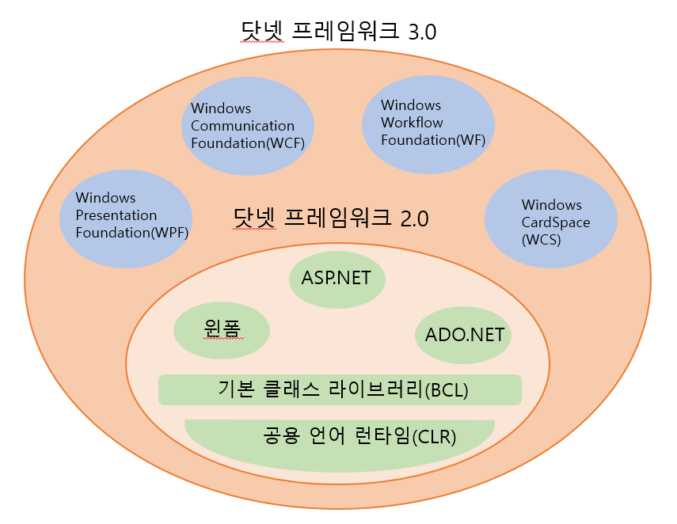

# Chapter01. 왜 WPF를 사용해야 하는가?
### 기술 발달과정을 되돌아보면
- GDI/USER 시스템을 기반으로 하는 윈도우는 1985년에 1.0 버전이 만들어짐
- 실리콘 그래픽스사에서 만든 OpenGL은 운영체제 여부를 더나 2D/3D 그래픽을 다루는 프로그램에서 이용할 수 있는
  가장 인기 있는 라이브러리
- 이 라이브러리를 이용하여 CAD, 가상 현실 프로그램, 게임들이 개발됨
- 다이렉트X는 2차원 그래픽, 입력장치, 커뮤니케이션, 사운드에서 고성능 기능을 구현할 수 있게 해줌
- 다이렉트X에서 2에서 3차원 그래픽을 지원하게 됨
- GDI와 다이렉트X에서 많은 기술적 진보가 이루어짐 
- 윈도우즈 XP가 출시됨 
  -> GDI는 알파 블렌딩이나 그레디언트 브러시 같은 더 다양한 효과를 지원하는 GDI+로 발전함.
- 다이렉트X는 새로운 버전 내놓음 -> 컴퓨터 그래픽이 할 수 있는 한계를 늘려옴
- 매니지드 코드와 닷넷의 발표 -> 개발자들은 윈도우나 웹 프로그램 작성할 때 생산성이 높은 기술을 접하게 됨
- 닷넷의 여러 기술 중, GDI+를 쉽게 이용할 수 있게 한 윈폼은 C#, 비주얼베이직, C++ 개발자들이 윈도우의 새로운 사용자 인터페이스를 만들기 위해 사용하는 중요한 기술이 됨
- GDI+나 USER 시스템의 근본적 한계는 아직까지 존재함
- 다이렉트X 9버전 소개된 후, 마이크로소프트는 과거에 비주얼베이직을 위한 라이브러리를 만들어서
  배포했던 것처럼 매니지드 코드를 위해서 다이렉트X 프레임워크를 만들었음 -> XNA 프레임워크로 발전시킴
- 1990년대 중반에도 GDI를 사용하지 않고도 3D 효과를 내는 윈도우 기반 이메일 프로그램을 만들 수 있었음
- 그래픽 하드웨어가 점점 가격이 저렴해짐 -> 성능 향상됨 -> 사용자들의 기대감도 꾸준히 증가됨

### WPF를 본격적으로 시작하면서
- 마이크로소프트사는 GDI+와 USER 시스템의 한계를 탈피한 새로운 것이 필요하다는 인식을 함

- 윈폼처럼 프레임워크 기반에서 사람들이 즐길 수 있을 정도로 생산성이 뛰어난 기술을 제공하기 시작함
->  WPF(Windows Presentation Foundation)은 난이도가 높고 기술적으로 어려운 문제들을 숙지하지 않고도 현대적인 사용자 경험(User eXperience)를 개발하기
    원하는 개발자나 디자이너에게는 하나의 대답이 될 수 있을 것
  
- WPF의 `Presentation`: 사용자 인터페이스를 칭하는 고상한 용어처럼 들림, 그러나 WPF에 포함된 매우 다양한 기능들과 오늘날의 프로그램에서 요구되는
                        높은 수준의 시각적인 면을 강조함                    
                    

**WPF의 중요한 특징**
1. 광범위한 통합성
    WPF는 모든 분야를 포함하면서 일관성 있는 프로그래밍 모델과 개별 기술이 서로 잘 작동하도록 기밀한 통합성 제공함 
    성격이 다른 개별 분야 간에 서로 일관성 있는 결과를 얻을 수 있고 한 분야에서 배운 많은 기술들은 다른 분야에서도 거의 사용이 가능함 
    예전처럼 개별 기술들을 다시 배우거나 다른 성격의 기술들을 상호 작동하게 하려고 고민하지 않아도 됨

2. 해상도 독립성
    해상도를 높이거나 DPI 값을 변경하는 것: 화면상에 나타나는 모든 것들이 점점 더 작아지지만 또렷해지는 것을 의미하지 않음
    화면 크기에 관계없이 인터페이스가 상황에 맞춰서 알맞게 보임
    WPF가 벡터 그래픽 기반이기 때문에 가능함

3. 하드웨어 지속 가능
    실제적인 내용은 다이렉트3D의 기반 위에서 만들어짐
    WPF 프로그램은 고사양을 요구하는 게임을 제외하고는 3D 기능에 중점을 둔 새로운 하드웨어나 드라이버에서 최대한의 기능을 맛볼 수 있게 해줌
    반드시 WPF가 고사양의 그래픽 하드웨어만을 요구하는 것은 아님
    하드웨어 렌더링 뿐만 아니라 소프트웨어 렌더링도 지원하기 때문임.

4. 선언형 프로그래밍
    모든 닷넷 프로그램은 XML을 이용해서 리소스 파일과 환경설정을 정의하곤 했음
                                vs
    WPF는 XAML(Extensible Application Markup Language)를 소개, 이를 이용한 선언형 프로그래밍을 도입함
    WPF와 XAML의 결합은 HTML로 사용자 인터페이스를 정의하는 것과 방식이 유사 
    but, 표현범위는 HTML에 비하면 놀라울 정도로 광범위함

5. 다양한 제작방식과 커스터마이징
    WPF는 동일한 코드를 가지고, 외형을 아주 쉽게 바꿀 수 있는 '스킨' 기능을 가진 프로그램을 쉽게 만들 수 있음

6. 쉬운 배포 
    WPF는 윈도우 인스톨러나 클릭원스를 이요한 전통적인 배포방식과 웹 브라우저에서 프로그램을 실행시키는 방식을 지원함

WPF는 다이렉트X의 3D나 하드웨어 가속 기능, 윈폼의 생산성, 플래시같은 강력한 애니메이션 지원 기능, HTML처럼 간단한 선언형 마크업과
쉬운 배포 등의 좋은 장점들만을 취합하는 것을 목표로 함
WPF는 윈폼의 컨트롤들을 언제든지 사용 가능함

### 닷넷 프레임워크의 중요한 한 축을 담당하다
- WPF는 닷넷 프레임워크 3.0에 포함되는 중요한 한 축을 담당함
- 닷넷 프레임워크는 WPF, WCF, WF, WCS 같은 주요한 새로운 기술들을 포함함
- 개발 당시에는 WinFX라는 코드명으로 불림

- 닷넷 프레임워크 3.0의 네 가지 중요한 기술은 독립적으로 동작하지만 두 가지 부분을 공유함
- 처음부터 매니지드 코드로 디자인되었다는 점, 프로그래밍 코드와 선언형 프로그래밍 방식을 혼합하여 사용함

#### 매니지드 코드로 설계되다
**매니지드 코드란?**
프로그램이 실행될 때, 특정 환경의 도움을 받는 코드
C#의 경우 CLR의 도움을 받아야 함

- 프레임워크 3.0에서 새롭게 소개된 기술들은 C#, 비주얼베이직, C++/CLI등 닷넷을 지원하는 언어라면 어떤 것으로도 직접 다룰 수 있음
- WPF로 작성된 프로그램들은 닷넷의 공통 타입, 멤버, 사용자 정의 속성을 갖는 DLL이나 EXE형태의 닷넷 어셈블리임.

- WPF와 닷넷 프레임워크 3.0의 다른 새로운 기술들 = MS 사에서 매니지드 코드를 이용해서 만든 첫 번째 대규모 라이브러리의 집합
- 반면에, 매니지드 다이렉트X, 윈폼, 닷넷의 기본 라이브러리는 언매니지드 코드와 호환될 수 있도록 래퍼를 만들어서 이용함 

#### 선언형 프로그래밍을 사용하다
- 닷넷 프레임워크에 새롭게 추가된 기술들을 XAML과 XML을 사용해서 선언적으로 정의함
- XAML을 통해 WPF에서는 사용자 인터페이스를 정의함
- WF에서는 행위와 관련 있는 업무 흐름을 정의함
- XML을 통해 WCF에서는 기반 프로토콜과 프로그램 포로토콜을 분리하기 위한 환경설정과 다른 프로그램과 통신을 위한 메세지,
  SOAP, WSDL과 같은 규약을 정의하는 데 사용됨

- 이런 특징들은 프로그래머가 다른 플랫폼의 개발자오 함께 작업하는 것을 쉽게 만들어줌
- XAML 과 XML은 개발이나 디자인 등의 분야를 포함한 거의 모든 부분에서 사용 가능한 범용적인 속성을 갖게 됨
- WPF는 API를 선언만으로 쉽게 접근 가능하게 함

## 결론
- WPF를 이용함으로써, 일반적인 윈도우 프로그램을 만들든지 대형 3D작업을 하든지간에 이전보다 사용자 인터페이스를 만드는 것이 훨씬 쉬워짐