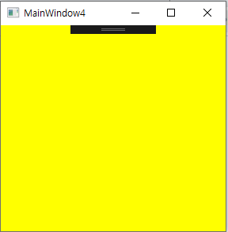
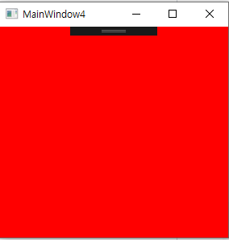
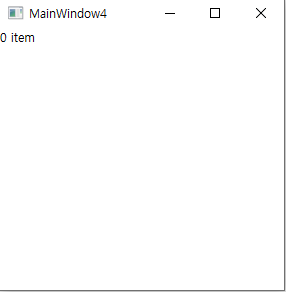
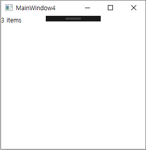
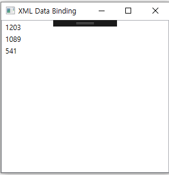

# Chapter9. 데이터 바인딩🦅

데이터 바인딩: 임의의 닷넷 객체를 함께 묶는 것
데이터 소스 통해 순서를 반복하거나 수동으로 리스트박스 아잍메을 리스트박스에 하나씩 추가하는 것이 아니라
이런 식으로 시키는 것
"리스트박스! 여기서 아이템들을 가져가! 그리고 그것들을 갱신해줘! 오호~ 이렇게 좀 바꿔줘" 
데이터 바인딩은 단순한 일 뿐만 아니라 훨씬 더 많은 일을 할 수 있음

## 바인딩 클래스 소개
- 데이터 바인딩의 핵심: System.Windows.Data.Binding 클래스
    - 두 개의 프로퍼티를 함께 이용 -> 두 프로퍼티 사이에 연결된 채널을 유지함
    - 바인딩 클래스는 한 번만 설정 -> 프로그램이 실행되는 나머지 시간 동안 동기적으로 작업 가능함

### 프로그래밍 코드에서 바인딩 사용하기
- 리스트박스에 이같은 텍스트블록을 추가한다고 가정하자
```XAML
<TextBlock x:Name="currentFolder" DockPanel.Dock="Top" Background="AliceBlue" FontSize="16" />
```
- 코드를 통해 트리뷰의 SelectedItem이 변경될 때마다 수동으로 텍스트블록을 갱신 가능함
```C#
void treeView_SelectedItemChanged(object sender, RoutedPropertyChangedEventArgs<object> e)
{
    currentFolder.Text=(treeView.SelectedItem as TreeViewItem).Header.ToString();
    Refresh();
}
```
- 바인딩 클래스를 사용하면, MainWindow의 생성자에서 한번만 초기화시키면 위의 코드를 사용하지 않아도 됨
```C#
public MainWindow()
{
    InitializeComponent();

    Binding binding = new Binding();
    //소스 객체를 설정한다
    binding.Source=treeView;
    //소스 프로퍼티를 설정한다.
    binding.Path=new PropertyPath("SelectedItem.Header");
    //타깃 프로퍼티를 추가한다.
    currentFolder.SetBinding(TextBlock.TextProperty, binding);
}
```
- treeView.SelectedItem.Header가 변경될 때마다 currentFolder.Text도 자동으로 갱신됨
- Header 프로퍼티가 없은 트리뷰의 아이템이 선택되면, 데이터 바인딩은 실패했다는 어떤 메시지도 보여주지 않음
- 바인딩 클래스는 **소스(Source)** 프로퍼티와 **타깃(Target)** 프로퍼티를 이용함
- TreeView.SelectedItem.Header 처럼 소스 프로퍼티는 두 단계를 거쳐서 설정됨
    1. 바인딩할 소스 객체를 Source 프로퍼티에 할당
    2. 의존 프로퍼티와 바인딩 인스턴스를 인수로 사용하는 SetBinding 메소드를 호출
    3. 타깃 프로퍼티와 바인딩 객체를 연결함
- FrameworkElement나 FrameworkContentElement 를 상속받은 모든 클래스들은 SetBinding 메소드를 갖고 있음

**바인딩 제거하기**
`BindingOperations.ClearBinding(currentFolder, TextBLock.TextProperty);`
- 프로그램이 실행되는 동안 바인딩을 원하지 않으면, 위의 메소드를 사용하여 언제든지 연결을 끊을 수 있음
- 바인딩 대상 객체와 의존 프로퍼티를 인수로 넘겨주면 됨

### XAML에서 바인딩 사용하기

- XAML에서는 SetBinding 메소드를 호출할 수 없음 -> Binding을 선언으로 사용가능하도록 마크업 확장식을 제공
- Binding 자체도 마크업 확장식 클래스임
- XAML에서 바인딩을 사용하기 위해 타깃 프로퍼티에 바인딩 인스턴스를 직접 설정, 마크업 확장식을 통해 프로퍼티처럼 사용 가능함
- 이전에 바인딩한 코드는 currentFolder에 추가적인 선언 통해 다음처럼 수정이 가능함
```XAML
<TextBlock x:Name="currentFolder" DockPanel.Dock="Top" Text="{Binding ElementName=treeView, Path=SelectedItem.Header}" Background="AliceBlue" FontSize="16"/>
```
- 소스와 타깃 프로퍼티간 연결은 프로그래밍 코드를 통해 간결하고 쉽게 사용이 가능함
- 바인딩 클래스는 소스 객체를 설정하기 위해 Source 프로퍼티가 아닌 ElementName 프로퍼티를 사용한 것을 볼 수 있음
- XAML에서 Source 프로퍼티를 사용하려면, 대상 객체가 ResourceDictionary에 리소스로서 적절하게 정의되어야 함
- 이런 내용을 반영해서 예제를 수정하면 treeView는 리소스의 키가 됨
```XAML
<TextBlock x:Name="currentFolder" DockPanel.Dock="Top" Text="{Binding Source={StaticResource treeView}, Path=SelectedItem.Header}" Background="AliceBlue" FontSize="16"/>
```

### 단순 프로퍼티와 바인딩
- 의존 프로퍼티들은 소스와 타깃 프로퍼티의 동기화에 필수적인 변경 통지 기능이 있음
- WPF는 임의의 닷넷 객체의 어떤 프로퍼티와도 데이터 바인딩이 가능함
```XAML
<Label x:Name="numItemsLabel" Content="{Binding Source={StaticResource photos}, Path=Count}" DockPanel.Dock="Bottom"/>
```
- 의존 프로퍼티를 데이터 바인딩의 소스로 활용 시, 변경 통보가 일어나지만 평범한 닷넷 프로퍼티를 활용하면 문제가 생김
    - 이 프로퍼티들은 변경 통보가 자동으로 일어나지 않음 -> 특별한 처리 안 하면 소스 프로퍼티가 변경되어도 갱신이 안 됨

- 타깃과 소스 프로퍼티를 동기적으로 유지해야 함 -> 이 문제 해결
- 소스 객체는 다음 중 한 가지 처리를 해야 함
    - PropertyChanged 이벤트를 정의하고 있는 System.ComponentModel.InotifyPropertyChanged 인터페이스를 구현해야 함
    - XXXChanged 이벤트를 구현해야 함. XXX는 값이 변하는 프로퍼티의 이름
- 첫 방법에 WPF가 최적화되어 있음
- XXXChanged 이벤트 처리하는 방법: 예전 클래스와 호환성을 위해 지원
- photos 컬렉션을 가진 Changed 이벤트가 일어날 때, Add, Remove,Clear, Insert처럼 그림의 개수에 영향을 주는 동작들을 가로챌 수 있음
- WPF는 이런 처리를 돕는 ObservableCollection 클래스를 내장함
- photos.Count에 다음처럼 한 줄만 고치면 바인딩에서 동기화를 지원함
`public class Photos: Collection<Photo>`
를
`public class Photos:ObservableCollection<Photo>`
로 고침

### 객체 전체와 바인딩
- 바인딩 객체의 Path 프로퍼티처럼 소스 프로퍼티를 사용하는 것은 선택의 문제
- 전체 소스 객체도 타깃 프로퍼티와 바인딩 가능

- 객체 전체와 바인딩한다는 것의 의미는?
```XAML
<Label x:Name="numItemsLabel"
       Content="{Binding Source={StaticResource photos}}"
       DockPanel.Dock="Bottom"/>
```
- photos 객체는 UIElement를 상속받은 객체가 아님 -> ToString 메소드에서 반환되는 문자열로 렌더링됨

### 컬렉션에 바인딩하기
- 라벨에 photos.Count를 바인딩한다는 의도는 좋음... 그러나 photos 컬렉션에 리스트박스를 바인딩하는 것이 더 좋은 생각!

**초기 바인딩**
- 타깃 프로퍼티로 ListBox.Items 컬렉션을 사용할 것이라고 생각하지만, 
  Items는 의존 프로퍼티가 아니어서 사용 불능, 대신 데이터바인딩에 적합한 ItemsSource라는 의존 프로퍼티를 사용함
- ItemsSource 프로퍼티는 IEnumerable 타입임.
-> 전체 photos 객체를 소스로 사용하여 다음처럼 바인딩 가능함

```XAML
<ListBox x:Name="pictureBox"
 ItemsSource="{Binding Source={StaticResource photos}}" ...>
 ...
</ListBox>
```  
- 엘리먼트를 추가하거나 제거하는 소스 컬렉션의 변화로 인해 타깃 프로퍼티가 갱신되어야 한다면, 소스 컬렉션은
  INotifyCollectionChanged라는 인터페이스를 구현해야 함
- ObservableCollection은 INotifyPropertyChanged와 INotifyCollectionChanged 인터페이스를 구현하고 있음
  ObservableCollection<Photo>를 상속받은 Photos 컬렉션이 바인딩 처리과정에 이런 결과를 잘 반영함

**표시방법 개선하기**
- photos 컬렉션은 ToString 메소드가 반환한 문자열을 렌더링해서 보여줌 -> 보기 좋지 않음
- 개선하는 한 가지 방법: 모든 ItemsControl 컨트롤이 갖고 있는 DisplayMemberPath를 사용하는 방법이 있음
- 포토 갤러리에서 컬렉션은 프로그램에 종속된 Photo 객체로 구성되어 있음, 각 객체마다 이미지의 이름, 생성날짜, 크기를 가짐
- 이런 방식으로 수정하면 향상된 결과를 보여줌
```XAML
<ListBox x:Name="pictureBox" DisplayMemberPath="Name" ItemsSource="{Binding Source={StaticResource photos}}" ...>
...
</ListBox>
```
- Photo 클래스를 별도로 정의 가능 -> 전체 경로를 반환하는 대신 ToSTring 메소드가 파일명을 반환하도록 Photo 클래스를 수정 가능
- 리스트박스에 표시할 실제 이미지를 얻기 위해서는?
    - Photo 클래스에 Image 프로퍼티를 추가
    - DisplayMemberPath를 사용
    - 소스 객체를 변화시키지 않고도 바인딩된 데이터를 효과적으로 표현하는 방법이 있음
- **일부 변경을 쉽게 반영할 수 있다는 것**은 중요함

- 데이터 바인딩에 종속되지 않는 다른 방법: 데이터 템플릿을 사용하는 것, 밸류 컨버터를 사용하는 것

**선택된 아이템 관리하기**
- 리스트박스 같은 셀렉터 컨트롤들은 선택된 아이템이라는 개념을 가짐
- 셀렉터가 컬렉션이나 IEnumerable을 구현한 객체들과 바인딩 시, WPF 자체적으로 선택된 아이템의 정보를 갖고 있음
- WPF 자체적으로 선택된 아이템의 정보를 갖고 있어서 동일한 소스로 다른 타깃과 바인딩 시에도 별다른 처리 없이 이 정보를 이용 가능함

- 이런 지원을 최적화하려면, 모든 셀렉터 컨트롤들이 공통으로 갖고 있는 IsSynchronizedWithCurrentItem 프로퍼티를 true로 설정하면 됨
```XAML
  <ListBox IsSynchronizedWithCurrentItem="True" DisplayMemberPath="Name" ItemsSource="{Binding Source={StaticResource photos}}"></ListBox>
  <ListBox IsSynchronizedWithCurrentItem="True" DisplayMemberPath="DateTime" ItemsSource="{Binding Source={StaticResource photos}}"></ListBox>
  <ListBox IsSynchronizedWithCurrentItem="True" DisplayMemberPath="Size" ItemsSource="{Binding Source={StaticResource photos}}"></ListBox>
```
- 개별 리스트박스는 IsSynchronizedWithCurrentItem="True"로 설정되었고 동일한 소스 컬렉션을 사용함 -> 선택 아이템이 변경되면 다른 두 곳도 동시에 변경됨(선택이 동기화되는 것!)
- 리스트박스 중 한 곳에서라도 IsSynchronizedWithCurrentItem 프로퍼티가 생략되거나 false로 설정되면 다른 리스트박스와의 연결고리가 끊어짐 -> 영향 안 받고 독립적인 리스트박스로 동작함

### 데이터 컨텍스트를 이용해서 소스 공유하기 

- 동일한 UI를 사용하는 많은 엘리먼트에서 하나의 소스 객체에 바인딩하는 것이 일반적인 경우
- WPF는 바인딩을 데이터 소스를 명시적으로 지정해서 사용하기보다 Source, RelativeSource, ElementName 등을 사용해서 암시적으로 사용하는 것을 선호함
- 암시적인 데이터 소스 = 데이터 컨텍스트

- 소스 객체를 데이터 컨텍스트로 사용하려면 공통적인 부모 엘리먼트를 찾아서 DataContext 프로퍼티를 설정하면 됨
- FrameworkElement 나 FrameworkContentElement를 상속받은 모든 엘리먼트들은 Object 타입의 DataContext 프로퍼티를 갖고 있음
- 명시적인 소스 객체 없이 바인딩하려고 하면 WPF는 널값이 아닌 DataContext를 만날 때까지 로지컬 트리를 찾음
```XAML
<StackPanel x:Name="parent" DataContext="{StaticResource photo}">
 <Label >
```
컬렉션: 데이터를 담는 자료구조 
ex) 배열은 아니고 ArrayList, Stack, Queue ...

**DataContext란?⭐️⭐️⭐️⭐️⭐️⭐️**
- 바인딩의 기초를 지정할 수 있는 속성
- 다른 소스를 명시적으로 선언하는 게 불필요한 바인딩의 기본 소스
- WPF Window를 비롯한 대부분 UI 컨트롤이 상속하는 FrameowrkElement 클래스에 정의되어 있음
- 보통은 viewmodel을 넣어줌
- 이 말은, viewmodel의 모든 것을 datacontext가 알기 때문에 바로 바인딩을 걸 수가 있다는 뜻임
- UserControl나 Window의 DataContext는 보통 cs 파일에서 ViewModel을 넣어주므로 Viewmodel이 맞지만 ListBox나 ItemsControl에 ItemsSource에 A라는 데이터가 바인딩되어 있다면 ListBox나 ItemsControl의 자식들의 DataContext는 자신에게 바인딩된 A 데이터의 모델임!!!

## 렌더링 조절하기
- 소스와 타깃 프로퍼티가 서로 호환되는 데이터 타입이고 처리고정 없이 기본적인 렌더링만으로 충분하다면 데이터 바인딩은 단순해짐
- WPF는 소스를 원하는 형태로 처리할 수 있는 두 가지 기능(데이터 템플릿, 밸류 컨버터)을 제공함 
  -> 복잡한 경우에도 데이터 바인딩을 사용 가능

### 데이터 템플릿 사용하기
- 데이터 템플릿: 임의의 닷넷 객체가 렌더링될 때 적용 가능한 UI의 한 부분임
    - 타깃을 원하는 형태로 렌더링하도록 조정함
- 많은 WPF 컨트롤들은 데이터 템플릿을 효과적으로 사용하기 위해 DataTemplate 타입의 프로퍼티들을 갖고 있음
- DataTemplate 의 인스턴스를 ContentTemplate, ItemTemplate 같은 프로퍼티들에 적용하면, 비주얼 트리가 새롭게 바뀜
- ItemsTemplate처럼, DataTEmplate은 FrameworkTemplate을 상속받았음 -> VisualTree 컨텐트 프로퍼티를 가지고 있음
- 이 프로퍼티는 FrameworkElement 클래스의 트리 설정을 바꿀 수 있게 해줌
```xaml
<ListBox x:Name="pictureBox" ItemsSource="{Binding Source={StaticResource photos}}">
    <ListBox.ItemTemplate>
        <DataTemplate>
            <Image Source="thumbnail.png" Height="35"/>
        </DataTemplate>
    </ListBox.ItemTemplate>
</ListBox>
<ListBox x:Name="pictureBox1" ItemsSource="{Binding Source={StaticResource photos}}">
    <ListBox.ItemTemplate>
        <DataTemplate>
            <Image Source="thumbnail.png" Height="35"/>
        </DataTemplate>
    </ListBox.ItemTemplate>
</ListBox>
```
- 모든 아이템이 이미지를 보여주지만 적어도 문자열이 아니라 이미지임
- 어떻게 Source 프로퍼티가 현재 Photo 객체의 FullPath 프로퍼티를 알 수 있는가?
    - 답: 데이터 바인딩
- 데이터 템플릿 적용 시, 적절한 데이터 컨텍스트(=소스 객체)가 암시적으로 사용됨 
- ItemTemplate이 적용되면, 데이터 컨텍스트는 ItemsSource에서 현재 아이템을 가리킴

- DataTemplate은 인라인으로 선언할 필요가 없음
- 대부분 리소스로 사용함 -> 다중 엘리먼트에서도 공유가 가능함
- 원하는 타입에 DataType 프로퍼티를 설정하는 곳마다 그 타입이 자동으로 적용된 DataTemplate을 얻을 수 있음

- DataTemplate 의 하위 클래스 중에는 XML처럼 계층적 구조의 데이터와 잘 맞도록 설계된 것들이 있음
    - HierarchicalDataTemplate이 그럼
- 계층적 데이터의 표현을 변경할 수 있게 해줌
- 트리뷰나 메뉴 컨트롤처럼 계층적인 데이터를 기본적으로 지원하는 엘리먼트와 직접 바인딩시킬 수 있음
 
### 밸류 컨버터 사용하기
- 밸류 컨버터: 소스를 원하는 값으로 완벽하게 변경함
- 서로 다른 데이터 타입의 소스와 타깃을 함께 사용할 경우 종종 사용함

**호환성이 없는 데이터 타입 연결하기**
- 라벨의 배경색을 photos 컬렉션에 포함된 아이템 숫자에 따라 변경한다면..?
`<Label Background="{Binding Path=Count, Source={StaticResource photos}}" ... />`
- 이 경우, 바인딩 객체는 브러시 대신 숫자를 배경색으로 어떻게 설정해야 하는지 모름

- 이것을 고치려면, 바인딩의 Converter 프로퍼티 이용 -> 밸류 컨버터를 추가해야 함
```XAML
<Label Background="{Binding Path=Count, Converter={StaticResource myConverter}, Source={StaticResource photos}}" />
```
- 브러시를 숫자로 전환가능한 별도의 클래스를 작성함, 리소스가 정의되었다는 가정하에 작성
```XAML
<Window.Resources>
    <local:CountToBackgroundConverter x:Key="myConverter"/>
</Window.Resources>
```
- 밸류 컨버터를 구현하려면 System.Windows.Data 네임 스페이스에 있는 IValueConverter 인터페이스를 구현해야 함
- 이 인터페이스는 넘겨받는 소스 인스턴스를 타깃 인스턴스로 전환해주는 Covnert 메소드와 그 반대 처리를 해주는 ConvertBack으로 구성됨

[CountToBackgroundConverter.cs]
```C#
 public class CountToBackgroundConverter : IValueConverter
    {
        //public string Template { get; set; }
        public object Convert(object value, Type targetType, object parameter, CultureInfo culture)
        {
            if (targetType != typeof(Brush))
                throw new InvalidOperationException("The target must be a Brush!");

            //넘어온 값이 적절치 않을 경우 Parse 메소드가 예외를 던지도록 함
            int num = int.Parse(value.ToString());

            return (num == 0 ? Brushes.Yellow : Brushes.Red);
        }
        public object ConvertBack(object value, Type targetType, object parameter,
            CultureInfo culture)
        {
            throw new NotSupportedException();
        }
    }    
```
- 소스의 값이 변경될 때마다 호출됨, 정수 값이 주어지면 Brushes.Yellow를 반환, 0이 되면 Brushes.Red값을 반환
- IValueConverter 인터페이스의 메소드들: 파라미터와 컬처를 한 개씩 인수로 사용
- 파라미터: null, 컬처: 타깃 엘리먼트의 Language 프로퍼티의 값으로 설정
- FrameworkElement와 FrameworkContentElement에 정의된 Language 프로퍼티가 처음 설정될 경우 루트 엘리먼트에서 상속받고 기본 값으로 "en-US"를 사용함
- 바인딩을 사용하는 경우 Binding.ConverterParmeter와 Binding.ConverterCulture를 이용 -> 원하는 값으로 변경 가능함
- 모든 마크업 확장식 형식의 파라미터들처럼 ConverterParameter의 값을 형변환함
  -> Yellow라는 단순 문자열을 사용해도 밸류 컨버터가 적당한 브러시로 받을 수 있음
- 비슷한 처리를 하는 ConverterCulture는 IETF 언어 태그를 문자열로 설정하면 적당한 CultureInfo객체로 전환되어 사용 가능함

[item이 0개일 때]<br>


[item이 1개 이상일 때]<br>



**데이터를 원하는 형태로 나타내기**
- 밸류 컨버터는 상황에 알맞은 문자열을 수정할 수 있게 해줌
- RawCountToDescriptionConverter를 사용하면 추가적인 라벨을 사용하지 않고도 수정이 가능함
```XAML
<Window x:Class="chapter8.MainWindow4"
        xmlns="http://schemas.microsoft.com/winfx/2006/xaml/presentation"
        xmlns:x="http://schemas.microsoft.com/winfx/2006/xaml"
        xmlns:d="http://schemas.microsoft.com/expression/blend/2008"
        xmlns:mc="http://schemas.openxmlformats.org/markup-compatibility/2006"
        xmlns:local="clr-namespace:chapter8"
        mc:Ignorable="d"
        Title="MainWindow4" Height="300" Width="300">
    <Window.Resources>
        <local:Photos x:Key="photos">
            <local:Photo Name1="Photo1_1" Name2="Photo1_2" Name3="Photo1_3"/>
            <local:Photo Name1="Photo2_1" Name2="Photo2_2" Name3="Photo2_3"/>
            <local:Photo Name1="Photo3_1" Name2="Photo3_2" Name3="Photo3_3"/>
        </local:Photos>
        <local:RawCountToDescriptionConverter xmlns:local="clr-namespace:chapter8" x:Key="myConverter"/>
    </Window.Resources>
    <DockPanel>
        <TextBlock Text="{Binding Path=Count, Converter={StaticResource myConverter}, Source={StaticResource photos}}" />
    </DockPanel>
</Window>
```
```C#
 class RawCountToDescriptionConverter:IValueConverter
    {
        public object Convert(object value, Type targetType, object parameter, CultureInfo culture)
        {
            //입력된 데이터가 올바르지 않으면 던져지는 예외를 알아볼 수 있도록 수정
            int num = int.Parse(value.ToString());
            return num + (num == 1 || num == 0? " item" : " items");
        }
        public object ConvertBack(object value, Type targetType, object parameter, CultureInfo culture)
        {
            throw new NotSupportedException();
        }
    }
```
[item이 0개일 때 또는 1개일 때]<br>


[item이 1개 이상일 때]<br>


## 컬렉션 뷰의 커스터마이징
- 컬렉션이나 IEnumerable을 구현한 객체에 바인딩할 때마다, 기본 뷰(default View) 가 소스와 타깃 객체 사이에 암시적으로 추가됨
- ICollectionView를 구현한 뷰는 현재 아이템을 저장하지만 별도로 정렬, 그룹핑, 필터링 및 아이템 탐색도 가능함

### 정렬
- ICollectionView 인터페이스는 SortDescriptions 프로퍼티를 사용해서 뷰의 아이템들을 정렬 가능함
- 정렬- 아이템 중에서 정렬하기 원하는 프로퍼티와 방향을 선택하면 됨
- Name, DateTime, Size 프로퍼티 중 하나만 선택 , 방향 지정하면 됨
`SortDescription sort = new SortDescription("Name", ListSortDirection.Ascending);`

- SortDescriptions 프로퍼티: SortDescription 객체들의 컬렉션 -> 동시에 여러 프로퍼티를 사용해서 정렬이 가능함
- 일반적으로 SortDescription 객체: 가장 중요한 프로퍼티를 설정, 갈수록 활용도가 떨어지는 것을 설정

- SortDescriptions 컬렉션은 기본 정렬된 뷰를 반환하는 Clear 메소드를 갖고 있음
```C#
  private void OnButtonClick1(object sender, RoutedEventArgs e)
        {
            SortHelper(this.ListBox1.ItemsSource, "Name");
        }

        private void OnButtonClick2(object sender, RoutedEventArgs e)
        {
            SortHelper(this.ListBox2.ItemsSource, "DateTime");
        }
        
        private void OnButtonClick3(object sender, RoutedEventArgs e)
        {
            SortHelper(this.ListBox3.ItemsSource, "Size");
        }
        void SortHelper(IEnumerable aSource, string propertyName)
        {
            ICollectionView view = CollectionViewSource.GetDefaultView(aSource);

            //현재 프로퍼티가 이미 내림차순으로 정렬되었는지 체크함
            if (view.SortDescriptions.Count > 0
                && view.SortDescriptions[0].PropertyName == propertyName
                && view.SortDescriptions[0].Direction == ListSortDirection.Ascending)
            {
                //이미 오름차순으로 정렬되어 있으므로 내림차순으로 정렬이 바뀜
                view.SortDescriptions.Clear();
                view.SortDescriptions.Add(new SortDescription(
                    propertyName, ListSortDirection.Descending));
            }
            else
            {
                //오름차순 정렬
                view.SortDescriptions.Clear();
                view.SortDescriptions.Add(new SortDescription(
                    propertyName, ListSortDirection.Ascending));
            }
        }
```
[tip]
- 화면의 모든 UI는 이벤트와 관련 있음

### 그룹핑
- ICollectionView 인터페이스는 SortDescription보다 훨씬 기능이 강력한 GroupDescriptions 프로퍼티를 갖고 있음
- PropertyGroupDescription 객체들을 이 프로퍼티에 추가 -> 소스 컬렉션의 아이템들을 그룹이나 잠재적인 하위 그룹으로 구성하는 데 사용 가능함

```C#
// 기본 뷰를 얻어옴
ICollectionView view = CollectionViewSource.GetDefaultView(
    this.FindResource("photos"));
// 그룹핑함
view.GroupDescriptions.Clear();
view.GroupDescriptions.Add(new PropertyGroupDescription("DateTime"));
```
- 정렬과 다르게, 그룹핑의 결과는 ItemsControl에 데이터를 렌더링하지 않으면 즉시 확인 불가능
- 원하는 형태로 그룹핑한 후, ItemsControl의 GroupStyle 프로퍼티에 GroupStyle 객체의 인스턴스를 설정해야 함
- 이 객체는 그룹 헤더의 모양을 정의하기 위해 데이터 템플릿을 사용해야 하는 HeaderTemplate 프로퍼티를 갖고 있음
- 포토 갤러리의 리스트박스는 그룹핑을 지원하기 위해 GroupStyle을 추가해야 함

```XAML
<Window x:Class="chapter8.MainWindow5"
        xmlns="http://schemas.microsoft.com/winfx/2006/xaml/presentation"
        xmlns:x="http://schemas.microsoft.com/winfx/2006/xaml"
        xmlns:d="http://schemas.microsoft.com/expression/blend/2008"
        xmlns:mc="http://schemas.openxmlformats.org/markup-compatibility/2006"
        xmlns:local="clr-namespace:chapter8"
        mc:Ignorable="d"
        Title="MainWindow5" Height="300" Width="300">
    <Window.Resources>
        <local:Photos x:Key="photos">
            <local:Photo Name="Photo1_1" DateTime="2020-01-08" Size="50"/>
            <local:Photo Name="Photo2_1" DateTime="2020-01-07" Size="30"/>
            <local:Photo Name="Photo3_1" DateTime="2020-01-10" Size="60"/>
        </local:Photos>
        <local:CountToBackgroundConverter x:Key="myConverter"/>
    </Window.Resources>
    <Grid>
        <ListBox x:Name="pictureBox" ItemsSource="{Binding Source={StaticResource photos}}">
            <ListBox.GroupStyle>
                <GroupStyle>
                    <GroupStyle.HeaderTemplate>
                        <DataTemplate>
                            <Border BorderBrush="Black" BorderThickness="1">
                                <TextBlock Text="{Binding Path=Name}" FontWeight="Bold"/>
                            </Border>
                        </DataTemplate>
                    </GroupStyle.HeaderTemplate>
                </GroupStyle>
            </ListBox.GroupStyle>
        </ListBox>
    </Grid>
</Window>
```
- 데이터 템플릿 내부에 데이터 바인딩이 사용됨
- 데이터 템플릿은 내부적으로 인스턴스화되는 CollectionViewGroup이라는 특별한 객체를 데이터 컨텍스트로 받음
- 데이터 템플릿은 데이터바인딩을 할 때, Name 프로퍼티를 이용해서 그룹핑 헤더를 렌더링함
- Photo.DateTime으로 그룹핑하는 것 좋지 않음 -> 날짜와 시간까지 구분하므로 각 Photo 객체는 고유한 날짜를 갖게 되고 결과적으로 아이템 하나하나마다 별도의 그룹이 됨
- ... 이런 문제 해결하기 위해서 PropertyGroupDescription 클래스의 오버로드 생성자를 이용 -> 그룹핑에 사용되는 기준 값을 변경 가능함
- 이 생성자는 밸류 컨버터를 사용할 수 있음 -> DateTimeToDateConverter를 작성 -> DateTime의 값을 그룹핑하기 적절한 값으로 변경 가능함.

### 필터링

- ICollectionView는 특정 조건에 따라 아이템들을 골라낼 수 있는 필터링(filtering)을 지원
- 이를 위해서 Predicate<Object> 타입인 Filter 프로퍼티를 가짐
- Predicate<Object>는 단일 Object를 받고 불리언 타입을 반환하는 델리게이트임
- Filter가 null일 때 소스 컬렉션의 모든 아이템들은 뷰를 통해 볼 수 있음, 그러나 델리게이트 설정 시 소스 컬렉션의 개별 아이템을 처리하기 위해 즉시 호출됨
- 결과로 true가 반환되면 보이고 false일 경우 감춰짐

- C#에서 익명 델리게이트 사용 시, 필터를 위한 소스가 아주 간단해짐 
- 예: 다음 코드는 모든 Photo아이템들이 가진 DateTime을 가져다가 7일 전 내용까지만 보여주도록 했음
```C#
ICollectionView view = CollectionViewSource.GetDefaultView(this.FindResource("photos"));
view.Filter=delegate(object o){
    return ((o as Photo).DateTime-DateTime.Now).Days <= 7;
}
```

### 탐색
- 현재 아이템을 관리한다는 의미
- ICollectionView는 CurrentItem 프로퍼티와 인덱스를 사용하는 CurrentPosition 프로퍼티뿐만 아니라 프로그램적으로 CurrentItem을 변경할 수 있는 메소드를 갖고 있음
```C#
        void previous_Click(object sender, RoutedEventArgs e)
        {
            //기본 뷰를 얻어옴
            ICollectionView view = CollectionViewSource.GetDefaultView(
                this.FindResource("photos"));
            //뒤로 이동
            view.MoveCurrentToPrevious();
            //마지막 부분에서 래핑함
            if (view.IsCurrentBeforeFirst) view.MoveCurrentToLast();
        }
        void next_Click(object sender, RoutedEventArgs e)
        {
            //기본 뷰를 얻어옴
            ICollectionView view = CollectionViewSource.GetDefaultView(
                this.FindResource("photos"));
            //앞으로 이동
            view.MoveCurrentToNext();
            if (view.IsCurrentAfterLast) view.MoveCurrentToFirst();
        }
```
- 소스 컬렉션에서 아이템이 선택될 때까지, CurrentItem은 null이고 CurrentPosition은 -1이 된다.

### 추가적인 뷰와 작업하기
- 동일한 소스 컬렉션에서 다른 뷰를 가진 엘리먼트도 생각해보장
- CollectionViewSource 클래스는 기본 뷰가 반환하는 것보다 훨씬 유용한 내용들이 있음
- 이 클래스는 어떤 소스라도 새로운 뷰를 생성 가능
    - 이렇게 생성된 뷰는 기본 뷰를 재정의해서 어떤 타깃이든지 선택적으로 적용 가능
- 포토 갤러리의 photos 컬렉션을 새로운 뷰로 만들기 위해 다음처럼 처리 가능함
```C#
CollectionViewSource viewSource = new CollectionViewSource();
            viewSource.Source = photos;
            //viewSource.View는 ICollectionView를 구현한 기본 뷰가 아님
```
- CollectionViewSource 클래스를 만든 목적: XAML에서 선언만으로 사용자 지정 뷰를 쉽게 만들 수 있도록 하기 위해서임
```XAML
<Window.Resources>
    <local:Photos x:Key="photos">
        <local:Photo Name="Photo1_1" DateTime="2020-01-08" Size="50"/>
        <local:Photo Name="Photo2_1" DateTime="2020-01-07" Size="30"/>
        <local:Photo Name="Photo3_1" DateTime="2020-01-10" Size="60"/>
    </local:Photos>
    <local:CountToBackgroundConverter x:Key="myConverter"/>
    <CollectionViewSource x:Key="viewSource" Source="{StaticResource photos}"/>
</Window.Resources>
```
- 타깃 프로퍼티에 사용자지정 뷰(custom view)를 적용하기 위해 소스 객체에 직접 바인딩하기보다는 CollectinViewSource를 이용함
```XAML
<DockPanel Grid.Row="0"  Grid.Column="1" >
    <ListBox IsSynchronizedWithCurrentItem="True" DisplayMemberPath="DateTime" ItemsSource="{Binding Source={StaticResource viewSource}}"></ListBox>
</DockPanel>
```
- 현재 원본 소스가 CollectionViewSource로 래핑되었음 그러나 이 클래스는 어떤 바인딩 경로도 변경할 필요 없음
- Count 프로퍼티와 바인딩은 Photos 객체의 프로퍼티를 참조하고 있음
- 사용자지정 뷰에서 기본 뷰에서 제공했던 기능들을 배제하고 싶다면, CollectionViewSource.GetDefaultView보다는 CollectionViewSource.View에서 반환하는 
  ICollectionView를 사용해서 이전에 추가했던 내용과 동일하게 작업하도록 처리하면 됨
- 사용자지정 뷰를 통해 XAML 내부에 정렬과 그룹핑을 설정하려면 ICOllectionView처럼 CollectionViewSource 클래스가 갖고 있는 별도의 SortDescriptions와 GroupDescriptions를 이용하면 됨
- SortDescription은 기본 XAML 네임스페이스에는 없고 닷넷에만 있음 -> 다음과 같이 지시자를 사용해야 함
`xmlns:componentModel="clr-namespace;System.ComponentModel;assembly=WindowsBase"`
- 직접 파라미터로 넘어오는 소스 아잍메을 사용하기보다 이벤트 처리기에서 e.Item을 사용하고, 불리언을 반환하는 것보다 e.Accepted 프로퍼티를 이용하는 편이 훨씬 수월함

## 데이터 프로바이더
- 소스 객체: 닷넷 객체
    - 적절한 코딩을 추가하면 데이터베이스나 레지스트리, 엑셀 시트 등과도 바인딩 가능함
    - 필요한 것: 값을 설정가능한 프로퍼티와 변경사항을 알려줄 수 있는 이벤트, 모든 내용을 담고 있는 적절한 닷넷 객체
- WPF는 이런 로직을 최소화하기 위해 데이터 바인딩을 지원하는 XmlDataProvider와 ObjectDataProvider 클래스를 지원해주고 있음

### XmlDataProvider
- XmlDataProvider 클래스는 XML이 어느 곳에 있든지 관계없이 데이터 바인딩에 사용가능한 쉬운 방법을 제공해줌
```XAML
<Window.Resources>
        <XmlDataProvider x:Key="dataProvider" XPath="GameStatus">
            <x:XData>
                <GameStatus xmlns="">
                    <GameStat Type="Beginner">
                        <HighScore>1203</HighScore>
                    </GameStat>
                    <GameStat Type="Intermediate">
                        <HighScore>1089</HighScore>
                    </GameStat>
                    <GameStat Type="Advanced">
                        <HighScore>541</HighScore>
                    </GameStat>
                </GameStatus>
            </x:XData>
        </XmlDataProvider>
    </Window.Resources>
    <Grid>
        <ListBox ItemsSource="{Binding Source={StaticResource dataProvider}, XPath=GameStat/HighScore}"/>
    </Grid>
```

- XData 엘리먼트에 포함된 XML은 XmlDataProvider의 컨텐트 프로퍼티로 설정됨
- XData 엘리먼트는 XAML과 XML을 구별하기 위해 사용되고 사용하지 않으면 컴파일 시에 에러가 발생
- XmlDataProvider에 사용한 XPath 프로퍼티는 XML내부에서 사용되는 XPath 질의와 동일함
- XmlDataProvider를 사용하는 것은 소스 객체를 사용하는 것과 거의 유사함
- XML이 별도의 파일로 존재한다면 XmlDataProvider의 Source 프로퍼티로 적절한 Uri를 지정해주면 됨
`<XmlDataProvider x:Key="dataProvider" XPath="GameStats" Source="GameStats.xml"/>`

- 계층적인 구조를 지원하는 트리뷰나 메뉴 엘리먼트와 XML 전체를 바인딩할 경우, 하나 이상의 HierarchicalDataTemplate을 사용해야 함

### ObjectDataProvider
- XmlDataProvider가 XML을 데이터 소스로 사용한다면, ObjectDataProvider는 닷넷 객체를 사용함
- ObjectDataProvider는 단순한 바인딩 외에 다음과 같은 기능을 추가함
    - 파라미터를 받는 생성자에서 소스 객체를 선언하는 것으로도 인스턴스를 만들 수 있음
    - 소스 객체의 메소드에 바인딩 가능
    - 비동기 데이터 바인딩(asynchronous data binding)을 지원하기 위한 다양한 옵션들이 있음

**XAML에서 파라미터를 사용하는 생성자 이용하기**
- 대부분 데이터 소스는 기본 생성자를 이용함
- ObjectDataProvider의 컬렉션에서는 다음과 같이 컬렉션 래핑이 가능함
```XAML
<Window.Resources>
    <local:Photos x:Key="photos"/>
    <ObjectDataProvider x:Key="dataProvider" ObjectInstance="{StaticResource photos}"/>
</Window.Resources>
```
- 키로 지정된 photos나 dataProvider 어느 곳에 바인딩해도 같은 결과를 얻을 수 있음
- 바인딩 패스(Binding Path)를 사용해도 바인딩 객체가 데이터 프로바이더 내부의 객체를 자동으로 가져오기 때문에 동일한 결과가 나옴
- ObjectDataProvider는 아직 인스턴스가 되지 않은 객체 자체에서 원하는 타입을 올 수도 있고 자동으로 생성도 가능함
- ObjectDataProvider를 사용하면 개체들의 컬렉션에 ConstructorParameters 프로퍼티 설정 -> 생성자에 파라미터를 넘겨줄 수도 있음
- XAML에서 객체를 선언하는 것=> 기본 생성자를 이용해야만 함
- XAML에서 데이터 소스를 선언하지 않아도 된다면 프로그래밍 코드에서 쉽게 생성하고 XAML 의 엘리먼트를 위한 데이터 컨텍스트로 설정도 가능함

**메소드에 바인딩하기**
- 선언이나 프로그래밍만으로 해결하기 어려운 문제와 만난 경우 -> ObjectDataProvider의 메소드 바인딩
- 데이터 바인딩이 어렵거나 변경이 쉽지 않은 클래스들에서 사용하기 좋음
- 프로퍼티를 통해 원하는 타입을 노출 -> 잠재적인 데이터 소스로 활용
`<ObjectDataProvider x:Key="dataProvider" ObjectType="{x:Type local:Photos}" MethodName="GetFolderName">`

- 메소드에 파라미터를 넘겨주려면, ConstructorParameters를 사용했던 처럼 ObjectDataProvider의 MethodParameters 프로퍼티를 사용하면 됨
- 이 메소드와 바인딩하려면, 전체 ObjectDataProvider에 바인딩하면 됨
`<TextBlock Text="{Binding Source={StaticResource dataProvider}}"/>`
- 여기서 Path를 사용 -> 메소드에서 반환되는 인스턴스에 바인딩해도 됨

## 고급 주제

### 데이터 플로우 조절하기
- 타깃 프로퍼티를 사용자가 직접 변경 가능, 소스 프로퍼티로 데이터의 흐름을 바꾸어 유용하게 사용 가능
- 바인딩 클래스는 Mode 프로퍼티 이용 -> 이 기능 제공함
- 이 프로퍼티는 BindingMode 열거형 중 하나를 값으로 가져야 함
    - OneWay: 소스가 변경될 때마다 타깃이 갱신됨
    - TwoWay: 타깃이나 소스 어느 쪽이든 한 쪽이 변경되면 서로 갱신
    - OneWayToSource: Oneway와 반대로 동작, 타깃이 변경될 때마다 소스가 갱신됨
    - OneTime: 소스가 변경되면 타깃에 반영되지 않는다는 점을 빼면 OneWay처럼 동작. 타깃은 바인딩 클래스가 인스턴스화될 때, 사용된 소스를 그대로 유지함
- TwoWay 바인딩은 이미 바인딩되었을 때 유용하게 써먹을 수 있음
- 바인딩되었다 => 사용자가 변경을 허용한 데이터를 텍스트박스 등에서 사용했다.
- 대부분 의존 프로퍼티는 OneWay 바인딩을 기본으로 함, TextBox.Text같은 일부 의존 프로퍼티들은 TwoWay 바인딩을 함
- 모드가 서로 다른 이유: 밸류 컨버터가 양쪽 방향으로 기능을 하는 Convert와 ConvertBack 메소드를 가지기 때문임
- TwoWay 바인딩은 이 메소드를 모두 이용함 그러나 OneWayToSource 바인딩은 ConvertBack 메소드를 이용함
- TwoWay 혹은 OneWayToSource 바인딩일 경우, 소스를 언제 어떻게 갱신할 지 개발자가 정해야 할 때가 있음
- 바인딩은 UpdateSourceTrigger 프로퍼티를 사용해서 처리를 지원함
- UpdateSourceTrigger 는 UpdateSourceTrigger 열거형의 한 가지를 가져야 함 
    - PropertyChanged: 타깃 프로퍼티의 값이 변경될 때마다 소스가 갱신됨
    - LostFocus: 소스는 타깃 프로퍼티의 값이 변경되고, 타깃 엘리먼트에서 포커스가 떠났을 때 갱신됨
    - Explicit:  이 모드일 때는 BindingExpression.UpdateSource 메소드를 명시적으로 호출해주어야 함
- 프로퍼티가 다를 경우 Mode 프로퍼티의 기본 값도 서로 다름

### 바인딩에 검증 규칙 추가하기
- 사용자의 입력을 받을 때, 유효하지 않은 데이터는 거절하고 적절한 시점에 잘못되었다는 내용을 사용자에게 알려주는 것이 좋은 방법임
- 데이터 바인딩은 검증 처리를 내부적으로 지원함 
- 방법이 여러가지가 있고 많은 설정을 해야한다는 단점도 있음...

- 바인딩된 텍스트박스에 이미 존재하는 *.jpg 파일의 이름을 사용자로부터 입력받는다고 할 때, 명확히 두 가지 처리를 해줘야 함
    - 존재하지 않는 파일 이름이나 jpg 확장자가 아닌 파일을 입력하는 경우
        - 텍스트박스가 바인딩되지 않았다면, 데이터 소스를 갱신하는 코드에 두 가지 상황을 처리가능한 검증 로직을 붙임
        - 데이터 바인딩이 자동으로 진행된다면 밸류 컨버터를 사용해서 로직을 실행, 잘못된 데이터가 입력될 경우 예외를 던지면 됨
    
- 이런 문제를 해결하는 몇 가지 방법이 있음 : 독자적인 검증 규칙을 작성 or 밸류 컨버터가 던진 예외를 이용하는 것

**독자적인 검증 규칙 작성하기**
- 바인딩 클래스는 Validation Rule을 상속받아 검증 로직을 처리하는 객체를 하나 이상 포함할 수 있는 ValidationRules 프로퍼티를 갖고 있음
- 각 검증 규칙들: 특정 상황에서 그 데이터가 유효한지 체크, 유효하지 않다면 그 내용을 알려줌
- ValidationRule 클래스를 상속받은 JpgValidationRule 클래스를 작성, Validate 메소드를 재정의할 것
```C#
public class JpgValidationRule : ValidationRule
    {
        public override ValidationResult Validate(object value, CultureInfo cultureInfo)
        {
            string filename = value.ToString();

            //존재하지 않는 파일들은 거절한다.
            if (!File.Exists(filename))
                return new ValidationResult(false, "Value is not a valid file.");
            //.jpg로 끝나지 않는 파일들을 거절한다.
            if (!filename.EndsWith(".jpg", StringComparison.InvariantCultureIgnoreCase))
                return new ValidationResult(false, "Value is not a .jpg file");
            //입력된 내용을 시험하고 결과를 반환한다.

            return new ValidationResult(true, null);
        }
    }
```
- 잘못된 데이터일 경우 ValidationResult가 false를 반환, 그렇지 않으면 true를 반환함
```XAML
 <TextBox Grid.Row="1">
    <TextBox.Text>
        <Binding ElementName="txtbox" Path="Text" Mode="TwoWay" UpdateSourceTrigger="PropertyChanged">
            <Binding.ValidationRules>
                <local:JpgValidationRule/>
            </Binding.ValidationRules>
        </Binding>
    </TextBox.Text>
</TextBox>
```
- 텍스트박스는 UpdateSourceTrigger의 기본값이 LostFocus여서 포커스가 떠날 때, 데이터를 갱신하려고 함
- 소스 갱신 시도 -> 밸류 컨버터보다 먼저 실행됨 -> 오류가 있는 데이터인 경우 갱신 거부, 데이터가 유효하지 않다고 알려주는 기능을 하나의 검증 규칙에서 모두 처리함

- 데이터가 유효하지 않다는 것을 언제 어떻게 알려줄 수 있는가?
    - 기본적으로 타깃 프로퍼티를 가진 엘리먼트는 새로운 템플릿을 사용해서 빨간색 테두리로 렌더링됨
- 타깃 엘리먼트에 Validation.ErrorTemplate 첨부 프로퍼티를 이용 시, 상황에 맞게 컨트롤 템플릿을 별도로 지정 가능함

- 데이터가 유효하지 않다고 판정되면, 타깃 엘리먼트의 Validation.HasError 첨부 프로퍼티가 true가 됨. 
- Validation.Error 첨부 이벤트가 발생함
- 주의할 점: 바인딩 클래스의 NotifyOnValidationError가 true로 설정되어야 한다
- 검증 실패 시, JpgValidationRule 클래스에서 반환되는 문자열과 타깃 엘리먼트의 Validation.Errors 첨부 프로퍼티 점검 시 자세한 정보 얻을 수 있음
- 데이터바인딩 계속 성공 시 이 프로퍼티들은 자동으로 없어짐

**검증 시스템을 통해서 예외 전송하기**
- 검증 규칙을 별도로 작성하는 것: 데이터 소스 혹은 밸류 컨버터에서 실행되는 오류 체크와 중복될 수 있음
- 동일한 오류 발생 시 한쪽에서만 에러를 던지도록 하려면 ExceptionValidationRule 객체를 사용하면 됨
```XAML
    <Grid>
        <Grid.RowDefinitions>
            <RowDefinition/>
            <RowDefinition/>
        </Grid.RowDefinitions>
        <TextBox Grid.Row="0" x:Name="txtbox"/>
        <TextBox Grid.Row="1">
            <TextBox.Text>
                <Binding ElementName="txtbox" Path="Text" Mode="TwoWay" UpdateSourceTrigger="PropertyChanged">
                    <Binding.ValidationRules>
                        <ExceptionValidationRule/>
                    </Binding.ValidationRules>
                </Binding>
            </TextBox.Text>
        </TextBox>
    </Grid>
```
- ExceptionValidationRule 클래스는 소스 프로퍼티를 갱신하려고 할 때, 예외 발생 시 데이터가 유효하지 않다고 알려주는 역할을 함
-> 결과적으로 디버그 트레이스에서 확인하는 것보다 효과적으로 예외에 대처할 수 있도록 함

- 별도의 에러 통지 로직을 추가하려면 UpdateSourceExceptionFilter를 사용하기
- Validation.HasError나 Validation.Error를 이용해서 별도의 로직을 추가, ErrorTemplate 을 정의할 수 있는 ExceptionValidationRule을 사용하기

### 흩어져 있는 소스와 작업하기
- WPF는 다중 데이터 소스를 모아 사용하기 위해 다음고 같은 기능들을 지원함
    - CompositeCollection
    - MultiBinding
    - PriorityBinding
**Compositecollection**
- CompositeCollection 클래스는 별개의 컬렉션이나 임의의 아이템들을 단일 컬렉션처럼 보이도록 해주는 기능이 있음
- 여러 소스에서 취합한 아이템들을 하나의 컬렉션처럼 묶어서 바인딩하려고 할 때 유용하게 사용 가능함
```XAML
<CompositeCollection>
  <CollectionContainer Collection="{Binding Source={StaticResource photos}}"/>
  <local:Photo .../>
  <local:Photo .../>
</CompositeCollection>
```
- photos 컬렉션은 CollectionContainer 객체로 래핑됨 -> 아이템들은 photos 컬렉션보다 CompositeCollection을 구성하는 아이템처럼 보임
- photos 컬렉션이 래핑되지 않고 직접 추가되면 CompositeCollection은 단지 세 개의 아이템을 포함한 것처럼 동작함

**MultiBinding**
- 여러 바인딩을 하나로 묶어서 단일 타깃과 작업할 수 있게 해줌
- 입력되는 여러 타입의 데이터를 어떻게 정리해야 되는지 알지 못함 -> 밸류 컨버터를 사용해서 알맞게 수정해줘야 함
- MultiBinding 에서 사용하는 밸류 컨버터는 단순 바인딩에서 사용하는 것과 차이가 있음
  -> IMultiValueConverter를 구현해야 함

**PriorityBinding**
- PriorityBinding 은 다수의 바인딩 객체를 사용함 -> MultiBinding 과 유사해보임
- 타깃의 값을 설정하기 위해 객체들을 경쟁시킴(이것이 좀 정확한 정의...!)
- 보통은 빠른 바인딩을 먼저 처리함
- 포토 갤러리에서도 이처럼 썸네일 이미지를 빠르게 바인딩, 원본 컬렉션과 바인딩이 마무리되면 썸네일 바인딩을 교체함
```XAML
<PriorityBinding>
    <Binding Source="HighPri" Path="SlowSpeed" IsAsync="True"/>
    <Binding Source="MediumPri" Path="MediumSpeed" IsAsync="True"/>
    <Binding Source="LowPri" Path="LowSpeed" />
</PriorityBinding>
```
- 선언된 바인딩 객체들은 처음부터 끝까지 실행됨
- 우선순위가 가장 높은 첫 번째 바인딩은 완벽하게 실행되는 데 시간이 꽤 걸림
- 마지막 바인딩은 우선순위가 낮으므로 빠르게 바인딩됨
- 서로 다른 값들이 반환되면서 높은 우선순위의 바인딩이 낮은 순위를 순차적으로 덮어씀
