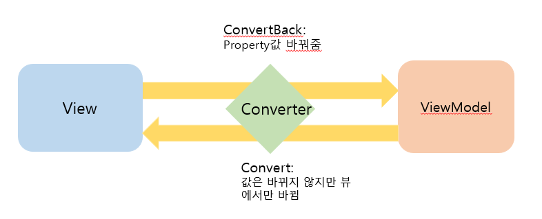

#  DataGrid와 Converter

## DataGrid의 EnableColumnVIrtualization 속성

DataGrid에는 EnableColumnVirtualization나 EnableRowVirtualization 속성이 있는데
메모리를 위해 사용자에게 보여줄 수 있는 최소한의 단위만 보여주고 그 외의 10~20개의
아이템들을 로딩해서 나머지는 사용자가 스크롤바를 움직이지 않는 이상
보여줄 값은 보여주고 별도의 여유분은 연산을 위해 남겨둔다

보통은 EnableRowVirtualization를 true로 하는 것이 default이지만
모든 값을 다 로드하고 싶으면 EnableRowVirtualization를 false로 함
-> 그런데... 이런 경우 메모리를 너무 많이 먹음
    특히 DB에서 계속해서 꺼내오는 경우는 좀 답이 ;;;

그리고 로드한 메모리가 어느 한도 이상을 넘으면 Garbage Collector도 이 아이를 처리하기 어렵게 됨
-> 그래서 그냥 냅둔다...

## Converter

- Converter는 data값을 바꿔서 View에 넘겨줌(근본값이 바뀌는 것이 아니라 View에 보여줄때만...!)
- ConverterBack은 ViewModel의 프로퍼티값을 바꿔줌
