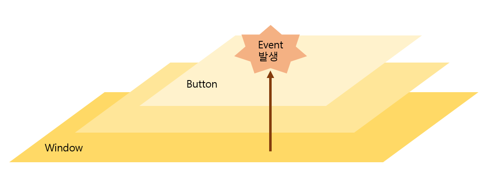
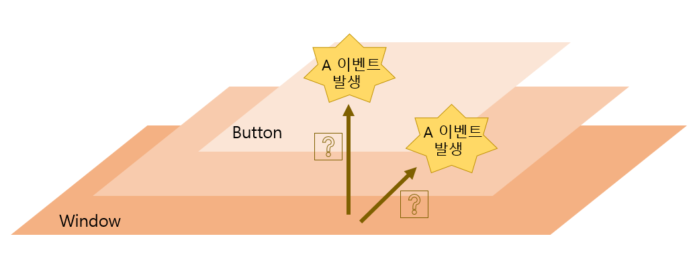

# Event
## Event가 인식되는 원리

- Window가 해당 컨트롤로 올라오면서 이벤트가 어디서 발생했는지 찾는다.

## Event도 간섭을 받는다?
- 만약 부모 패널과 자식 컨트롤이 같은 이벤트를 발생시킨 경우, 조치를 취해주지 않으면 프로그램이 죽는다.

- 이벤트도 컷팅될 수 있음
- 이벤트의 문제를 보고 있다면 이 두 가지를 언제나 생각해보기!
- 이벤트가 의도한 대로 잘 되어지지 않을 때 이 문제가 걸려있을 가능성이 높다!

## Mouse Click 관련 이벤트
- Click Event:
    - MouseLeftButtonDown -> Move -> MouseLeftButtonUp
    - Preview 관련 이벤트들도 있음

- ClickMode:
    - Hover: 마우스가 컨트롤 위에 있을 때, 이벤트 발생
    - Press: 마우스가 컨트롤을 누를 때 바로 그 순간 이벤트 발생
    - Release: 마우스가 컨트롤을 누르고 나서 손을 뗐을 때, 이벤트 발생

# Event에 대해 더 궁금한 게 있다면 이 곳으로...
- http://blog.naver.com/PostView.nhn?blogId=js686ll&logNo=221801148678&parentCategoryNo=61&categoryNo=&viewDate=&isShowPopularPosts=true&from=search
